# [TBD]. GitOps Onboarding Redesign

Date: 2024-12-21

## Status

Proposed

## Context

Currently, Konflux offers two distinct onboarding paths that create friction and complexity for developers:

### UI Onboarding
- easy to use with good validation and feedback
- Provides immediate feedback but doesn't align with GitOps principles

### GitOps Onboarding
- Requires manually authoring YAML across multiple files
- Validation happens during GitLab CI runs, creating tension between Konflux and GitLab CI workflows
- Onboarding requires manual creation of complex yaml objects
- Merge conflicts are more likely in monorepos, increasing time to onboard
- CI is not under control of the namespace owner
- Users are forced to use a specific git forge that might be different than the one their apps live in

### Current Pain Points
1. **Fragmented experience**: Developers must context-switch between UI and GitOps approaches
2. **Poor experience**: Onboarding / creating new objects requires authoring complex YAML objects by using examples from documentation or other repositories.
3. **Error-prone process**: Manual YAML authoring can lead to frequent failures
4. **Monorepo complexity**: Current GitOps monorepo for tenant configuration creates CODEOWNERS management overhead, requires freqeuent rebases and is prone to merge conflicts
5. **UI improvement limitations**: Despite continuous improvements to the UI, many users still choose GitOps onboarding for its inherent disaster recovery and change management benefits, leaving them unable to benefit from UI enhancements

## Decision

Redesign the onboarding experience to converge UI and GitOps into a single coherent, Git-centric flow through the following architectural changes:

### Alternative Approaches Considered

**Improving the existing UI** was considered but rejected because:
- Despite continuous UI improvements, many users still choose GitOps onboarding for its inherent disaster recovery and change management benefits
- UI enhancements don't address the fundamental issue of maintaining two separate onboarding flows
- Users who prefer GitOps principles cannot benefit from UI improvements, creating a permanent split in the user experience
- Konflux needs a strong disaster recovery story and having Gitops-based tenant configuration is a significant advantage there.

**Chosen approach** replaces both current flows with a unified Git-centric solution that preserves GitOps benefits while providing the usability improvements users expect.

### Core Shift
- **Deprecate ability to configure tenant resources via the UI** Users will configure resources directly via Kubernetes or via Gitops
- **Promote use of Git as the single source of truth** for applications, components, integration test scenarios, releasePlans and RBAC in production environments
- **Preserve the UI for non-configuration activities** including:
  - Monitoring and observability: logs, build inspection, viewing metrics, dashboards
  - Operational actions: triggering builds/tests, starting manual releases, pipeline management
  - Any other runtime actions that don't involve declarative resource configuration
- **Commit to single onboarding flow**: UI-based onboarding will be completely deprecated with no fallback option to minimize maintenance overhead and deliver optimal user outcomes

### Component Architecture

| Component | Role | Optional |
|-----------|------|----------|
| Git Repos | Source of truth for Konflux config | Yes |
| GitOps Registration Service | API for automated registration of GitOps repos as tenants | **Yes** (recommended) |
| ArgoCD Service | Continuous GitOps sync and deployment | **Yes** (recommended) |
| Konflux UI | Monitoring, runtime insights, and operational actions (non-configuration) | Yes |

### Multi-Repo GitOps Model & Optional Services

**GitOps Registration Service (Optional):**
Konflux will optionally provide a **GitOps Registration Service** API that automates the registration and lifecycle of GitOps repositories as first-class tenants. This service is recommended for production deployments but not required for basic Konflux functionality. Using the service will ensure that installation and configuration of ArgoCD will follow secure practices tested by the Konflux team and provide a better user experience.

**GitOps Registration Service Architecture:**
The GitOps Registration Service will store its data in git and always push to main. A database is added for approval workflow, where approval is captured before pushing the data to main. This approach:
- Requires no reliance on another CI system like GitHub Actions
- Eliminates CODEOWNERS file maintenance overhead
- Prevents PR modifications that could compromise the artifacts linking a GitOps repo to a namespace
- Ensures everything needed to restore the cluster is in source control

**ArgoCD Service (Optional):**
ArgoCD can be optionally deployed as a continuous GitOps synchronization service. While recommended for production use, Konflux can operate without ArgoCD, though this results in reduced automation and requires manual synchronization of GitOps repositories or manual creation of resources using cli (kubectl) or API.

**Impact of Optional Services:**
- **With both services**: Full automated GitOps experience with continuous deployment and streamlined onboarding
- **Without both services**: Konflux remains fully functional but requires manual GitOps repository setup and synchronization. This configuration provides:
  - Smaller deployment footprint suitable for lower-spec machines
  - Simplified setup for testing and development environments  
  - Reduced operational complexity for teams preferring manual control
  - Degraded user experience with manual setup steps
  - Reduced disaster recovery capabilities due to lack of automated drift detection

**Tenant Model:**
- **Tenant Definition**: A tenant is equivalent to a Kubernetes namespace
- **1:many Mapping**: Each GitOps repository maps to 1 or more Kubernetes namespaces

**Registration Process (when using optional services):**
1. Team registers GitOps repo via CLI (`konflux register`) or UI
2. At registration time the desired namespace name is provided to (UI | API)
3. GitOps Registration Service validates the repo and the requested namespace
4. **Optional approval step**: If approval workflow is enabled, the registration request is stored in the database pending approval
5. Upon approval (or if no approval required), service provisions the new requested Kubernetes namespace if necessary, or ensures the user has sufficient access to link a new gitops repo to an existing namespace
6. Service configures necessary service account, appProject and impersonation
7. Registration data is committed to git and pushed to main
8. ArgoCD continuously syncs changes from the repo to the namespace
9. sync status is reported back to user PRs

**Manual Process (when not using optional services):**
1. Team manually creates Kubernetes namespace with desired name
2. Team manually configures cluster access and GitOps tooling
3. Team manually applies GitOps repository contents to namespace
4. Team manually monitors for changes and applies updates as needed or runs their own gitops sync daemon

**Key Principles:**
- **Team Autonomy**: Each team owns their GitOps repo and corresponding namespace
- **Simplified Management**: Eliminates complex CODEOWNERS management in monorepos
- **ArgoCD provides security**: Use ArgoCD appProject and impersonation features instead of complex CI workflows
- **Environment Agnostic**: Environments are not a concept in Konflux-CI; teams manage environment separation through their own repo organization

The following diagram illustrates the relationship between GitOps repositories, namespaces, and Konflux resources:

```mermaid
graph TD
    subgraph "Team"
        Repo["📁 GitOps Repo<br/>github.com/team/config"]
    end
    
    subgraph "Konflux"
        GRS["🏗️ GitOps Registration Service<br/>(Optional)<br/>• Validates repo<br/>• Provisions namespace<br/>• Configures ArgoCD"]
        
        NS["🎯 Namespace: team-prod<br/>(declared in repo)"]
        
        ArgoCD["🔄 ArgoCD Service<br/>(Optional)<br/>• Continuous sync<br/>• Propagates changes<br/>• Monitors repo"]
    end
    
    Repo -.->|"One-time registration<br/>(if using optional services)"| GRS
    GRS -.->|"Creates"| NS
    GRS -.->|"Configures (if available)"| ArgoCD
    
    Repo -->|"Continuous sync<br/>(if ArgoCD available)"| ArgoCD
    ArgoCD -->|"Deploys resources"| NS
    
    classDef repoStyle fill:#1976d2,stroke:#0d47a1,stroke-width:2px,color:#fff
    classDef nsStyle fill:#7b1fa2,stroke:#4a148c,stroke-width:2px,color:#fff
    classDef optionalServiceStyle fill:#f57c00,stroke:#e65100,stroke-width:2px,color:#fff,stroke-dasharray: 5 5
    
    class Repo repoStyle
    class NS nsStyle
    class GRS optionalServiceStyle
    class ArgoCD optionalServiceStyle
```

**Key Relationships:**
- **Optional Registration**: GitOps Registration Service (when available) is used once per repo to create namespace and configure ArgoCD
- **Optional Continuous Sync**: ArgoCD (when available) continuously propagates changes from repo to namespace
- **Manual Alternative**: Without optional services, teams manually manage namespace creation and GitOps synchronization
- **1:1 Mapping**: Each GitOps repo maps to exactly one namespace
- **Immutable Names**: Namespace names are declared in the repo and cannot change
- **Single Deployment Target**: All resources from one repo deploy to one namespace
- **No Cross-Namespace Resources**: Each team's resources are isolated within their own namespace

### UI Changes

**Preserve:**
- dashboard
- build and release logs
- functions related to data plane resources: triggering builds/tests, starting manual releases, pipeline management, secret rotation, etc.
- secrets management; secrets need to be managed via UI unless ESO is used (outside the scope of this ADR)
- the current page which instructs users to install the Github application. 

**Remove/Demote:**
- UI forms for configuring components, applications, and other control plane resources

**Add to UI**
- gitops registration service

**Kubernetes CLI and API Access:**
This ADR does not impact users' ability to use Kubernetes CLIs like `kubectl` and `oc`, or the Kubernetes API directly. Users retain full access to standard Kubernetes tooling and can continue to interact with their namespaces using these familiar tools.

**Data Plane vs Control Plane Resources:**
We will sync control plane resources/attributes (components, image repositories, releasePlans); we won't sync data plane resources (snapshots, pipelineRuns, releases and certain annotations/fields). The Web UI can still exist for data plane resources.

Some UI functions, for example those which annotate resources to rerun pipelines, will continue to function. These are 'data plane' attributes. ArgoCD can be configured to ignore certain fields in order to prevent resource thrashing and we will need to do this. 

## Consequences

### Positive Consequences

1. **Unified Developer Experience**: Single Git-centric flow eliminates context switching between UI and GitOps
2. **Faster Onboarding**: Local validation reduces time-to-merge for onboarding PRs (enhanced with optional services)
3. **Clear Tenant Model**: 1:1 mapping between GitOps repos and namespaces provides clear ownership and boundaries
4. **Improved Team Autonomy**: Multi-repo model allows teams to own their GitOps repositories and corresponding namespaces
6. **Flexible Deployment Options**: Optional services allow deployment scaling from lightweight setups to full-featured production environments
7. **Resource Efficiency**: Minimal footprint option suitable for lower-spec machines and testing environments
8. **Optional GitOps Automation**: When ArgoCD is deployed, provides industry-standard continuous deployment with automatic drift detection and reconciliation
9. **Maintained GitOps Benefits**: Preserves disaster recovery, change history, and automation capabilities (enhanced with optional services)

### Negative Consequences

4. **Manual Operations**: Without further onboarding experience work, teams must manually manage GitOps operations, reducing automation benefits
5. **Migration Complexity**: Existing users must migrate from current UI/GitOps hybrid approach
6. **Configuration Complexity**: Teams must choose between manual setup (simple but limited) vs. optional services (full-featured but more complex)

### Risks and Mitigations

1. **Schema Validation**: Local validation may diverge from server-side validation
   - Mitigation: Use same validation logic in CLI and CI
2. **No Rollback Option**: Once UI-based onboarding is deprecated, there is no fallback to the previous approach
   - Mitigation: Ensure thorough testing and gradual rollout with comprehensive user training and documentation
3. **User Experience**: GitOps onboarding may be challenging for novice users
   - Mitigation: Work will be done to ensure good user experience for GitOps, especially for novice users, but the details are outside the scope of this ADR

### Open Questions

No open questions at this time.

### Migration Path

1. **Phase 1**: Implement optional GitOps Registration Service
2. **Phase 2**: Implement ArgoCD Service
3. **Phase 3**: Migration support for existing users
4. **Phase 4**: Remove deprecated UI configuration components

**Note**: Teams can choose to deploy Konflux without the optional services for simpler setups, accepting the trade-offs in automation and user experience.

**Note**: Once the GitOps approach is implemented, the UI-based onboarding will be completely deprecated with no fallback option. This decision prioritizes streamlining to a single onboarding flow to minimize maintenance overhead and deliver the best user outcomes.

### Migration from UI to GitOps

To support migration from the current UI-based approach to GitOps, a CLI tool will be provided that enables tenant administrators to export their existing namespace configurations to a local GitOps repository structure. The tool will accept a namespace as input and generate the required YAML objects (applications, components, integration test scenarios, release plans, and RBAC configurations) in the local folder structure expected by the GitOps workflow. This allows existing UI users to bootstrap their GitOps repositories with their current configurations and then transition to the new Git-centric workflow without recreating their entire setup from scratch.

## Security Implications

A critical security consideration in any GitOps implementation is ensuring that the GitOps sync process cannot create arbitrary resources beyond what a namespace administrator would normally be permitted to create. Without proper constraints, GitOps operators could potentially be exploited to escalate privileges or deploy unauthorized resources.

### Security Mitigation Approaches

**ArgoCD Application Sync Using Impersonation:**
ArgoCD impersonation allows GitOps sync operations to use dedicated, limited-privilege service accounts per namespace rather than the highly privileged control plane service account. This ensures that sync operations can only create resources that a namespace administrator would normally be allowed to create, providing strong tenant isolation through the principle of least privilege.

It is the job of the gitops registration service to create service accounts which can be used to support impersonation
1. service accounts should have konflux-admin privileges in the namespace they are used to sync objects to
2. service accounts should be stored in a special, dedicated namesace which users do not have access to. This will prevent service account secrets from being used for priviliege escalation

**ArgoCD AppProject Controls:**
ArgoCD AppProjects provide logical security boundaries that prevent cross-contamination by restricting which Git repositories can deploy to which namespaces. Each AppProject defines allowed source repositories, destination namespaces, and permitted resource types, with strict validation occurring before any sync operations begin. In Konflux's architecture, the GitOps Registration Service would automatically create and manage these AppProject definitions during tenant onboarding.

### References

- [ArgoCD Application Sync Using Impersonation](https://argo-cd.readthedocs.io/en/latest/operator-manual/app-sync-using-impersonation/) - Official ArgoCD documentation on impersonation features
- [Leveraging ArgoCD in Multi-tenanted Platforms](https://www.cecg.io/blog/multi-tenant-argocd/) - CECG guidance on using ArgoCD AppProjects for tenant autonomy and isolation

## References

No external references at this time. 

