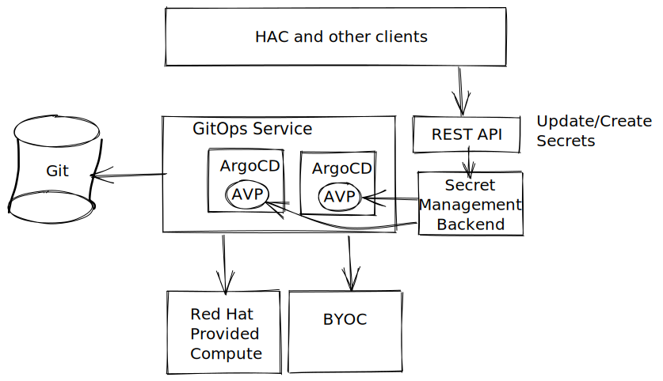

# Secret Management For User Workloads

Date: 2023-03-25

## Status

Accepted

## Context

* When user workloads are deployed to environments, the system should be able to provide a way to inject values that are specific to the environment. Currently, this is done through environment variables that are managed as overlays on the GitOps repository for the application. However, this method does not provide a good way to manage `Secret`. This ADR addresses the secret management of user workloads for different environments.
* As a StoneSoup component, I expect to have the ability to securely upload a secret, associate it with the component, and propagate it to the target environment.
* It is important to distinguish the process of uploading confidential information and deploying it in the destination environment. This should/can be performed by different roles: first, creating a searchable `RemoteSecret` with linked `SecretData` that is stored remotely on `SecretStorage`, and second, finding this `RemoteSecret` and creating a working Secret with `SecretData` linked to it.
* It should be possible to set multiple destination targets.
* Any consumer should be able to perform a search of existing `RemoteSecret` by target environment/component/application.

## Decision

### Architecture Overview
#### Terminology

- **Upload Secret**: A short-lived Kubernetes `Secret` used to deliver confidential data to permanent storage and link it to the `RemoteSecret` CR. The Upload Secret is not a CRD.
- `SecretData`: An object stored in permanent SecretStorage. Valid SecretData is always linked to a RemoteSecret CR.
- `RemoteSecret`: A CRD that appears during upload and links `SecretData` + `DeploymentTarget(s)` + K8s `Secret`. `RemoteSecret` is linked to one (or zero) SecretData and manages its deleting/updating.
- K8s `Secret`: What appears at the output and is used by consumers.
- `SecretId`: A unique identifier of SecretData in permanent SecretStorage.
- `SecretStorage`: A database eligible for storing `SecretData` (such as HashiCorp Vault, AWS Secret Manager). That is an internal mechanism. Only spi-operator will be able to access it directly.

#### Architecture


TODO update diagram

The proposed solution is to create a new Kubernetes Custom Resource (CR) called `RemoteSecret`. It serves as a representation of the Kubernetes Secret that is stored in permanent storage, which is also referred to as `SecretStorage`. This Custom Resource includes references to targets, like Kubernetes namespaces, that may also contain the required data to connect to a remote Kubernetes. To perform an upload to permanent storage, a temporary **Upload Secret** is utilized, which is represented as a regular Kubernetes Secret with special labels and annotations that the SPI controller recognizes. Different `SecretStorage` implementations, like AWS Secret Manager or HashiCorp Vault, can be used. It is simpler to create the RemoteSecret first and then use the linked **Upload Secret** to upload secret data. However, in simple cases, the **Upload Secret**  can be used to perform both uploading and the creation of RemoteSecret in a single action. It's worth noting that the **Upload Secret** is not a core component of the framework, but rather a convenient way of creating secrets. In the future, it is possible that new methods of uploading SecretData to RemoteSecret may be added.

The design specifically allows for separating the upload of the secret data (using the `UploadSecret`) and delivering the secret to the target. The list of targets of the `RemoteSecret` can be initially empty and can be updated as time evolves.

Apart from the remote secret supporting the delivery of the secret, it is also optionally able to link this secret to the service accounts in the target. These service accounts are either managed by the remote secret (i.e. share its lifecycle) or are required to pre-exist in the target cluster and namespace. This is similar to the features of the `SPIAccessTokenBinding` which also delivers secrets albeit sourced from a different workflow.

The remote secret is a template of a single secret that can be delivered to multiple targets. Because the target is identified by the namespace (and the URL of the cluster, if provided), there can be at most one secret delivered to a certain namespace by a single remote secret.

The linking of a remote secret to an application, environment and/or component, is done using labels. The exact behavior of where to deploy when the remote secret is labeled in a certain way is still TBD but the current thinking is lack of component label means that the secret should be available to all components and lack of environment means that the remote secret should be deployed to all environments. There is a specialized controller that watches `SnapshotEnvironmentBinding`s and updates the targets of remote secrets matching the application/environment/components that correspond to the SEB with appropriate targets.

#### Example: Delivering the secrets interatively

At first, the targets to which the secret should be deployed might not yet be known. Nevertheless, the remote secret can be created at this point in time. The creator just doesn't declare any targets.

```yaml
apiVersion: appstudio.redhat.com/v1beta1
kind: RemoteSecret
metadata:
    name: test-remote-secret
    namespace: default
spec:
    secret:
        name: db-credentials
    targets: []
status:
  conditions:
  - lastTransitionTime: "..."
    message: ""
    reason: AwaitingData
    status: "False"
    type: DataObtained
  targets: []
```

After creating the remote secret, the secret data may be associated with it, still without any targets. The user creates an `UploadSecret` that associates the data with the remote secret.

```yaml
apiVersion: v1
kind: Secret
metadata:
    name: upload-secret-data-for-remote-secret
    namespace: default
    labels:
        spi.appstudio.redhat.com/upload-secret: remotesecret
    annotations:
        spi.appstudio.redhat.com/remotesecret-name: test-remote-secret
type: Opaque
stringData:
    username: u
    password: passw0rd
```

After this step, the data is associated with the `RemoteSecret` which is reflected in its status.

```yaml
apiVersion: appstudio.redhat.com/v1beta1
kind: RemoteSecret
metadata:
    name: test-remote-secret
    namespace: default
spec:
    secret:
        name: db-credentials
    targets: []
status:
  conditions:
  - lastTransitionTime: "..."
    message: ""
    reason: DataFound
    status: "True"
    type: DataObtained
  targets: []
```

The targets of the `RemoteSecret` can be defined at any time. If the secret data is not yet associated with the `RemoteSecret`, nothing is delivered to the targets. If there is secret data associated with the secret, it is immediatelly delivered to the targets, if any are defined.

```yaml
apiVersion: appstudio.redhat.com/v1beta1
kind: RemoteSecret
metadata:
    name: test-remote-secret
    namespace: default
spec:
    secret:
        name: db-credentials
    targets:
    - namespace: ns
status:
  conditions:
  - lastTransitionTime: "..."
    message: ""
    reason: DataFound
    status: "True"
    type: DataObtained
  targets:
  - namespace: ns
    secretName: db-credentials
```

#### Example: Define the structure of the secrets in the targets

```yaml
apiVersion: appstudio.redhat.com/v1beta1
kind: RemoteSecret
metadata:
    name: test-remote-secret
    namespace: default
spec:
    secret:
        name: secret-from-remote
    targets: []
status:
  conditions:
  - lastTransitionTime: "..."
    message: ""
    reason: AwaitingData
    status: "False"
    type: DataObtained
  targets: []
```

This example illustrates that we can prescribe the `name` of the secret in the targets. If not specified, as in this case, the type of the secret defaults to `Opaque`.

```yaml
apiVersion: appstudio.redhat.com/v1beta1
kind: RemoteSecret
metadata:
    name: test-remote-secret
    namespace: default
spec:
    secret:
        generateName: secret-from-remote-
    targets:
    - namespace: ns
status:
  conditions:
  - lastTransitionTime: "..."
    message: ""
    reason: DataFound
    status: "True"
    type: DataObtained
  targets:
  - namespace: ns
    secretName: secret-from-remote-sdkfl
```
Here, we merely illustrate that the secret might have a dynamic name when using the `generateName` property. To learn the actual name of the secret when created in the target, the user can inspect the status of the remote secret.

```yaml
apiVersion: appstudio.redhat.com/v1beta1
kind: RemoteSecret
metadata:
    name: test-remote-secret
    namespace: default
spec:
    secret:
        name: secret-from-remote
        type: kubernetes.io/basic-auth
    targets: []
status:
    ...
```

It is also possible to declare the required annotations and labels that the secret should have in the targets:

```yaml
apiVersion: appstudio.redhat.com/v1beta1
kind: RemoteSecret
metadata:
    name: test-remote-secret
    namespace: default
spec:
    secret:
        name: secret-from-remote
        type: kubernetes.io/basic-auth
        labels:
            key: value
        annotations:
            key: value
    targets: []
status:
    ...
```
#### Example: Associating the secret with a service account in the targets
The spec of the `RemoteSecret` can specify that the secret should be linked to a service account in the targets. This is identical to the [feature](https://github.com/redhat-appstudio/service-provider-integration-operator/blob/main/docs/USER.md#providing-secrets-to-a-service-account) present in the `SPIAccessTokenBinding`.

The secret may be linked to a service account that must be already present in the target namespace. When deleting the `RemoteSecret`, such service account is kept in place and only the link to the secret that is being deleted is removed from it.

```yaml
apiVersion: appstudio.redhat.com/v1beta1
kind: RemoteSecret
metadata:
    name: test-remote-secret
    namespace: default
spec:
    secret:
        name: secret-from-remote
        type: kubernetes.io/basic-auth
        linkedTo:
        - serviceAccount:
            reference:
                name: app-sa
    targets: []
status:
    ...
```

It is also possible to create a managed service account. Such service account shares the lifecycle of the `RemoteSecret`.

```yaml
apiVersion: appstudio.redhat.com/v1beta1
kind: RemoteSecret
metadata:
    name: test-remote-secret
    namespace: default
spec:
    secret:
        name: secret-from-remote
        type: kubernetes.io/basic-auth
        linkedTo:
        - serviceAccount:
            managed:
                name: app-sa
    targets: []
status:
    ...
```

It is possible to link the secret to the service account either as an ordinary secret but also as an image pull secret.

```yaml
apiVersion: appstudio.redhat.com/v1beta1
kind: RemoteSecret
metadata:
    name: test-remote-secret
    namespace: default
spec:
    secret:
        name: secret-from-remote
        type: kubernetes.io/basic-auth
        linkedTo:
        - serviceAccount:
            as: imagePullSecret
            managed:
                name: app-sa
    targets: []
status:
    ...
```

#### Example: Inspecting the state of the deployment to targets

```yaml
apiVersion: appstudio.redhat.com/v1beta1
kind: RemoteSecret
metadata:
    name: test-remote-secret
    namespace: default
spec:
    secret:
        generateName: secret-from-remote-
        linkedTo:
            - serviceAccount:
                  managed:
                      generateName: sa-from-remote-
    targets:
        - namespace: "test-target-namespace-1"
        - namespace: "test-target-namespace-2"
        - namespace: "test-target-namespace-3"
        - namespace: "test-target-namespace-rainbow"
          apiUrl: "over-the-rainbow"
          clusterCredentialsSecret: "team-a--prod-dtc--secret"
status:
  conditions:
  - lastTransitionTime: "..."
    message: ""
    reason: DataFound
    status: "True"
    type: DataObtained
  - lastTransitionTime: "..."
    message: "some of the targets were not deployed to"
    reason: PartiallyInjected
    status: "False"
    type: Deployed
  targets:
  - namespace: "test-target-namespace-1"
    secretName: secret-from-remote-lsdjf
    serviceAccountNames:
    - sa-from-remote-llrkt
  - namespace: "test-target-namespace-2"
    secretName: secret-from-remote-lemvs
    serviceAccountNames:
    - sa-from-remote-lkejr
  - namespace: "test-target-namespace-3"
    secretName: secret-from-remote-kjfdl
    serviceAccountNames:
    - sa-from-remote-lmval
  - namespace: "test-target-namepace-rainbow"
    apiUrl: "over-the-rainbow"
    error: "Connection refused"
```
> There are 2 conditions in the status expressing the state of data readiness (`DataObtained` condition type with `AwaitingData` and `DataFound` as possible reasons) and the overall deployment status (`Deployed` condition type with the condition either missing altogether if there are no targets or `PartiallyInjected` or `Injected` reasons).
> Additionally, the status contains the details of the deployment of each of the targets in the spec. The entries might not come in the same order as in the spec but correspond to each entry in the spec by the `namespace` + `apiUrl` compound key (we don't support 2 targets of a single remote secret pointing to the same namespace atm). The status of the target contains the actual names of the secret and the (optional) service accounts (this is important in case of using `generateName` for the secret or the service account(s)) and optionally also an `error` that explains why certain target was not deployed to.

#### Example: If RemoteSecret has to be created with target namespace and Environment
```yaml
apiVersion: appstudio.redhat.com/v1beta1
kind: RemoteSecret
metadata:
    name: test-remote-secret-secret
    labels:
        appstudio.redhat.com/environment: prod
        appstudio.redhat.com/component: m-service
        appstudio.redhat.com/application: coffee-shop
spec:
    secret:
        name: test-remote-secret-secret
    target:
        - namespace: jdoe-tenant
status:
  conditions:
  - lastTransitionTime: "..."
    message: ""
    reason: AwaitingData
    status: "False"
    type: DataObtained
```

#### Example: If RemoteSecret has to be created all Environments of certain component and application
```yaml
apiVersion: appstudio.redhat.com/v1beta1
kind: RemoteSecret
metadata:
    name: test-remote-secret-secret
    labels:
        appstudio.redhat.com/component: m-service
        appstudio.redhat.com/application: coffee-shop
spec:
    secret:
        name: test-remote-secret-secret
    target:
        - namespace: jdoe-tenant
status:
  conditions:
  - lastTransitionTime: "..."
    message: ""
    reason: AwaitingData
    status: "False"
    type: DataObtained
```
### Security and Access Control

* Access to the secret management backend should be restricted to authorized users and components. See the table for the access levels for different roles.
* The default backend should use authentication and authorization mechanisms provided by the underlying service, such as Kubernetes or AWS IAM.
* Workspace maintainers should have the ability to create and update secrets for their workspace on the default secret management backend.
* Access to the secret management backend should be audited to detect and prevent unauthorized access or misuse.

#### Additions to Roles and Permissions

| Role        | Permissions  | API Groups           | Verbs            | Resources    |
|-------------|--------------|----------------------|------------------|--------------|
| Contributor | RemoteSecret | appstudio.redhat.com | get, list, watch | remotesecret |
| Maintainer  | RemoteSecret | appstudio.redhat.com | get, list, watch | remotesecret |
| Admin       | RemoteSecret | appstudio.redhat.com | *                | remotesecret |

Only roles with `create` privileges to `Secret`s can create and update secrets. At the time if this ADR this is limited to Admin role only.
> **Note :**  Initially, we decrease Maintainer's capabilities to the Contributor level. Later we might introduce instruments, so they can modify RemoteSecret.


### Monitoring and Auditing

* The secret management system should be monitored and audited to detect and prevent unauthorized access or misuse.
* Access and usage of secrets should be monitored and tracked to identify potential security issues or incidents.
* An audit log of all secret access and usage should be maintained to provide a record of who accessed and used secrets, when, and for what purpose.
* The secret management system should also provide alerting and notification mechanisms to alert security administrators and other stakeholders of potential security issues or incidents. This may include alerts for unauthorized access or misuse of secrets, as well as alerts for other security-related events or issues.

## Consequences

* The new secret management system will provide a more secure and scalable way for users to manage secrets for their workloads. It will also require some additional work to integrate with existing systems and processes. A new UI will need to be created to allow users to create and update secret values for their components and provide environment-specific overrides to them.
* Further work to be addressed, mechanisms for determining the exact target namespace in case if Environment name is used as a destination for K8s Secret, and determining the trigger when the K8s Secret has to be delivered. The use of ArgoCD's Resource  ArgoCD's [Resource Hooks](https://argo-cd.readthedocs.io/en/stable/user-guide/resource_hooks/) may be helpful in this regard.
