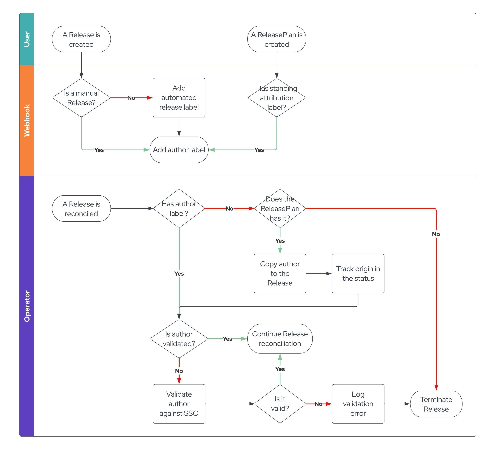

# 24. Release Objects Authorization Tracking and Propagation

Date: 2023-04-25

## Status

Accepted

## Context

It is imperative to know which individual has authorized a change to production in order to have accountability for changes.
This information needs to be propagated through the release process and needs to be flexible enough to specify authorization
either on a per-release basis or as a standing authorization.

## Decision

An admission webhook will be used to capture and track the user information provided in the Kubernetes request. This user
will be validated against Red Hat's SSO.

### Architecture Overview

#### Terminology

* `Release`: A CRD that describes what should be released and using which plan.
* `ReleasePlan`: A CRD that describes where and how an application should be released.
* `ReleaseStrategy`: A CRD that describes which pipeline to execute along with specific pipeline parameters.

#### Architecture

##### Capturing authorization data

The end goal of the ADR is to permit the release-service's `Pipeline`'s `Tasks` to have access to the name of the
individual that authorized the change in production. There are two kind of authorizations involved:

###### Authorization for a particular Release

It will be obtained by capturing the user that created the object. This information is available for requests intercepted
by admission webhooks. The `Release` CR will be updated with the label `release.rhtap.openshift.io/author` using the
username that triggered the requests as its value.

As automated `Releases` would also obtain this label, it's important to add a new label to indicate their nature. Automated
`Releaes` are exclusively created by the Integration service, which will have to add the label
`release.rhtab.openshift.io/automated` and set it to true so the author label is not set in the webhook.

###### Standing Authorization for an Application

It will be obtained by capturing the user that creates or updates the `ReleasePlan` CR. This will be done exclusively when
the resource has the label `release.rhtap.openshift.io/standing-authorization` set to `true`.

Since we expect ReleasePlans to be updated by users who may not intend to provide a `Standing Authorization`
(i.e. Change `ReleaseStrategy`), it is important to keep track of author information when the annotation is set.
ReleasePlans will make use of the same label described above (`release.rhtap.openshift.io/author`) to keep track of the
user information.

##### Changes in the Release reconciliation

The inclusion of authorization labels expands the validation phase. When a `Release` is reconciled, it must follow this
process:
* Verify that the `release.rhtap.openshift.io/author` label is present.
  * If not present, consult the `ReleasePlan` to look if it is present there.
  * If the author information is not present in either of them, fail with `ValidationError`.
  * If found, copy the author label to the Release and add the `status.authorization.author`. The field
`status.authorization.standingAuthorization` should be also set to `true` in the case the author is coming from the
`ReleasePlan`.
* Verify if the author is a "real" `User` as opposed to a `ServiceAccount`. Given an author value, the system will query
the SSO service to determine that the user is known for the SSO service. This rules out **kube:admin** and any other
service account. It will also help weed out the cases where the user has left the organization.
* Update `status.authorization.verified` and set it to `true` if verification passed. Otherwise, fail with a `ValidationError`.

At this point, the `status.authorization` will be populated and the author is validated to be a real user. The Release
Service operator makes the `Release` along with the authorization info available to the Release Pipelines.

This validation process will not be performed when `status.authorization.verified` is set to true to reduce the number
of requests to the SSO service.

##### Removing authorization data

A `Standing Authorization` for an Application can be deleted by a user when the `ReleasePlan` CR has the label
`release.rhtab.openshift.io/standing-authorization` set to `false` or removed.

## Consequences

* The SSO service interaction must be adequately efficient to ensure the Release process is not delayed.
* The system needs to handle the situation whereby a `User` specified in the `ReleasePlan` is not longer a valid user.
