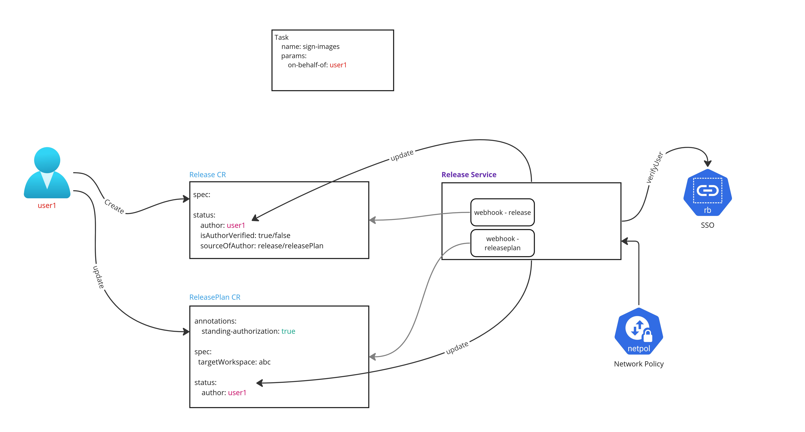

# 24. Release and ReleasePlan Authorization

Date: 2023-04-17

## Status

Accepted

## Context

* It is imperative to know which individual has authorized a change to production in order to have accountability for changes.
* Flexibility is required when specifying authorization either on a per-release basis or as a standing authorization.

## Decision

### Architecture Overview
#### Terminology

- `Release`: A CRD that describes what should be released and using which plan.
- `ReleasePlan`: A CRD that describes where and how an application should be released.
- `ReleaseStrategy`: A CRD that describes which pipeline to execute along with specific pipeline parameters.

#### Architecture

##### Capturing authorization data
The end goal of the ADR is to permit the release-service's `Pipeline`'s `Tasks` to have access to the name of the individual that authorized the change in production.
* `Authorization` for a particular `Release` will be obtained by capturing the user that has created the object.
  * The `status` section of the `Release` CR will be updated with to specify the `author`.
* A `Standing Authorization` for an application will be obtained by capturing the user that creates or updates the `ReleasePlan` CR **when** `annotations.standing-authorization` is set to `true`
  * Since we expect ReleasePlans to be updated by users who may not intend to provide a `Standing Authorization` (i.e. Change `ReleaseStrategy`), it is important to intercept only when the above annotation is set.
  * The `status` section of the `ReleasePlan` CR will be updated with the `author`.

##### Processing a Release
* When a `Release` is processed, the Release service must follow this process:
  * Verify that the `status.author` is populated.
    * If empty, consult the `ReleasePlan` to look if `status.author` is present and populated.
     * If `status.author` of `ReleasePlan` is empty, fail with `ValidationError`.
    * If found, copy `ReleasePlan` `status.author` to `Release` `status.author`.
  * Verify if author is a "real" `User` as opposed to a `ServiceAccount`.
    * Given an author value, the system will query the SSO service to determine that the user is a known user in SSO.
      * This rules out **kube:admin** and any other **ServiceAccount**.
      * It will also help weed out the cases where the user has left the organization.
  * Update `status.isAuthorVerified` if verification passed.
   * Otherwise, fail with a `ValidationError`.

* At this point, the `status.author` is non-empty and has been validated to be a real `User`.
  * The Release Service makes the `status.author` value available to the Release pipelines.

##### Removing authorization data
* A `Standing Authorization` for an application can be deleted by a user **when** the `ReleasePlan` CR has its `annotations.standing-authorization` set to `false` or is removed.

## Consequences
* The SSO service interaction must be adequately efficient to ensure the Release process is not delayed.
* The system needs to handle the situation whereby a `User` specified in the `ReleasePlan` is not longer a valid user.

