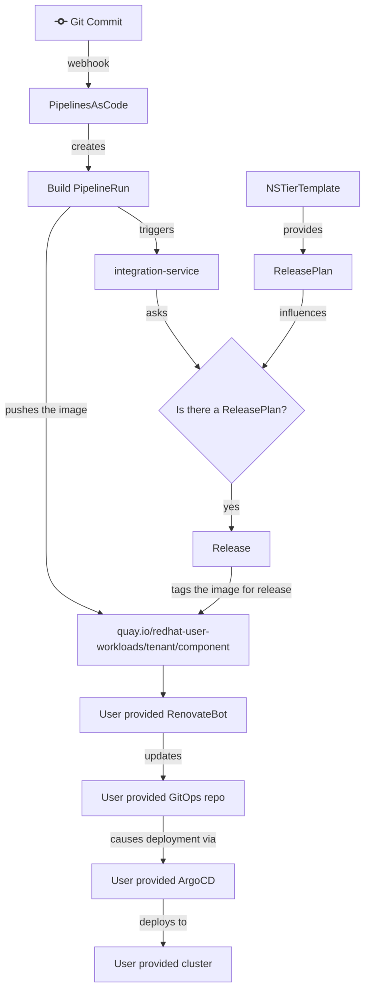
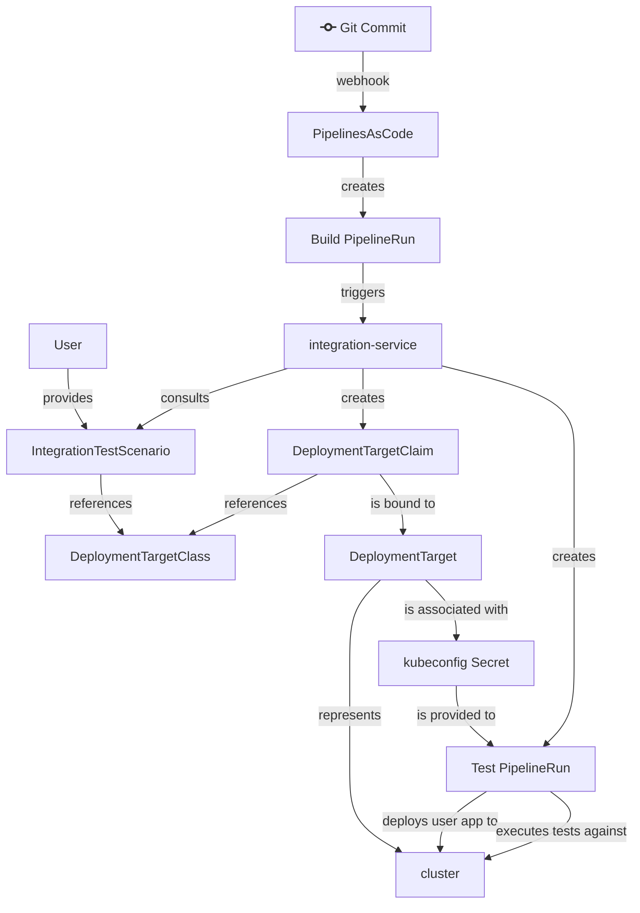

# 32. Decoupling Deployment

Date: 2023-11-17

## Status

Draft

Relates to:
* [ADR 14. Let Pipelines Proceed](0014-let-pipelines-proceed.html)

Supercedes:
* [ADR 08. Environment Provisioning](0008-environment-provisioning.html)
* [ADR 16. Integration Service Promotion Logic](0016-integration-service-promotion-logic.html)
* [ADR 28. Handling SnapshotEnvironmentBinding Errors](0028-handling-snapshotenvironmentbinding-errors.html)

## Authors

- Ralph Bean

## Context

Since the beginning of our project, we've had an emphasis on providing an integrated experience for
the user, automating all steps through build, test, deployment, and release to higher environments.

Some challenges:

- Our controllers' APIs are highly coupled. For example, it isn't feasible to try and use
  [integration-service] today without [application-service] and [gitops-service]. This creates
  a high barrier to engage with some of the useful subsystems we've built. A user (and potential
  contributor) has to adopt the whole thing, or nothing.
- Today, we can generate simple but often incorrect deployment manifests for users' applications,
  which we deploy via the application gitops repo. The user cannot interact with or influence these
  resources directly; they have to do so through the Application/Component API. If we permit them to
  directly provide deployment resources through that API, the API will become a leaky abstraction.
  If don't permit them to provide their own resources, and instead try to handle every application
  configuration case in the HAS generation code, we will struggle to keep up with users' demands for
  the many and varied kinds of application deployments.

See also [RHTAP-1873](https://issues.redhat.com/browse/RHTAP-1873).

## Decision

We are going to decouple the deployment from the build, test, and release portions of our system.

**Deployment**:

- The [Environment], [SnapshotEnvironmentBinding], and [GitOpsDeploymentManagedEnvironment]
  resources will be deprecated and eventually decomissioned.
- The [application-service] will stop generating GitOps repo content.
- HAC will stop rendering [Environments] and their status.
- If a user wants to make use of deployment capabilities, we will promote the usage of [renovatebot]
  to propagate _released_ images to their self-managed gitops repo as pull requests. Dependabot is
  equally viable if the user's gitops repo is on GitHub.

**Test and promotion**:

- We will retain the [DeploymentTargetClaim], [DeploymentTarget], and [DeploymentTargetClass] APIs.
  Collectively, call these the "DTC" APIs. These should have no dependence on other AppStudio APIs.
  Only [integration-service] should depend on them. The controllers that support the DTC API should
  be organized into their own project: "the [deployment-target-operator]", or something like that.
- [integration-service] should be modified to create and destroy [DeploymentTargetClaims] directly
  instead of [Environment] resources. Users will be expected to provide integration test pipelines
  that accept a kubeconfig and snapshot as they do now, but those pipelines should now take initial
  steps to *deploy the instance of their application to be tested* to the deployment target provided
  by [integration-service] using the provided kubeconfig.
- We should promote [release-service] as the primary means to advertise to [renovatebot] that one or
  more images have passed testing and are ready to be promoted to a particular environment (with
  a lowercase "e") by way of image tags in a registry.

### Out of scope

Some other interesting ideas that are floating around these days, but which should be taken up in
other ADRs, if we take them up at all:

- Decoupling [integration-service] and [release-service] from a shared [Snapshot] API. They will
  continue to share a [Snapshot] API as of this ADR.
- Decoupling [integration-service] from the [application-service] APIs, like [Application] and
  [Component]. It will still promote images to the "global candidate list" (on the [Component]
  resources) and continue to use the list of [Components] to guide its construction of [Snapshots].

### Use Case Descriptions

**During onboarding**: whereas today when a user requests a new appstudio tier namespace, the tier
template includes an [Environment] that the integration-service will promote to. Tomorrow, the
appstudio tier template should no longer include an [Environment] which on its own will cause
integration-service to _not_ trigger a deployment when testing completes. Instead, the appstudio
tier template should include a [ReleasePlan] with a reference to the [push-to-registry]
release pipeline. This new default [ReleasePlan] should carry parameters such that whenever
a [Snapshot] is successfully tested, a [Release] is created that re-tags the images in build-time
quay repositories with a tag like `:released` or `:validated` (name tbd). The
[push-to-registry] pipeline can use the `appstudio-pipeline` service account in the user's
dev workspace, which already has push access to the repository in question.

Outside of the AppStudio member cluster, the user is responsible for acquiring a gitops repo and
deployment environments of their choice, manually laying out their application resources in the repo
(assisted by tools like `kam`), specifying image references by tag to match the `:released` or
`:validated` tagging schem mentioned above, configuring Argo to deploy from their gitops repo, and
configuring [renovatebot] to propagate image updates by digest to their gitops repo.

**For manual creation of new environments** - the user manages this directly using a combination of
their gitops repo and argo, outside of the AppStudio member cluster.

**For automated testing in ephemeral environments** - the user specifies an
[IntegrationTestScenario] CR with a [DeploymentTargetClass] reference. After a build completes, but
before it executes tests, the integration-service creates a new [DeploymentTargetClaim] CR with
a [DTCLS] matching the one on the [IntegrationTestScenario]. This should cause the
[deployment-target-operator] to provision and bind a [DeploymentTarget] matching the
[DeploymentTargetClass]. [integration-service] then passes the kubeconfig and [Snapshot] to the
integration test to deploy the user's app and run tests.  The integration-service should delete the
[DTC] once it isn’t needed anymore for the test.

## Consequences

- Users who expect effortless deployment of their app when onboarding to the system will be
  dissapointed. They have more work to do to set up a deployment of their app outside the system.
- Users will lose visibility of their applications' deployments and status in the AppStudio UI
  (HAC). Other systems like the Argo UI are arguably better at this than we are.
- Users who expect to provide and manage their own resources to control their app will be delighted.
  They now no longer have to interact with an intermediary API to try to express details about their
  deployment(s).
- As a team, we'll be in a position to try to achieve independence for the [DeploymentTarget] APIs,
  make it usable outside the context of AppStudio, and ideally make it attractive for collaborators.

## Phases of implementation

- Create the [deployment-target-operator], as step 0.
- [integration-service]: use [DTCs] directly instead of [Environments].
- [release-service]: Drop the environment reference from the [ReleasePlanAdmission] spec, and
  related controller code for managing a [SnapshotEnvironmentBinding].
- [HAC]: update [IntegrationTestScenario] CRUD to use [DTCs] instead of [Environments].
- [HAC]: Drop UI features showing the [Environments]: (commit view, Environments pane, etc.)
- [integration-service]: stop creating a [SEB] for the lowest [Environments].
- [application-service]: stop generating the gitops repo content in response to [SEBs].
- Drop the [Environment], [SnapshotEnvironmentBinding], and [GitOpsDeploymentManagedEnvironment]
  APIs from the [application-api] repo.

[renovatebot]: https://github.com/renovatebot/renovate
[deployment-target-operator]: #
[gitops-service]: ../ref/gitops-service.md
[push-to-registry]: https://github.com/redhat-appstudio/release-service-catalog/tree/main/pipelines/push-to-external-registry
[application-api]: https://github.com/redhat-appstudio/application-api
[application-service]: ../book/application-service.md
[integration-service]: ../book/integration-service.md
[release-service]: ../book/release-service.md
[Component]: ../ref/application-environment-api.md#component
[Components]: ../ref/application-environment-api.md#component
[Environment]: ../ref/application-environment-api.md#environment
[Environments]: ../ref/application-environment-api.md#environment
[GitOpsDeploymentManagedEnvironment]: ../ref/application-environment-api.md#GitOpsDeploymentManagedEnvironment
[GitOpsDeploymentManagedEnvironments]: ../ref/application-environment-api.md#GitOpsDeploymentManagedEnvironment
[SnapshotEnvironmentBinding]: ../ref/application-environment-api.md#snapshotenvironmentbinding
[SnapshotEnvironmentBindings]: ../ref/application-environment-api.md#snapshotenvironmentbinding
[Snapshot]: ../ref/application-environment-api.md#snapshot
[Snapshots]: ../ref/application-environment-api.md#snapshot
[Release]: ../ref/release-service.md#Release
[Releases]: ../ref/release-service.md#Release
[ReleasePlan]: ../ref/release-service.md#ReleasePlan
[ReleasePlans]: ../ref/release-service.md#ReleasePlan
[ReleasePlanAdmission]: ../ref/release-service.md#ReleasePlanAdmission
[ReleasePlanAdmissions]: ../ref/release-service.md#ReleasePlanAdmission
[IntegrationTestScenario]: ../ref/integration-service.md#IntegrationTestScenario
[IntegrationTestScenarios]: ../ref/integration-service.md#IntegrationTestScenario
[DT]: ../ref/application-environment-api.md#deploymenttarget
[DTs]: ../ref/application-environment-api.md#deploymenttarget
[DeploymentTarget]: ../ref/application-environment-api.md#deploymenttarget
[DeploymentTargets]: ../ref/application-environment-api.md#deploymenttarget
[DTC]: ../ref/application-environment-api.md#deploymenttargetclaim
[DTCs]: ../ref/application-environment-api.md#deploymenttargetclaim
[DeploymentTargetClaim]: ../ref/application-environment-api.md#deploymenttargetclaim
[DeploymentTargetClaims]: ../ref/application-environment-api.md#deploymenttargetclaim
[DTCls]: ../ref/application-environment-api.md#deploymenttargetclass
[DTClses]: ../ref/application-environment-api.md#deploymenttargetclass
[DeploymentTargetClass]: ../ref/application-environment-api.md#deploymenttargetclass
[DeploymentTargetClasses]: ../ref/application-environment-api.md#deploymenttargetclass
