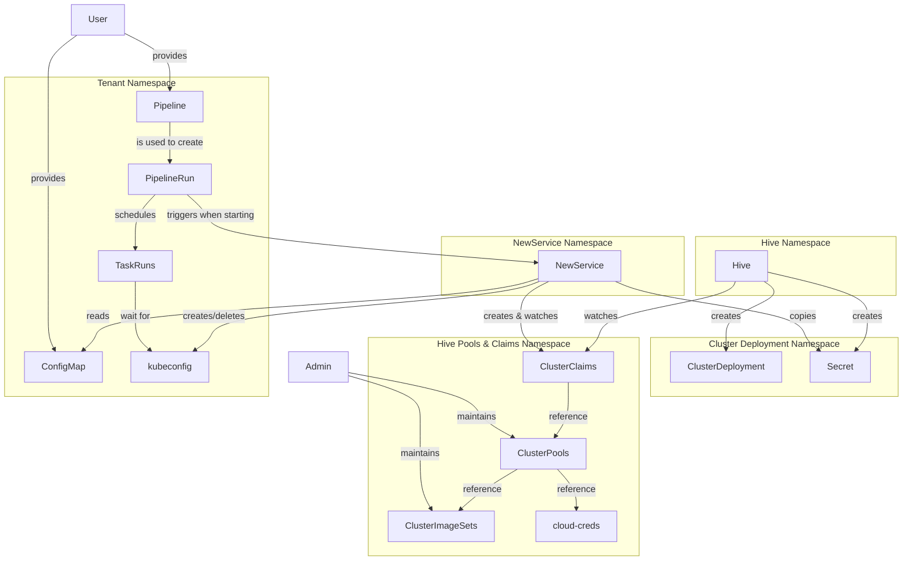

# 33. Provisioning Test Resources

Date: 2024-02-14

## Status

Accepted

Supersedes:

- [ADR 08. Environment Provisioning](0008-environment-provisioning.html)
- Environment provisioning parts of [ADR 32. Decoupling Deployment](0032-decoupling-deployment.html)

## Context

This decision clarifies how integration test environments will be dynamically provisioned. In prior
decisions it was believed that [Dynamic Resource Allocation] (DRA) would graduate out of OpenShift
TechPreview on a timeline suitable for this project. This is no longer the case and, as such, a new
approach to requesting compute resources for test pipelines is needed. DRA is still expected to
become the kubernetes-native approach to managing dynamically provisioned resources across pods.
Therefore, any interim solution should intentionally avoid introducing new barriers that might
prevent the adoption of DRA some day.

The problem of provisioning test resources/environments can be broken down into a few questions:

1. How can resources (OpenShift clusters, to start) be provisioned, efficiently, without exposing
   cloud/infra credentials to the end user?
1. How does the user declare ephemeral resources and inject their resulting secrets into
   `TaskRuns`/`Pods`?
1. How can ephemeral resources be shared across `TaskRuns`/`Pods`?

## Decision

### Cluster Provisioning

[Hive] will be used to provision OpenShift clusters. It's widely used in OpenShift CI testing,
supports hibernated cluster pools for quick (5-7m), cost-efficient, allocation and is maintained
and distributed by Red Hat on OperatorHub. [Cluster API] is an intriguing option for provisioning
Kubernetes and OpenShift clusters but expected to remain in OpenShift TechPreview throughout 2024.
It also recommends using a dedicated management cluster separate from application workloads which
creates additional infrastructure complexity.

Hive `ClusterPools` and `ClusterImageSets` will be maintained by Konflux admins (possibly with the
aid of dependabot) and deployed to a single Konflux-managed namespace. `ClusterClaims` must reside
in the same namespace as the `ClusterPools` but that's also where the cloud secrets are stored.
Furthermore, the user cannot be allowed to create claims in their tenant namespace since it will
only generate errors from Hive due to missing cluster pools. We could grant each tenant's pipeline
service account the permission to create claims in the protected namespace but that opens up an
attack surface where the pool of clusters could be starved by scripted creation of claims.
Alternatively, something else could create the claims in the protected namespace on behalf of the
user. A DRA provider would have been this actor.

### Declaring Ephemeral Resources

A `provision.konflux.dev/cluster-claims` annotation on integration `Pipelines`/`PipelineRuns` will
be used to signal the intent to create claims for ephemeral OpenShift clusters. The value of this
annotation is a reference to a `ConfigMap` in the same namespace. The `ConfigMap` keys will be used
to dynamically name certain resources. The values are `ClusterClaims` to be applied alongside the
managed `ClusterPools`.

A new controller will apply the `ClusterClaims` to the namespace containing the pools, not the
tenant's namespace. The claims must reference the predefined `ClusterPools` or the user
should expect to encounter errors (via conditions on the `PipelineRun`). The name of the
`ClusterClaim` will be replaced using the pattern `<PipelineRunName>-<ConfigMapKey>` and
additional labels/annotations may be used to keep track of the origin tenant details. The
`lifetime` of claims may be defined by the user but an upper bound can be enforced at this
layer (e.g. via a controller config or dynamically based on the timeout of the `PipelineRun`).
Hive will take care of deleting claims and their associated clusters when the lifetime has been
exceeded. Additionally, this controller may delete `ClusterClaims` as `PipelineRuns` reach
completion or get pruned/deleted.

If desired, the controller can be enhanced to support deploying additional resources at the start
of a `PipelineRun`. Take these potential annotations, for example:
* `provision.konflux.dev/resource-claims` might reference a `ConfigMap` of DRA `ResourceClaims`
* `provision.konflux.dev/capi-clusters` might reference a `ConfigMap` of Cluster API `Clusters`

It may be possible to replace this annotation approach if Tekton ever adds support for declaring DRA
`ResourceClaimTemplates` on a `Pipeline`. However, this isn't on any roadmap at the time of this
writing.

### Sharing Ephemeral Resources Across `TaskRuns`/`Pods`

The controller will also watch the status of `ClusterClaims` as they are allocated. Upon success,
the secret for the `ClusterDeployment` (containing a kubeconfig) will be copied to the tenant
namespace using the same name as the `ClusterClaim`. Using this pattern allows `Pipeline` authors to
predictably reference the secrets in its spec. The creation of the secret will unblock the execution
of `TaskRuns` trying to mount it as a volume. The controller will need to take care to remove a
copied secret when the claim expires.

DRA is also designed to solve this problem. When it becomes available, this portion of
the controller could be replaced by a resource provider which allocates `ClusterClaims` referenced
by DRA `ResourceClaimParameters`. That provider would have additional means of injecting secrets
into a `TaskRun`'s `Pod`.

### Overview



### Example

#### Managed Hive Resources
```yaml
---
apiVersion: hive.openshift.io/v1
kind: ClusterPool
metadata:
  name: openshift-latest-ga-x86
spec:
  baseDomain: #TBD
  imageSetRef:
    name: openshift-latest-ga-x86
  platform:
    aws:
      credentialsSecretRef:
        name: aws-creds
      region: us-east-1
  pullSecretRef:
    name: shared-pull-secret
  runningCount: 1
  size: 10

---
apiVersion: hive.openshift.io/v1
kind: ClusterPool
metadata:
  name: openshift-4-13-x86
spec:
  baseDomain: #TBD
  imageSetRef:
    name: openshift-4-13-x86
  platform:
    aws:
      credentialsSecretRef:
        name: aws-creds
      region: us-east-1
  pullSecretRef:
    name: shared-pull-secret
  runningCount: 0
  size: 5

---
apiVersion: hive.openshift.io/v1
kind: ClusterImageSet
metadata:
  name: openshift-latest-ga-x86
spec:
  releaseImage: quay.io/openshift-release-dev/ocp-release:4.14.0-x86_64

---
apiVersion: hive.openshift.io/v1
kind: ClusterImageSet
metadata:
  name: openshift-4-13-x86
spec:
  releaseImage: quay.io/openshift-release-dev/ocp-release:4.13.0-x86_64
```

#### Tenant Namespace Resources
```yaml
---
apiVersion: v1
kind: ConfigMap
metadata:
  name: my-cluster-claims
data:
  cluster1: |
    apiVersion: hive.openshift.io/v1
    kind: ClusterClaim
    spec:
      clusterPoolName: openshift-latest-ga-x86
      lifetime: 2h
  cluster2: |
    apiVersion: hive.openshift.io/v1
    kind: ClusterClaim
    spec:
      clusterPoolName: openshift-4-13-x86
      lifetime: 2h

---
apiVersion: tekton.dev/v1
kind: Pipeline
metadata:
  name: my-integration-pipeline
  annotations:
    provision.konflux.dev/cluster-claims: my-cluster-claims
spec:
  params:
    - name: SNAPSHOT
      type: string
      default: ""
  tasks:
    - name: task-1
      taskSpec:
        steps:
          - image: registry.access.redhat.com/ubi9
            script: "echo 'Using cluser1 claim only'"
        volumes:
          - name: kubeconfig
            secret:
              secretName: $(context.pipelineRun.name)-cluster1

    - name: task-2
      taskSpec:
        steps:
          - image: registry.access.redhat.com/ubi9
            script: "echo 'Using cluster1 and cluster2 claims'"
        volumes:
          - name: kubeconfig1
            secret:
              secretName: $(context.pipelineRun.name)-cluster1
          - name: kubeconfig2
            secret:
              secretName: $(context.pipelineRun.name)-cluster2
```

## Consequences

* A new service will be created which applies `ClusterClaims` on behalf of the end
  user when a test `PipelineRun` starts. It will also manage the lifespan of the secrets
  for provisioned resources inside the tenant namespaces.
* Konflux admins will be responsible for maintaining a set of Hive `ClusterPools` and
  `ClusterImageSets` for the end users.
* Konflux users will be granted permissions to manage `ConfigMaps` in their tenant namespaces.
* Konflux users will need to be instructed where and how to define `ClusterClaims` as well as how
  to reference their resulting secrets within a `Pipeline`.
* The Konflux UI may need to expose new condition types on `PipelineRuns` to help end users
  debug simple issues with Hive provisioning.
* Integration service will continue to be unaware of environment provisioning.

[Dynamic Resource Allocation]: https://kubernetes.io/docs/concepts/scheduling-eviction/dynamic-resource-allocation/
[Hive]: https://github.com/openshift/hive
[Cluster API]: https://cluster-api.sigs.k8s.io/introduction
