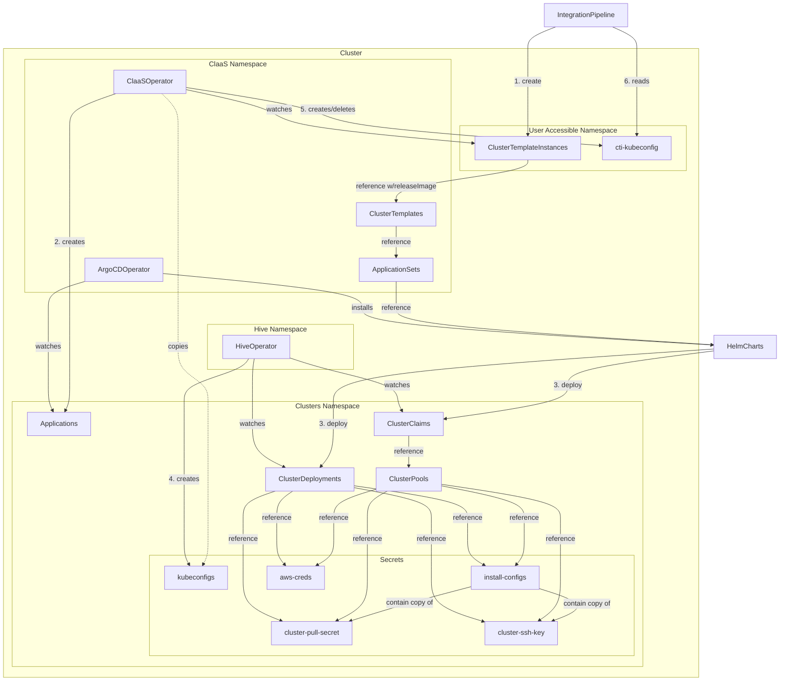
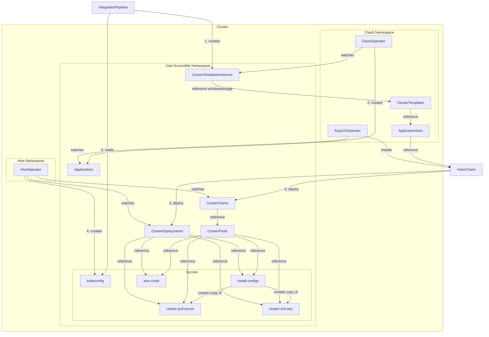
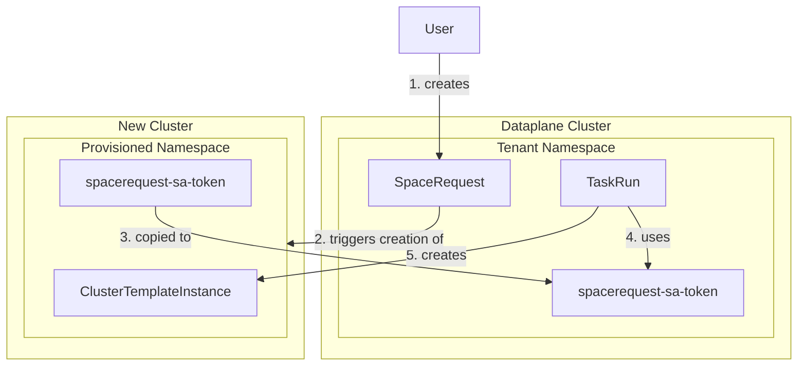

# 33. Provisioning Clusters for Integration Tests

Date: 2024-03-07

## Status

Accepted

Supersedes:

- [ADR 08. Environment Provisioning](0008-environment-provisioning.html)
- Environment provisioning parts of [ADR 32. Decoupling Deployment](0032-decoupling-deployment.html)

## Context

This decision clarifies how integration test environments will be dynamically provisioned. In prior
decisions it was believed that [Dynamic Resource Allocation] (DRA) would graduate out of OpenShift
TechPreview on a timeline suitable for this project. This is no longer the case and, as such, a new
approach to requesting compute resources for test pipelines is needed. DRA is still expected to
become the kubernetes-native approach to managing dynamically provisioned resources across pods.
Therefore, any interim solution should intentionally avoid introducing new barriers that might
prevent the adoption of DRA some day.

The problem of provisioning test resources/environments can be broken down into a few questions:

1. How can resources (OpenShift clusters, to start) be provisioned, efficiently, without exposing
   shared cloud/infra credentials to the end user?
1. In case the user requires more customization than what's provided by shared configuration, how
   can they provide their own (including infra credentials)?
1. How does the end user request resources from an integration `Pipeline`?

Provisioning of infrastructure can consume some significant compute resources itself. All possible
solutions must also account for the challenge of scalability in production.

### Cluster Provisioning

[Hive] may be used to provision OpenShift clusters. It's widely used in OpenShift CI testing,
supports hibernated cluster pools for quick (5-7m), cost-efficient, allocation and is maintained
and distributed by Red Hat on OperatorHub. Architecture support for provisioned clusters is
determined by the infra provider for which Hive supports all the most popular options. The
[scaling characteristics][HiveScaling] of Hive on a single cluster are well documented with some
known upper limits (max of ~1000 provisioned clusters per management cluster).

[Hypershift] allows for creating control planes at scale with reduced cost and provisioning time
when compared to Hive. But unlike Hive, the version of the management cluster dictates the
cluster versions which can be provisioned. For example, Hypershift deployed on top of OpenShift 4.14
only allows for requesting control planes for version 4.12-4.14. Hypershift scales better than Hive
though since the control plane is deployed as pods on worker nodes. It's currently available as
part of OpenShift TechPreview and supports deploying 64-bit x86 and 64-bit ARM `NodePools`. 

[Cluster API][CAPI] is an intriguing option for provisioning Kubernetes and OpenShift clusters but
expected to remain in OpenShift TechPreview throughout 2024. A dedicated
management cluster separate from application workloads is recommended when deploying this in
production.

The Cluster as a Service ([CaaS]) Operator provides self-service cluster provisioning using
additional guardrails like custom templates and quotas. CaaS supports [Hive] and [Hypershift] for
the cluster creation process. It uses Helm as a templating engine which makes it quite flexible.
This Operator also provides the option to apply the resources, generated from a template, to the
namespace alongside the related `ClusterTemplateInstance` or to a common namespace which is
necessary when protecting shared credentials.

## Decision

### Cluster Provisioning

We will use the ([CaaS]) Operator to orchestrate the process of provisioning OpenShift clusters.
Users will create `ClusterTemplateInstances` referencing `ClusterTemplates` which will be
maintained by Konflux admins. By default, the templates will reference infra/pull/ssh
secrets from a namespace inaccessible to the user. Templates for a "BYOC" or bring your own
credential model will be created that allow the user to provide their own secrets referenced from
their namespace. Below are a couple examples of how this could work with Hive using either
`ClusterDeployments` or `ClusterPools` with `ClusterClaims`.

#### CaaS, Hive & Shared Credentials

#### CaaS, Hive & Bring Your Own Credentials

### Scalability

The [CaaS] Operator should scale well. It hands off most workloads to ArgoCD. Even so,
there are a few good reasons to deploy CaaS, Hive and/or Hypershift on clusters separate from the
Konflux dataplane clusters:

* Hive's upper limits, once reached, are ultimately only surmountable by adding more management
  clusters.
* The tight coupling of Hypershift management cluster version to provisionable control plane
  versions suggests timely upgrades of the management cluster may be important to our end users.
  The rest of the Konflux services on the dataplane may not support as aggressive of an upgrade
  schedule.

### Access Management
  
Introducing new cluster(s) creates complexity elsewhere. A tenant needs the ability to request
access to a namespace from which they can manage select resources
(e.g. `ClusterTemplateInstances`, `Secrets`, `ClusterPools`). `SpaceRequests`, which the
user already has permission to create in their tenant namespace, can be leveraged here.
A new cluster role will be created on the `ToolchainCluster` Custom Resource to classify the
cluster(s) used for test environment provisioning. The `SpaceRequest` controller, noticing the
cluster role on the request will create the namespace on the remote cluster. It will also create a
secret in the tenant namespace containing a token for a service account with access to the remote
namespace. This secret can then be used from any `PipelineRun` workload like any other.

### Tekton Tasks

Provisioning will take place inside a Tekton PipelineRun and, more specifically, from utility
Task(s) that will handle the process of:

* Creating the `ClusterTemplateInstance` on the remote cluster using the service account token
  corresponding to the provisioned `SpaceRequest`.
* Waiting for the `ClusterTemplateInstance` to be ready.
* Collecting logs or other debug information from the provisioning process.
* Copying the secrets for the provisioned cluster and injecting them into the pipeline workspace.

## Consequences

* At least one new cluster will be created which is dedicated to the purpose of provisioning
  OpenShift clusters. The cluster will need to be registered with kubesaw using a new type of
  cluster role and include adequate monitoring to support its operation.
* The CaaS Operator along with Hive and/or Hypershift will be deployed to the new clusters.
* Users will be granted permission to manage a limited set of resources in namespaces they request
  on the new clusters.
* Users will continue to be granted create permissions for `SpaceRequests` in their tenant
  namespaces.
* New Tekton Task(s) for creating `ClusterTemplateInstances` will be created that can be added to
  a `Pipeline` with minimal effort.
* Konflux admins will be responsible for maintaining `ClusterTemplates` and the necessary secrets
  that accompany them.
* Integration service will continue to be unaware of environment provisioning.

[DRA]: https://kubernetes.io/docs/concepts/scheduling-eviction/dynamic-resource-allocation/
[Hive]: https://github.com/openshift/hive
[HiveScaling]: https://github.com/openshift/hive/blob/master/docs/scaling-hive.md
[Hypershift]: https://www.redhat.com/en/blog/multi-arch-workloads-hosted-control-planes-aws
[CAPI]: https://cluster-api.sigs.k8s.io/introduction
[CaaS]: https://github.com/stolostron/cluster-templates-operator
