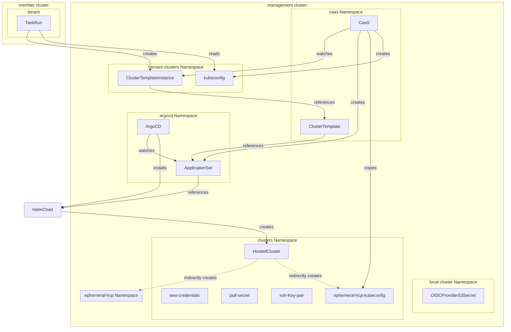

# 33. Provisioning Clusters for Integration Tests

Date: 2024-04-09

## Status

Accepted

Supersedes:

- [ADR 08. Environment Provisioning](0008-environment-provisioning.html)
- Environment provisioning parts of [ADR 32. Decoupling Deployment](0032-decoupling-deployment.html)

## Context

This decision clarifies how integration test environments will be dynamically provisioned. In prior
decisions it was believed that [Dynamic Resource Allocation] (DRA) would graduate out of OpenShift
TechPreview on a timeline suitable for this project. This is no longer the case and, as such, a new
approach to requesting compute resources for test pipelines is needed. DRA is still expected to
become the kubernetes-native approach to managing dynamically provisioned resources across pods.
Therefore, any interim solution should intentionally avoid introducing new barriers that might
prevent the adoption of DRA some day. For example, we should not build new controllers to manage the
lifespan of an ephemeral resource across a `PipelineRun`.

The problem of provisioning test resources/environments can be broken down into a few questions:

1. How can the clusters be provisioned efficiently?
2. How can shared shared cloud/infra credentials and accounts be protected from the end user?
3. In case the user requires more customization than what's provided by shared configuration, how
   can they provide their own? Depending on the provisioning tools used, this may include:
    * Cloud provider credentials (AWS, Azure, GCP, IBM cloud, etc.)
    * OpenShift image pull secrets
    * OpenShift SSH public/private keypairs
    * OIDC configuration (e.g. an AWS S3 bucket)
    * Registered public domains (e.g. in AWS Route53)
4. How does the end user request resources from an integration `Pipeline`?

Provisioning and managing ephemeral clusters can consume some significant compute resources itself.
All possible solutions must also account for the challenge of scalability in production. Tenants may
require one or more clusters to test each build of their application (e.g. multiarch). The demand
will be based on tenant build activity in addition to their individual requirements for testing.
Even with the unpredictable nature, it would not be unreasonable to expect scenarios where hundreds
or thousands of ephemeral clusters are active at a given time, especially following bursts in
build activity.

### OpenShift Cluster Provisioning

There are a number of tools which are capable of provisioning Kubernetes clusters today but only a
handful which support the creation of OpenShift clusters. This is brief breakdown of those options.

[Hive] may be used to provision OpenShift clusters. It's widely used in OpenShift CI testing,
supports hibernated cluster pools for quick (5-7m), cost-efficient, allocation, and is maintained
and distributed by Red Hat on OperatorHub. Architecture support for provisioned clusters is
determined by the cloud provider for which Hive supports some of the most popular options
(AWS, Azure, GCP, IBM Cloud, OpenStack, and vSphere). The [scaling characteristics][HiveScaling]
of Hive on a single cluster are well documented with some known upper limits (max of ~1000
provisioned clusters per management cluster).

[Hypershift] allows for creating control planes at scale with reduced cost and provisioning time
when compared to Hive. But unlike Hive, the version of the management cluster dictates the
cluster versions which can be provisioned. For example, Hypershift deployed on top of OpenShift 4.14
only allows for requesting control planes for version 4.12-4.14. Hypershift scales better than Hive
though since the control plane is deployed as pods on worker nodes of the management cluster. It's
currently available as part of OpenShift TechPreview and supports deploying 64-bit x86 and 64-bit
ARM `NodePools`. 

[Cluster API][CAPI] is an intriguing option for provisioning Kubernetes and OpenShift clusters but
expected to remain in OpenShift TechPreview throughout 2024. There's a limited set of
[providers][CAPI Providers] for OpenShift (e.g. [ROSA][CAPI ROSA]) which are currently experimental.
A dedicated management cluster separate from application workloads is recommended when deploying
this in production.

The Cluster as a Service ([CaaS]) Operator provides self-service cluster provisioning using
additional guardrails like custom templates and quotas. CaaS supports [Hive] and [Hypershift] for
the cluster creation process. It uses ArgoCD to deploy and configure the clusters with options to
leverage Helm Charts as a templating engine or any other type of `ApplicationSet` source which makes
it quite flexible. Since it doesn't contain much logic for the cluster creation process, it should
be possible to add support for Cluster API within the templates. This Operator also provides the
option to apply the resources, generated from a template, to the namespace alongside the related
`ClusterTemplateInstance` or to a common namespace which is necessary when protecting shared
credentials. The CaaS Operator may make a great candidate as an eventual DRA cluster middleware
provider where the [ClusterTemplate API] is at least partially supplanted by the [Resource API].
This is merely hypothetical, however.

## Decision

### Cluster Provisioning

We will use the ([CaaS]) Operator to orchestrate the process of provisioning OpenShift clusters.
Users will create `ClusterTemplateInstances` (CTI) via a curated Tekton task executed as part of an
integration `PipelineRun`. The CTI will be deployed to a new management cluster separate from the
member cluster. Each CTI must reference one of the `ClusterTemplates` maintained by Konflux admins.
The `ApplicationSet` source, most likely a Helm Chart, will define the schema for allowed template
parameters (e.g. OCP version, arch, etc.). By default, most templates will reference infra/pull/ssh
secrets from a namespace inaccessible to the user. Templates for a bring your own
credential/infrastructure model may be created that allow the user to provide their own secrets
referenced from their namespace.

We will prioritize templates which use Hypershift since it will be more cost effective and is
capable of providing a working cluster faster than Hive. The following diagram is a reference
architecture for the shared credentials/infrastructure model.



### Scalability

The [CaaS] Operator should scale well. It hands off most workloads to ArgoCD. Even so,
there are a few good reasons to deploy CaaS, Hive and/or Hypershift on clusters separate from the
Konflux dataplane clusters:

* Hive's upper limits, once reached, are ultimately only surmountable by adding more management
  clusters.
* The tight coupling of Hypershift management cluster version to provisionable control plane
  versions suggests timely upgrades of the management cluster may be important to our end users.
  The rest of the Konflux services on the dataplane may not support as aggressive of an upgrade
  schedule.
* When leveraging Hypershift, each hosted control plane requires a non-insignificant amount of
  [resources][Hypershift Resource Requirements]. The control planes run on the management cluster's
  worker nodes so it will be necessary to setup worker node autoscaling.

Scaling the number of management cluster(s) should be handled independently from member clusters.
While increasing the number of member clusters in a given environment may increase load on the
associated management cluster(s), it's not a linear scale. Tenant activity is the defining factor
so active monitoring of available headroom will be important. If for any reason it becomes necessary
to add more than one management cluster in an environment, this will require admin intervention.

### Access Management
  
Introducing new cluster(s) creates complexity elsewhere. A tenant needs access to a namespace
on the remote cluster within which they can manage select resources
(e.g. `ClusterTemplateInstances`, `Secrets`, `ClusterPools`).

We will either update or create [NSTemplateTiers] with the addition of a `SpaceRequest`. A new
cluster role will be created on the `ToolchainCluster` Custom Resource to classify the cluster(s)
used for test environment provisioning. The `SpaceRequest` controller, noticing the
cluster role on the request, will create the namespace on one of the remote clusters. It
will also create a secret in the tenant namespace containing credentials for a service account
with access to the remote namespace. This secret can then be used from a `PipelineRun` workload
like any other.

The user will not be allowed to completely remove the `SpaceRequest` from their workspace as the
member operator will restore it from the assigned `NSTemplateTier` if attempted.

Should a new `NSTemplateTier` be created, existing tenants can be migrated to the new tier by an
admin with a single `sandbox-cli` command. This technique can also be used for a manual approval
workflow, if desired, but the expectation is all tenants will be migrated to or placed in the new
tier by default.

```
sandbox-cli promote-user <username> <tier-name>
```

### Tekton Tasks

Provisioning will take place inside a Tekton PipelineRun and, more specifically, from utility
Task(s) committed to the [tekton-tools] repo that will handle the process of:

* Creating the `ClusterTemplateInstance` on the remote cluster using the service account token
  corresponding to the provisioned `SpaceRequest`.
* Waiting for the `ClusterTemplateInstance` to be ready.
* Collecting logs or other debug information from the provisioning process.
* Copying the secrets for the provisioned cluster and injecting them into the pipeline workspace.

## Consequences

* At least one new cluster will be created which is dedicated to the purpose of provisioning
  OpenShift clusters. The cluster will need to be registered with kubesaw using a new type of
  cluster role and include adequate monitoring to support its operation.
* It will only be possible to provision OpenShift clusters to start. Support for provisioning other
  Kubernetes distributions may follow later.
* The CaaS Operator along with Hypershift will be deployed and configured on the new cluster(s).
* Users will be granted permission to manage a limited set of resources in namespaces they own
  on the new cluster(s).
* A new point of dependency on Kubesaw is introduced.`NSTemplateTiers` and `SpaceRequests` will be
  used to grant tenants access to namespaces on the new management cluster(s).
* New Tekton Task(s) for creating `ClusterTemplateInstances` will be created that can be added to
  a `Pipeline` with minimal effort.
* Konflux admins will be responsible for maintaining `ClusterTemplates` and the necessary secrets
  that accompany them. Contributions by other community members or Konflux users will be welcome.
* Integration service will continue to be unaware of environment provisioning.

[Dynamic Resource Allocation]: https://kubernetes.io/docs/concepts/scheduling-eviction/dynamic-resource-allocation/
[Hive]: https://github.com/openshift/hive
[HiveScaling]: https://github.com/openshift/hive/blob/master/docs/scaling-hive.md
[Hypershift]: https://www.redhat.com/en/blog/multi-arch-workloads-hosted-control-planes-aws
[Hypershift Resource Requirements]: https://access.redhat.com/documentation/en-us/red_hat_advanced_cluster_management_for_kubernetes/2.9/html/clusters/cluster_mce_overview#hosted-sizing-guidance
[CAPI]: https://cluster-api.sigs.k8s.io/introduction
[CAPI Providers]: https://cluster-api.sigs.k8s.io/reference/providers
[CAPI ROSA]: https://cluster-api-aws.sigs.k8s.io/topics/rosa/index.html
[CaaS]: https://github.com/stolostron/cluster-templates-operator
[NSTemplateTiers]: https://github.com/codeready-toolchain/host-operator/tree/master/deploy/templates/nstemplatetiers
[ClusterTemplate API]: https://github.com/stolostron/cluster-templates-operator/blob/main/docs/api-reference.md
[Resource API]: https://kubernetes.io/docs/concepts/scheduling-eviction/dynamic-resource-allocation/#api
[tekton-tools]: https://github.com/redhat-appstudio/tekton-tools/
