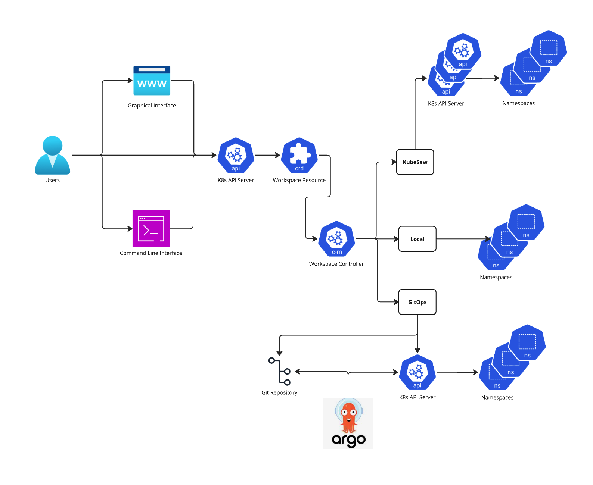

# 40. Workspace Abstraction

Date: 2024-9-26

## Status

WiP

## Context

Workspaces are being handled differently today in our community and in our downstream deployments. 

### Downstream

We have a workspace CRD defined with a controller that interfaces with KubeSaw as the NSaaS implementation.

Kubesaw provides multiple features but mainly namespace provisioning, multi-cluster placement algorithms, syncronization of tiers (Quotas, Roles, RoleBindings and ConfigMaps) and user lifecycle management.

Workspace CRD serves as an abstraction to be able to make changes to a workspace or create new workspaces for a specific users. 

This abstraction also enable Konflux to implement other features in the future like for example limmiting the amount of workspaces per user, allowing workspace delete self-service and adding workspace delete protection.

### Upstream

There is not support for multi-cluster for a single instance of Konflux. The Idea here is to require a new deployment of konflux of there is a need to scale beyond a single cluster. Therefore, there is a one to one relationship between konflux instance and k8s cluster.

With this contraint in place workspace concept can be implemented differently
We relay on the ability to create namespaces directly. Which requires access to all authenticated users to have premissions to create a namespace.

The boostrapping of the namespace created is delegate to a GitOps workflow that will automatically create an application with the necesary resources, including RoleBinding and Quotas and will continue to synch this through the lifecycle of the project.

To be able to see exisiting workspaces for a specific user, we developed a small abstraction called workspace manager, which is able to determine what namepsace have a rolebinding providing access to the current user.

There is currently no way to delete a workspace self-service. User will have to make a request to a konflux admin to delete a specific workspace

### Namespace Limitations

Kubernetes namespaces where not designed for self-service provisioning in a multi-tenant.

Access for namespace list and create operation is all namepaces or none. This affects multi-tenancy if self-service is desired.

Access to get and delete can be granted via RBAC once the namespace is created. This will required admin access which also affect self-service.

Allowing access to specific Roles or ClusterRoles via RoleBinding can be done by an Admin, also braking self-service. This is required to be able to execute Konflux actions inside the namespace.

## Decision

Introduce a workspace CRD and corresponding controller as a project of our community.

We will provide all authenticated users access to create their own workspaces within a limit.
They will also be able to update, list, get and delete only workspaces they own. 

## Consequences

Extending k8s API with the workspace concept will allow konflux user to manage their konflux workspaces in a secured, self-service manner while konflux admin can maintain multi-tenancy.

Such extention of the API that wraps namepsace has precedence, for example OpenShift apis provide a Project kind the wraps a k8s namespace.

### Additional benefit 

We can automate the bootstraping of namespaces with extra resources a konflux admin deems proper for their specific use case.

We can create exension points that enable the community to use different backends of the implementation which will include the ability to scale to multiple cluster with a single instance of Konflux.

## Konflux Workspaces Upstream Design Proposal

### Purpose

This a design proposal to represent the Konflux workspace concept long term. It aims to show how the Konflux upstream project should implement a workspace abstraction that will allow the community to select their own authentication provider as well as their own namespace provisioning backend. Three namespace provisioning backends will be presented as reference implementation but it should not be limited to those as the community will be able to extend or modify to better suit their use case.

### Glossary

Workspace: A collection of resources in a namespace that are required for Konflux secured pipelines to execute.

NSaaS: A service that provisions, bootstraps, and manages k8s namespaces.

NSaaS backend: A specific implementation of a workspace controller.

### Background

Konflux Workspaces is an abstraction for a Kubernetes namespace containing a set of predefined resources that a Konflux user needs for their secured pipeline lifecycle operation. The workspace concept was introduced by AppStudio when KCP was considering each workspace being its own virtual Kubernetes cluster, and it was later implemented via KubeSaw as a NSaaS technology used by [Developer Sandbox](https://developers.redhat.com/developer-sandbox). Today, the concept continues to be the same: each user in Konflux needs at least one namespace in some cluster where their pipeline jobs can execute.

Directly managing a namespace for a user has limitations imposed by Kubernetes.  First, Kubernetes lacks the granularity to allow a user to see only the namespaces it has access to.  If we want to only provide a list of namespace a user has access to, we will need another mechanism.  Second, we also will need to support provisioning of a namespace, which involves the creation of the namespace and populating it with the resources necessary for Konflux including but not limited to RoleBindings and Quotas.  Without any kind of secondary mechanism for this process, a user will need to understand how to do this process manually or delegate to an admin.  Finally, we will want to have support for setting specific limmits and restrictions on users, such as how many workspaces a user can create and own.  Collecting these metrics and determining violations will require some mechanism for enforcing these policies, which Kubernetes does not give us.

Given these limitations in Kubernetes, it becomes clear that we can benefit with a mechanism for abstracting workspaces from their underlying namespaces. The approach proposed here to best represent the workspace concept is to extend the kubernetes API via a new CRD. The Konflux user will be able to interact with workspaces as a resource of kubernetes. They will be able to execute all CRUD operations to manage their workspace lifecycle.

### Architecture

The workspace team has factored these limitations in while developing features on Konflux downstream by creating a layer between the Konflux User Interfaces and the KubeSaw components that provide namespace as a service (NSaaS) layer. We understand that there are multiple ways to implement a namespace provisioning service depending on the constraints of the system. Our first implementation is KubeSaw, but as we redefined some constraints on Konflux deployments, other backends for a workspace became viable. See the diagram below for the different backends that can be implemented at the moment.

#### Diagram

#### Description

The diagram depicts 3 backend implementations for the Workspace Controller: KubeSaw, Local and GitOps. All backends end up managing namespaces, their initial resources required, and connectivity between these namespaces to authenticated identities.

##### KubeSaw

This is the current implementation downstream running today in our KubeSaw deployments. It leverages the KubeSaw host operator, member operator and registration service components. It is designed to scale with multiple member cluster support. This implementation will only be possible with OpenShift clusters, since there is no vanilla support of K8S at the moment. Implementing support for non-OpenShift Kubernetes deployments is scheduled for the future.

##### Local

This implementation assumes Konflux runs in single cluster mode. It is a straightforward implementation of local namespace provisioning, bootstrapping and user allocation. It will require a workspace config object that describes the default resources to set during the bootstrapping phase.

##### GitOps

This implementation provisions the namespace in a target cluster, but the bootstrapping is delegated to a GitOps provider like ArgoCD. A new application will be spawned on the git repo and ArgoCD will track those resources and synchronize them with the cluster. This is the current approach using upstream at the moment.

### Features by backend

The table below expands with more details on the features that each backend can provide and which features will not be available.

| Feature | KubeSaw | Local | GitOps |
| :---- | :---- | :---- | :---- |
| Single-cluster | ✅ | ✅ | ⚠️ (ArgoCD) |
| Multi-cluster | ✅ | ❌ | ✅ |
| User Authentication | ⚠️ (IdP) | ⚠️ (IdP) | ⚠️ (IdP) |
| User Lifecycle | ✅ | ⚠️ (IdP) | ⚠️ (IdP) |
| Workspace Sharing | ✅ | ⚠️ (K8S) | ⚠️ (K8S) |
| Self Healing | ✅ | ❌ | ⚠️ (ArgoCD) |
| Proxying  | ✅ | ❌ | ❌ |
| Public Workspace | ✅ | ⚠️ (IdP+K8S) | ⚠️ (IdP+K8S) |
| Workspace Provisioning | ✅ | ✅ | ✅ |
| Workspace Bootstrapping | ✅ | ✅ | ⚠️ (ArgoCD) |
| Personal Workspaces | ✅ | ❌ | ❌ |
| Workspace Idling | ✅ | ❌ | ❌ |
| Multiple Workspaces | ✅ | ✅ | ✅ |
| Vanilla K8S | ❌\* | ✅ | ✅ |

\* planned for future

#### Legend

* ✅ implemented in the backend and available  
* ⚠️ available but delegated to other services  
* ❌ not available

### Pros and Cons

The following section will describe pros and cons of providing an extensible workspace abstraction layer for the Konflux upstream project.

#### Advantages

* Third Party Integration
  * Consistent API available to develop CLI tools, Graphical Interfaces and other client solutions.  
* Self-Service Automation
  * Able to represent only the namespaces assigned to a user.  
  * User’s API are decoupled from Kubernetes core concepts, e.g. Namespaces    
  * Workspace delete protection  
  * Enforcement of workspace creation limits
  * Able to validate duplicate workspaces 
* Extensible
  * Enables community to implement additional backends  
  * Multiple backends can be activated at the same time
* Advance Features
  * Enable multi-cluster support
  * Enables attribute-based dynamic backend selection  
  * Will be able to migrate workspaces between backends

#### Disadvantages

* Additional development and maintenance of K8S API and Controllers

### Future ideas

#### Attribute-based dynamic backend selection

Workspaces attributes, such as a backend-selector or requiring access to a service, can be mapped to a specific Namespace as a Service (NSaaS) backend. The chosen backend would be able to provision resources to match the attributes requested.
