# 47. GitOps Onboarding Redesign

Date: 2024-12-21

## Status

Proposed

## Context

Currently, Konflux offers two distinct onboarding paths that create friction and complexity for developers:

### UI Onboarding
- Very easy to use with good validation and feedback
- Handles secrets, build config, environments through web interface
- Provides immediate feedback but doesn't align with GitOps principles

### GitOps Onboarding
- Requires manually authoring YAML across multiple files
- Validation happens during GitLab CI runs, creating tension between Konflux and GitLab CI workflows
- Secrets must still be created via UI, breaking the GitOps flow
- Onboarding requires manual creation of complex yaml objects
- Merge conflicts are more likely in monorepos, increasing time to onboard
- CI is not under control of the namespace owner
- Users are forced to use a specific git forge that might be different than the one their apps live in

### Current Pain Points
1. **Fragmented experience**: Developers must context-switch between UI and GitOps approaches
2. **Validation delays**: Schema validation only occurs during CI runs, not locally
3. **Error-prone process**: Manual YAML authoring leads to frequent failures
4. **Monorepo complexity**: Current GitOps monorepo for tenant configuration creates CODEOWNERS management overhead
5. **UI improvement limitations**: Despite continuous improvements to the UI, many users still choose GitOps onboarding for its inherent disaster recovery and change management benefits, leaving them unable to benefit from UI enhancements

## Decision

Redesign the onboarding experience to converge UI and GitOps into a single coherent, Git-centric flow through the following architectural changes:

### Alternative Approaches Considered

**Improving the existing UI** was considered but rejected because:
- Despite continuous UI improvements, many users still choose GitOps onboarding for its inherent disaster recovery and change management benefits
- UI enhancements don't address the fundamental issue of maintaining two separate onboarding flows
- Users who prefer GitOps principles cannot benefit from UI improvements, creating a permanent split in the user experience

**Chosen approach** replaces both current flows with a unified Git-centric solution that preserves GitOps benefits while providing the usability improvements users expect.

### Core Shift
- **Replace UI configuration** with a VS Code plugin for onboarding and editing
- **Use local schema validation**, linting, and previews to reduce onboarding errors
- **Use Git as the single source of truth** for applications, components, integration test scenarios, releasePlans and RBAC
- **Preserve the UI for non-configuration activities** including:
  - Monitoring and observability: logs, build inspection, viewing metrics, dashboards
  - Operational actions: triggering builds/tests, starting manual releases, pipeline management
  - Any other runtime actions that don't involve declarative resource configuration
- **Commit to single onboarding flow**: UI-based onboarding will be completely deprecated with no fallback option to minimize maintenance overhead and deliver optimal user outcomes

### IDE Selection Rationale
VS Code was chosen as the primary IDE target because:
- **Wide adoption**: VS Code is extensively used across development teams
- **Robust plugin ecosystem**: Provides comprehensive APIs for linting, schema validation, and custom tooling
- **Advanced visualization capabilities**: Plugin system supports rich visualizations and can run full, sandboxed React-based applications within webview windows
- **Extensibility**: Enables building sophisticated onboarding wizards and configuration interfaces directly within the familiar IDE environment

### Component Architecture

| Component | Role |
|-----------|------|
| VS Code Plugin | Main interface for onboarding and configuration |
| Git Repos | Source of truth for Konflux config |
| Tenant Registration Service | API for one-time registration of GitOps repos as tenants |
| ArgoCD Service | **New core service** for continuous GitOps sync and deployment |
| Konflux UI | Monitoring, runtime insights, and operational actions (non-configuration) |

### VS Code Plugin Design

**Core Features:**
- Forms and wizards to scaffold and edit YAML objects
- Built-in schema-aware YAML editor
- Linting and validation against Konflux schemas
- Git-aware diff view and PR-ready commit generation
- Optional: preview pipeline graph / dependency resolution

**GitOps Flow:**
1. Developer creates an empty git repo with Github, Gitlab, etc.
4. **If first time**: Uses wizard to register repo with Tenant Registration Service (declares namespace name, configures ArgoCD)
5. Developer opens repo in VS Code
3. Launches Konflux plugin and uses it to configure new components, tests, releasePlans
6. Plugin generates YAML objects in repo
7. Developer commits and pushes code (optionally via PR, with CI,reviews etc.)
9. ArgoCD automatically syncs merged changes to the namespace

### Multi-Repo GitOps Model & Tenant Registration Service

**Tenant Registration Service:**
Konflux will introduce a new **Tenant Registration Service** API that manages the registration and lifecycle of GitOps repositories as first-class tenants.

**Tenant Model:**
- **Tenant Definition**: A tenant is equivalent to a Kubernetes namespace
- **1:1 Mapping**: Each GitOps repository maps to exactly one Kubernetes namespace
- **Namespace Declaration**: The namespace name is a parameter to the registration service. Once the repo is registered, the namespace it is immutable.
- **Registration Immutability**: Re-registering the same repo is rejected to prevent namespace conflicts

**Resource Scope:**
- **Multi-Resource Support**: One GitOps repo can contain multiple applications, components, integrationTestScenarios, and releasePlans
- **Single Namespace Constraint**: All resources from a GitOps repo deploy to its designated namespace only
- **No Cross-Namespace Interaction**: Changes affecting N namespaces require changes in N separate GitOps repos

**Registration Process:**
1. Team registers GitOps repo via VS Code plugin, CLI (`konflux register`), or UI
2. at registration time the desired namespace name is provided to (UI | API)
3. Tenant Registration Service validates the repo and reads the declared namespace name
4. Service provisions the new requested Kubernetes namespace
6. Service configures ArgoCD to monitor the repo for continuous deployment
7. ArgoCD continuously syncs changes from the repo to the namespace

**ArgoCD as New Core Service:**
Konflux does not currently run ArgoCD, so this will be introduced as a new core service to handle continuous GitOps synchronization. The Tenant Registration Service is used only once per repo for initial setup, while ArgoCD handles all ongoing deployment activities.

**Key Principles:**
- **Team Autonomy**: Each team owns their GitOps repo and corresponding namespace
- **Simplified Management**: Eliminates complex CODEOWNERS management in monorepos
- **Environment Agnostic**: Environments are not a concept in Konflux-CI; teams manage environment separation through their own repo organization

The following diagram illustrates the relationship between GitOps repositories, namespaces, and Konflux resources:

```mermaid
graph TD
    subgraph "Team"
        Repo["📁 GitOps Repo<br/>github.com/team/config"]
    end
    
    subgraph "Konflux"
        TRS["🏗️ Tenant Registration Service<br/>• Validates repo<br/>• Provisions namespace<br/>• Configures ArgoCD"]
        
        NS["🎯 Namespace: team-prod<br/>(declared in repo)"]
        
        ArgoCD["🔄 ArgoCD Service<br/>(New Core Service)<br/>• Continuous sync<br/>• Propagates changes<br/>• Monitors repo"]
    end
    
    Repo -.->|"One-time registration"| TRS
    TRS -.->|"Creates"| NS
    TRS -.->|"Configures"| ArgoCD
    
    Repo -->|"Continuous sync"| ArgoCD
    ArgoCD -->|"Deploys resources"| NS
    
    classDef repoStyle fill:#1976d2,stroke:#0d47a1,stroke-width:2px,color:#fff
    classDef nsStyle fill:#7b1fa2,stroke:#4a148c,stroke-width:2px,color:#fff
    classDef serviceStyle fill:#f57c00,stroke:#e65100,stroke-width:2px,color:#fff
    classDef newServiceStyle fill:#d32f2f,stroke:#b71c1c,stroke-width:2px,color:#fff
    
    class Repo repoStyle
    class NS nsStyle
    class TRS serviceStyle
    class ArgoCD newServiceStyle
```

**Key Relationships:**
- **One-Time Registration**: Tenant Registration Service is used once per repo to create namespace and configure ArgoCD
- **Continuous Sync**: ArgoCD (new core service) continuously propagates changes from repo to namespace
- **1:1 Mapping**: Each GitOps repo maps to exactly one namespace
- **Immutable Names**: Namespace names are declared in the repo and cannot change
- **Single Deployment Target**: All resources from one repo deploy to one namespace
- **No Cross-Namespace Resources**: Each team's resources are isolated within their own namespace

### CI/Validation Design

- Introduce a Konflux CLI validator (or GitHub Action) for local + CI use
- Validates schema, references, build logic statically
- Same validator embedded in VS Code plugin
- Optional: Plugin lints against live cluster (e.g., available build agents)

### UI Changes

**Preserve:**
- Dashboard
- Build and release logs
- Observability / metrics
- Operational actions: triggering builds/tests, starting manual releases, pipeline management

**Remove/Demote:**
- UI forms for configuring components, applications, and other declarative resources

## Consequences

### Positive Consequences

1. **Unified Developer Experience**: Single Git-centric flow eliminates context switching between UI and GitOps
2. **Faster Onboarding**: Local validation reduces time-to-merge for onboarding PRs
3. **Clear Tenant Model**: 1:1 mapping between GitOps repos and namespaces provides clear ownership and boundaries
4. **Improved Team Autonomy**: Multi-repo model allows teams to own their GitOps repositories and corresponding namespaces
5. **Better IDE Integration**: Leverages familiar VS Code tooling and workflows
6. **True GitOps Automation**: ArgoCD provides industry-standard continuous deployment with automatic drift detection and reconciliation
7. **Maintained GitOps Benefits**: Preserves disaster recovery, change history, and automation capabilities

### Negative Consequences

1. **Tool Dependency**: Requires VS Code and plugin installation for optimal experience
2. **Learning Curve**: Developers must adapt to new plugin-based workflow
3. **Development Overhead**: Requires building and maintaining VS Code plugin and Tenant Registration Service
4. **New Core Service**: ArgoCD must be introduced as a new core service in Konflux
5. **Migration Complexity**: Existing users must migrate from current UI/GitOps hybrid approach

### Risks and Mitigations

1. **Plugin Adoption**: Risk of low adoption if plugin is complex or unreliable
   - Mitigation: Provide CLI fallback and comprehensive documentation
2. **Schema Validation**: Local validation may diverge from server-side validation
   - Mitigation: Use same validation logic in plugin and CI
3. **No Rollback Option**: Once UI-based onboarding is deprecated, there is no fallback to the previous approach
   - Mitigation: Ensure thorough testing and gradual rollout with comprehensive user training and documentation

### Open Questions

No open questions at this time.

### Migration Path

1. **Phase 1**: Develop VS Code plugin with local validation
2. **Phase 2**: Implement ArgoCD as core service and Tenant Registration Service
3. **Phase 3**: Implement multi-repo GitOps support with ArgoCD integration
4. **Phase 4**: Migrate existing users and fully deprecate UI configuration flows
5. **Phase 5**: Remove deprecated UI configuration components

**Note**: Once the GitOps approach is implemented, the UI-based onboarding will be completely deprecated with no fallback option. This decision prioritizes streamlining to a single onboarding flow to minimize maintenance overhead and deliver the best user outcomes.

## References

No external references at this time. 
