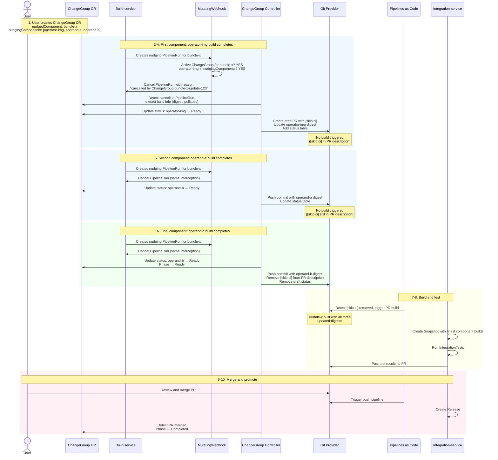

# 59. Orchestrated Component Rebuilds

* Date: 2026-02-12

## Status

Proposed

## Context

[ADR 29: Component Dependencies](https://github.com/konflux-ci/architecture/blob/main/ADR/0029-component-dependencies.md) introduced the `build-nudges-ref` mechanism, where builds of **nudging** components propagate digest references to **nudged** components via PRs. This works well for simple dependency chains, but creates significant problems in many-to-one nudging scenarios.

Consider an OLM operator with 30 operator/operand images (nudging components) and one bundle image (nudged component). When all 30 images are affected by the same change (e.g., a UBI CVE fix), the current behavior is:

1. Each operator/operand image rebuild triggers build-service to create a separate nudging PipelineRun for the bundle
2. Each PipelineRun creates a separate PR updating the bundle's digest references
3. The bundle is rebuilt and tested 30 times — one for each nudging PR merge
4. Only the final bundle build (containing all 30 updated digests) is the desired end state; the first 29 builds are immediately superseded

This produces two problems:

- **Resource waste**: 29 out of 30 bundle builds are unnecessary, consuming compute resources and CI pipeline capacity
- **Inconsistent state**: If any operator/operand image PR fails, the bundle is left in a partially updated state with no easy way to identify which updates succeeded and which did not

While OLM operators are the primary motivating example, this problem applies to any many-to-one nudging scenario — including common parent images with multiple child images, monorepo setups, or any dependency structure where multiple components nudge a single target via `build-nudges-ref`.

The feature refinement for this problem is documented in [KONFLUX-8243](https://issues.redhat.com/browse/KONFLUX-8243). This ADR describes the implementation design.

## Decision

### New Custom Resource: ChangeGroup

A new Kubernetes Custom Resource called **ChangeGroup** provides repository-level control of component nudging and orchestrated updates. It integrates with the existing `build-nudges-ref` mechanism defined in [ADR 29](https://github.com/konflux-ci/architecture/blob/main/ADR/0029-component-dependencies.md).

**Note on naming**: The name `ChangeGroup` is intentionally generic to allow future extension beyond component nudging scenarios. If you have a better name suggestion, please propose it.

```yaml
apiVersion: appstudio.redhat.com/v1alpha1
kind: ChangeGroup
metadata:
  name: bundle-x-update-123
  namespace: my-tenant
spec:
  nudgedComponent: bundle-x  # The component that will be nudged (bundle image)
  nudgingComponents:  # Operator and/or operand images that nudge the bundle
    - name: operator-image
    - name: operand-a
    - name: operand-b
  # Optional: Timeout configuration
  timeout: 24h  # Cancel if not complete within 24 hours

status:
  phase: Waiting  # Initialized | Waiting | Ready | Completed | Cancelled | Failed
  pullRequestURL: https://github.com/org/bundle-repo/pull/123
  startTime: "2025-01-15T10:28:00Z"
  readyTime: ""  # When all components became ready
  completionTime: ""  # When PR was merged or cancelled

  # components is auto-populated by the controller at CR creation time
  # originalBuild is set from the Component CR's latest successful promoted build
  components:
    - name: operator-image
      originalBuild: sha256:abc123...
      newBuild: sha256:xyz789...
      newBuildPullSpec: quay.io/org/operator-image@sha256:xyz789...
      state: Ready
      lastUpdateTime: "2025-01-15T10:30:00Z"
      buildPipelineRun: operator-image-nudging-abc123  # Reference to the PipelineRun
    - name: operand-a
      originalBuild: sha256:def456...
      newBuild: sha256:uvw012...
      newBuildPullSpec: quay.io/org/operand-a@sha256:uvw012...
      state: Ready
      lastUpdateTime: "2025-01-15T10:32:00Z"
      buildPipelineRun: operand-a-nudging-def456
    - name: operand-b
      originalBuild: sha256:ghi789...
      newBuild: ""
      newBuildPullSpec: ""
      state: Waiting
      lastUpdateTime: ""
      buildPipelineRun: ""

  conditions:
    - type: AllComponentsReady
      status: "False"
      reason: WaitingForComponents
      message: "Waiting for 1 component: operand-b"
      lastTransitionTime: "2025-01-15T10:32:00Z"
```

**CR creation behavior**:
- The spec does **not** include original build digests — these are populated automatically by the controller in `status.components[].originalBuild` at CR creation time, using the digest from each nudging component's latest successful promoted build (retrieved from the Component CR)
- If no nudging components are specified, all components that have `build-nudges-ref` pointing to the nudged component are included automatically, and the spec is updated by the controller

### MutatingWebhook: Intercepting Nudging PipelineRuns

Build-service is **not modified**. It continues to create nudging PipelineRuns exactly as it does today per [ADR 29](https://github.com/konflux-ci/architecture/blob/main/ADR/0029-component-dependencies.md). A **MutatingWebhook** intercepts nudging PipelineRun creation at admission time and decides whether the PipelineRun should proceed or be cancelled.

When build-service creates a nudging PipelineRun:
1. The **MutatingWebhook** intercepts the PipelineRun creation request
2. The webhook checks: "Does the nudged component (target of this PipelineRun) have an active ChangeGroup?"
3. The webhook checks: "Is the nudging component (source of this PipelineRun) listed in the ChangeGroup's nudging component list?"
4. If YES to both:
   - The webhook **cancels the PipelineRun** by mutating it (e.g., setting `spec.status` to cancel)
   - The PipelineRun is annotated with the reason for cancellation, including which ChangeGroup CR triggered it
   - The **ChangeGroup controller** detects the cancelled PipelineRun, extracts the build information (new image digest), and updates the ChangeGroup CR's status accordingly
   - The controller then creates or updates the PR as needed
5. If NO (no active ChangeGroup exists, or this component is not in the ChangeGroup):
   - The webhook **does not modify** the PipelineRun — it proceeds normally, and build-service nudging behavior is unchanged

**Example**:
- Operator-image-a has `build-nudges-ref: ["bundle-x"]` (configured on Component CR)
- Operator-image-a build completes
- Build-service creates a nudging PipelineRun targeting bundle-x (normal behavior, unchanged)
- MutatingWebhook intercepts: Does bundle-x have an active ChangeGroup? → YES
- MutatingWebhook checks: Is operator-image-a in that ChangeGroup's nudging component list? → YES
- MutatingWebhook: Cancels the PipelineRun with reason "cancelled by ChangeGroup bundle-x-update-123"
- ChangeGroup controller: Detects the cancelled PipelineRun, extracts build info, updates CR and PR

**Note on future architecture**: This document describes the current state where build-service creates dedicated nudging PipelineRuns. There is a plan to move nudging to integration-service (see [ADR 56](https://github.com/konflux-ci/architecture/blob/main/ADR/0056-revised-component-model.md)). The MutatingWebhook approach works as long as nudging continues to use dedicated PipelineRuns — the webhook is agnostic to which service creates them. However, if integration-service embeds nudging as a step within its existing integration PipelineRun (rather than creating a separate PipelineRun), the MutatingWebhook approach would not work — cancelling the entire integration PipelineRun would disrupt other steps (testing, promotion, etc.) that are unrelated to nudging. In that scenario, the interception mechanism would need to be revisited (e.g., integration-service could check for active ChangeGroups directly before performing the nudge). This should be coordinated with the integration-service team as the ADR 56 transition progresses.

### ChangeGroup Controller

The ChangeGroup controller is a new standalone controller responsible for:
- Watching ChangeGroup CRs for status changes
- Detecting cancelled nudging PipelineRuns (cancelled by the webhook) and extracting build information (image digest, pullspec)
- Updating ChangeGroup CR status with new build references
- Creating and managing PRs (marked as draft) on nudged component repositories
- Managing `[skip ci]` in PR descriptions to prevent intermediate builds
- Updating PR descriptions with component status tables
- Removing `[skip ci]` from PR description and removing draft status when all components are ready
- Handling manual interventions (PR closed, merged, or modified)

### Detailed Service Interaction Flow



### Pull Request Management

When the **first** nudging component becomes ready:
1. The ChangeGroup controller creates a **PR** to the nudged component repository
2. The PR is marked as **draft** as a visual indicator that it is not ready for review
3. The PR description includes `[skip ci]` to prevent Pipelines as Code from triggering the build pipeline (note: draft status alone does NOT prevent PaC from triggering builds — see [Preventing Intermediate Builds](#preventing-intermediate-builds-with-skip-ci) below)
4. The PR includes:
   - Updates for the ready component(s)
   - A status table in the PR description showing all components and their states
   - A link to the ChangeGroup CR for detailed status
5. The ChangeGroup status is updated with the PR URL

Example PR description:
```markdown
## Orchestrated Component Update

This PR is managed by ChangeGroup `bundle-x-update-123`.

### Component Status

| Image          | Current       | New           | State      | Last Updated |
|----------------|---------------|---------------|------------|--------------|
| operator-image | sha256:abc123 | sha256:xyz789 | ✅ Ready   | 10:30:00 UTC |
| operand-a      | sha256:def456 | sha256:uvw012 | ✅ Ready   | 10:32:00 UTC |
| operand-b      | sha256:ghi789 |               | ⏳ Waiting |              |

[skip ci]

This PR will remain in draft until all components are ready or until manually marked as ready for review. The `[skip ci]` directive above prevents PaC from triggering builds until it is removed.

[View ChangeGroup](link-to-konflux-ui/changegroup/bundle-x-update-123)
```

### Incremental Updates to the PR

When subsequent nudging components become ready:
1. Build-service creates a nudging PipelineRun → the MutatingWebhook cancels it (same interception as above) → the controller detects the cancelled PipelineRun and updates the ChangeGroup CR with the new build reference
2. The ChangeGroup controller watches for CR updates and:
   - Force pushes a commit to the PR, the commit include the previous and new component's image digest changes (no build is triggered because the PR description still contains `[skip ci]`)
   - Updates the status table in the PR description to reflect current component states

### Handling Incremental Updates to the Same Component

When a component that is already in "Ready" state receives additional updates (e.g., operator-image has builds A0 → A1 → A2 → A3 while other components are still building):

- **Behavior**: Each new build **replaces** the previous one in the ChangeGroup
- The PR is updated with the latest build reference (no build triggered because the PR description contains `[skip ci]`)
- The status table shows the most recent build

**Rationale**: Later builds should include all changes from earlier builds. This ensures the final PR always references the most current builds without becoming stale. The component remains in "Ready" state, but with updated build references.

**Example Flow** (using OLM operator with operator-img, operand-a, operand-b nudging bundle-x):
```
Initial State (ChangeGroup created):
  operator-img: img0      | Waiting
  operand-a:    opa0      | Waiting
  operand-b:    opb0      | Waiting

After operator-img rebuild completes:
  operator-img: img0 → img1 | Ready (draft PR created, description has [skip ci])
  operand-a:    opa0        | Waiting
  operand-b:    opb0        | Waiting

After operand-a rebuild completes:
  operator-img: img0 → img1 | Ready (PR updated with operand-a digest)
  operand-a:    opa0 → opa1 | Ready
  operand-b:    opb0        | Waiting

After operator-img rebuilds again (incremental update):
  operator-img: img0 → img2 | Ready (img1 superseded, PR updated)
  operand-a:    opa0 → opa1 | Ready
  operand-b:    opb0        | Waiting

After operand-b rebuild completes:
  operator-img: img0 → img2 | Ready
  operand-a:    opa0 → opa1 | Ready
  operand-b:    opb0 → opb1 | Ready ([skip ci] removed from description, draft removed)
```

### Finalizing the Update

When **all** nudging components are ready:
1. The ChangeGroup controller removes `[skip ci]` from the PR description, which allows PaC to trigger the build pipeline on the PR update event
2. The controller removes the draft status from the PR (signaling to developers that it is ready for review)
3. The ChangeGroup phase transitions to "Ready"
4. Developers can review and merge the PR following their normal workflow

**Integration with testing workflow**: Once the final build pipeline completes:
- **Integration-service** will create a Snapshot containing all components in the application (including all nudging components and the newly built nudged component)
- Integration tests run against this Snapshot
- If tests pass and the PR is merged, integration-service promotes the new component builds to the Global Candidate List (GCL) per [ADR 36](https://github.com/konflux-ci/architecture/blob/main/ADR/0036-integration-service-promotes-to-GCL-immediately.md)

### Manual Intervention

Developers can manually intervene at any time:
- **Force-trigger build early**: If a developer wants to proceed without waiting for all components (e.g., one component is blocked), they can remove `[skip ci]` from the PR description and remove the draft status. This will trigger the build pipeline with whatever components are currently ready.
- **Close the PR**: The controller will detect this and update the ChangeGroup status to "Cancelled"
- **Merge the PR**: The controller will detect this and update the ChangeGroup status to "Completed"
- **Edit the ChangeGroup CR**: Developers can remove nudging components from the waiting list or cancel the entire ChangeGroup

**Implementation note**: The controller must check the PR state before making updates. If the PR has been closed, merged, or manually modified by a developer, subsequent automated updates will be skipped. If `rebase` is checked in PR description, the controller can force push to update the PR even though the PR has manual updates, but that means all manual updates will be discarded.

### Preventing Intermediate Builds with `[skip ci]`

**Challenge**: Pipelines as Code (PaC) currently triggers PR build pipelines for all PR events, **including draft PRs**. There is no built-in PaC configuration to skip builds for draft PRs. This means draft PR status alone is insufficient to prevent intermediate builds.

**Solution**: The ChangeGroup controller includes `[skip ci]` in the **PR/MR description** when creating the PR. PaC checks the PR description for the `[skip ci]` directive and skips triggering the build pipeline when it is present. When all nudging components are ready, the controller removes `[skip ci]` from the PR description, which allows PaC to trigger the build on the next PR event.

The workflow is:

1. **PR creation and intermediate updates** (while waiting for components): PR description contains `[skip ci]` → PaC does not trigger a build
2. **All components ready**: Controller removes `[skip ci]` from the PR description → PaC triggers the build pipeline normally

**Draft status** is used purely as a **visual indicator** for developers, signaling that the PR is not yet ready for review or merge. It does not control build pipeline behavior.

**PaC dependency**: At the time of writing, PaC does not yet support detecting `[skip ci]` in PR/MR descriptions. PaC does support `[skip ci]` in commit messages, but that approach is less flexible. Adding support for `[skip ci]` in PR descriptions to PaC is a **prerequisite** for this feature. This should be coordinated with the PaC team.

**Platform considerations**:

- **GitHub**: Draft PRs are supported natively. The controller marks the PR as draft when creating it and removes draft status when all components are ready.
- **GitLab**: Implements draft status via title prefix (e.g., `Draft: ...`). The controller must manage title prefixes, and rebasing operations must preserve or restore the prefix.

**Why not `[skip ci]` in commit messages?**

PaC already supports `[skip ci]` in commit messages, but this approach is problematic for the ChangeGroup workflow:

- **Manual intervention requires force push**: To trigger a build early, a user would need to modify and force push the commit without `[skip ci]` to the PR branch. This force push counts as a manual modification to the PR, which by default prevents the ChangeGroup controller from making further automated updates (to avoid overwriting user changes). This creates a conflict: the user wants to trigger one early build but still allow the controller to continue updating the PR as remaining components complete.
- **Less flexible**: The PR description can be updated independently of git history, making it a better control surface for both automation and manual intervention.

**Other alternative approaches** (for future consideration):
- **Label-based filtering**: PaC's `on-cel-expression` could potentially be configured to ignore PRs with a specific label (e.g., `skip-build`), though this has not been validated and would require users to update their build pipeline definitions
- **Event payload filtering**: PaC's CEL expression matching may be able to check for the draft PR flag in the event payload, which would avoid the race condition inherent in label-based approaches

**Fallback**: If PaC support for `[skip ci]` in PR descriptions is not available in time, `[skip ci]` in commit messages can be used as an interim solution, with the caveat that manual intervention (removing `[skip ci]` via force push) will block further automated PR updates unless the user also signals the controller to resume (e.g., by checking the `rebase` checkbox in the PR description). Alternatively, if neither approach is available, intermediate builds would be triggered but are functionally harmless — the status table in the PR description serves as the primary progress indicator and developers can track the actual readiness state via the PR description. This trades some resource efficiency for implementation simplicity.

### Integration with Existing Services

**Build-service**: Completely unchanged — continues to create nudging PipelineRuns as it does today. The MutatingWebhook transparently intercepts nudging PipelineRuns at admission time. If no ChangeGroup matches the nudging PipelineRun, the webhook does not modify it and build-service behaves exactly as before.

**Integration-service**: No changes needed. When the bundle PR build completes, integration-service creates a Snapshot with the application's latest component builds as normal. Integration-service handles promotion to GCL per [ADR 37](https://github.com/konflux-ci/architecture/blob/main/ADR/0037-integration-service-promotes-to-GCL-immediately.md).

**Component CRs**: ChangeGroup references must align with existing Component `build-nudges-ref` declarations. Nudging components in a ChangeGroup must have `build-nudges-ref` pointing to the nudged component.

### Alignment with Component Groups (Future)

The ongoing architectural transition to Component Groups ([ADR 56](https://github.com/konflux-ci/architecture/blob/main/ADR/0056-revised-component-model.md)) presents an opportunity to align ChangeGroup with the new model:

1. **Current Model (Application/Component)**:
   - ChangeGroup references Component names within an Application namespace
   - Works with existing `build-nudges-ref` annotations on Component CRs
   - Scoped to Applications (as defined in ADR 29)

2. **Future Model (Component Groups/Component Versions)**:
   - ChangeGroup can reference Component Versions instead of Components
   - Multiple Component Versions of the same Component can be orchestrated separately
   - Component Groups naturally represent release structures — ChangeGroup could orchestrate updates within a Group
   - The concept of nudging may move to integration test pipelines — ChangeGroup design should accommodate this potential change

3. **Design considerations**:
   - Use flexible naming in the CR spec (e.g., `nudgingComponents` can refer to either Component names or Component Version names)
   - Ensure the ChangeGroup controller can be updated to work with both models during the transition period

## Consequences

### Positive

- **Reduced builds**: For a bundle with N operator/operand images, bundle builds are reduced from N to 1 per orchestrated update — a significant reduction in compute resource consumption and CI pipeline capacity
- **Single PR**: Instead of N separate nudging PRs, a single orchestrated PR collects all digest updates, reducing notification spam and simplifying the review workflow
- **Better UX**: The PR status table and ChangeGroup CR provide clear visibility into which components are ready, which are pending, and what the overall orchestration status is
- **No build-service changes**: The MutatingWebhook approach means build-service continues to function without any modification — the orchestration layer is entirely additive
- **Opt-in and backwards compatible**: Existing workflows are unaffected; only components with an active ChangeGroup are orchestrated
- **Manual override**: Developers retain full control and can force-trigger builds, close PRs, or modify the CR at any time

### Negative

- **New components to deploy and maintain**: The MutatingWebhook and ChangeGroup controller are new standalone components that must be deployed, monitored, and maintained
- **PaC dependency**: The `[skip ci]` in PR description feature requires coordination with and a change to PaC; until that support is available, a fallback approach (commit message `[skip ci]` or accepting intermediate builds) is needed
- **Webhook latency**: The MutatingWebhook adds a small amount of latency to nudging PipelineRun creation requests since the webhook must check for active ChangeGroups
- **Complexity in edge cases**: Incremental updates to the same component, manual interventions, and concurrent ChangeGroup CRs for the same nudged component introduce complexity that must be handled correctly

### Downstream Effects

- **Pipelines as Code**: Requires a new feature to support `[skip ci]` in PR/MR descriptions
- **Konflux UI**: Should be updated to display and manage ChangeGroup resources
- **User documentation**: New documentation is needed for creating and managing ChangeGroup CRs, understanding draft PR workflows, and manual intervention procedures

## References

- [ADR 29: Component Dependencies](https://github.com/konflux-ci/architecture/blob/main/ADR/0029-component-dependencies.md) — the existing `build-nudges-ref` nudging mechanism
- [ADR 56: Revised Component Model](https://github.com/konflux-ci/architecture/blob/main/ADR/0056-revised-component-model.md) — Component Groups and the future of nudging
- [KONFLUX-8243](https://issues.redhat.com/browse/KONFLUX-8243) — Feature request: Orchestrated Component Rebuilds
- [KFLUXSPRT-2432](https://issues.redhat.com/browse/KFLUXSPRT-2432) — Status of many-to-one nudging for bundles
