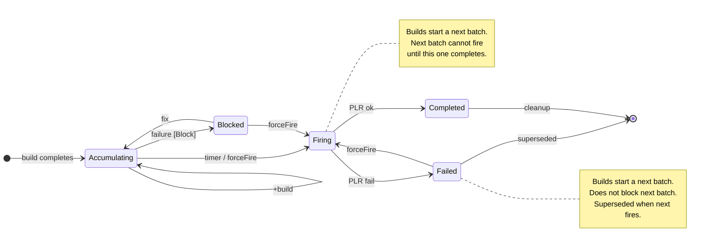

# 72. Batched Nudging for Many-to-One Component Dependencies

Date: 2026-07-19

## Status

Proposed

Builds upon [ADR 67. Nudging Relationship Storage via Singleton CRD](0067-nudging-relationship-singleton-crd.md).
Implements the "batched nudging for operator bundles" phase deferred by
ADR 67.

## Context

When multiple nudging components all point to the same nudged component
(many-to-one), every upstream build fires an independent nudge. This
creates a cascade of redundant downstream rebuilds, integration tests,
and releases.

**Concrete example:** An OLM operator with 30 operand images and one
bundle. All operand images declare `build-nudges-ref` (or NudgeConfig
edges) to the bundle. When a UBI CVE triggers rebuilds of all 30
operands, the bundle is rebuilt 30 times. Only the final rebuild
contains all 30 updated digests -- the first 29 are immediately
superseded.

**Impact at scale:**
- **Resource waste:** 29 unnecessary Renovate PipelineRuns + 29 bundle
  builds + 29 integration test suites + 29 potential releases. Each
  PipelineRun consumes 10-50 KB of etcd storage and cluster compute.
- **Inconsistent state:** If any operand build fails, the bundle ends up
  in a partially updated state with no mechanism to detect or remediate
  the partial update.
- **Notification spam:** Users receive 30 sets of build/test/release
  notifications for what is logically one event.

### Current Architecture

[ADR 67](0067-nudging-relationship-singleton-crd.md)
introduced the `NudgeConfig` singleton CRD and migrated nudging
orchestration from build-service to integration-service. It defines two
modes:

- **`immediate`** -- nudge fires when the source build PipelineRun
  succeeds (current default, replicating ADR 29 behavior).
- **`validated`** -- nudge fires after the gating ComponentGroup's
  Snapshot passes integration tests (Phase 2 of ADR 67).

### Constraints

- **etcd pressure.** The Konflux infrastructure team has identified etcd
  as the primary scaling bottleneck. This design must not introduce new
  CRDs or per-batch objects. All state lives in the existing NudgeConfig
  status.
- **Pruner compatibility.** Tekton PipelineRuns are pruned after
  completion. Batch state must be captured before pruning occurs.
- **Trigger-agnostic.** The solution must work regardless of what
  triggered the upstream builds (MintMaker CVE updates, user-initiated
  changes, or any other source).

### Alternatives Considered

#### Orchestrator Pipeline (Matrix + fan-in)

Changes the build model. Today, PaC triggers builds per git event. An
orchestrator pipeline would need to own build triggering, conflicting
with PaC. Also doesn't handle independently-arriving builds.

#### Debounce at the Renovate/PR level

Renovate already supports branch reuse (`build-nudge-simple-branch`), so
multiple nudges update the same PR. But each PR update still triggers a
rebuild of the nudged component. This reduces PR spam but not build spam.

#### MintMaker-initiated explicit grouping

Only works for MintMaker-initiated changes. The user requirement is
trigger-agnostic. Also requires MintMaker to propagate group metadata
through PaC to PipelineRuns, which PaC doesn't natively support.

#### ChangeGroup CR ([ADR PR #308](https://github.com/konflux-ci/architecture/pull/308))

Detailed proposal using a MutatingWebhook to intercept nudge
PipelineRuns, a ChangeGroup CR to track membership, and `[skip ci]` on
draft PRs. The debounce approach is preferred for several reasons:

1. **CVE-centric design** -- the ChangeGroup proposal is framed around
   coordinated rebuilds where a known event (e.g., a UBI CVE fix)
   triggers many components at once. But batching is equally valuable
   for organic, unrelated builds that happen to arrive close together
   (routine dependency bumps, independent feature merges). The
   ChangeGroup model requires someone to anticipate each batch and
   create a CR for it, making it unsuitable for these everyday cases.
   The debounce approach is trigger-agnostic -- it batches any builds
   that arrive within the window regardless of why they were triggered.

2. **Explicit group creation required** -- someone (a user, or
   automation that doesn't exist yet) must create a ChangeGroup CR
   before each batching event, specifying which components to wait for.
   The debounce approach is fully automatic once `batchPolicy` is
   configured -- it collects whatever builds arrive within the debounce
   window with no per-event setup.

3. **Membership must be known upfront** -- the ChangeGroup spec lists
   `nudgingComponents` at creation time, which means the creator must
   predict which components will rebuild. If an unexpected component
   rebuilds (e.g., a transitive dependency), it falls outside the group.
   The debounce approach doesn't require an enumeration -- any build for
   a component with a nudge edge to the batched target is automatically
   collected.

4. **Misaligned with ADR 67** -- the ChangeGroup ADR was written before
   ADR 67 moved nudging ownership to integration-service. The
   MutatingWebhook intercepts nudge PipelineRuns created by
   build-service, but [the ADR itself notes](https://github.com/konflux-ci/architecture/pull/308#:~:text=if%20integration-service%20embeds%20nudging)
   that the approach breaks if integration-service embeds nudging as a
   step rather than a separate PipelineRun. The debounce approach is
   built into integration-service from the start, fully aligned with
   ADR 67.

5. **Risk of delivering stale updates** -- nothing prevents multiple
   ChangeGroup CRs for the same `nudgedComponent`. If ChangeGroup A and
   ChangeGroup B both target bundle-x, they collect digests
   independently. If A fires after B but contains older digests for
   overlapping components, merging A's PR regresses the bundle to
   outdated images. The ChangeGroup design has no single-batch-per-target
   invariant. The debounce approach enforces exactly one active batch per
   target in NudgeConfig status, so a later batch always includes the
   results of an earlier one and digest regression is impossible.

6. **Operational risk** -- the MutatingWebhook sits in the admission
   path for all nudge PipelineRun creation; any webhook latency or
   downtime blocks builds across the cluster. The debounce approach runs
   as part of integration-service's existing reconciliation loop with no
   admission-path dependency.

7. **Dual state machine** -- state lives in both the ChangeGroup CR and
   the git PR (draft status, `[skip ci]`, commit history). If these
   diverge (e.g., a user edits the PR description, or a force-push
   race), reconciliation is complex. The debounce approach has a single
   state machine in NudgeConfig status.

8. **etcd pressure** -- each batching event creates a new ChangeGroup
   CR, so a namespace with many targets produces many CRs. The debounce
   approach stores all batch state in the existing NudgeConfig singleton
   status (zero new objects).

The ChangeGroup design doc is a valuable reference for edge cases
(incremental updates, manual intervention, PR status tables).

## Decision

Introduce a **`targetConfig`** section on the NudgeConfig spec that
declares per-target batch policies. A target is batched if and only if
it has a `batchPolicy` in its `targetConfig` entry. When
integration-service is about to fire a nudge for a target that has a
`batchPolicy`, it records the build result in the NudgeConfig status and
resets a debounce timer instead. A single aggregated Renovate
PipelineRun fires only when the debounce timer expires (no new builds
for the same target within the quiet period) or a hard deadline is
reached.

The debounce timer is implemented as a `fireAt` timestamp in status. On
each build result capture, the controller updates
`fireAt = now + debounceTimeout` and schedules
`RequeueAfter: debounceTimeout`. On controller startup, the informer
cache triggers a reconcile for every NudgeConfig, allowing expired
`fireAt` values to be detected and fired immediately, and future
`fireAt` values to be re-queued with the appropriate remaining delay.

Batching is orthogonal to the nudge mode defined in ADR 67. In
`immediate` mode the accumulation trigger is a successful build; in
`validated` mode the trigger is a passing Snapshot. Either way, the
batch collects the result and delays the Renovate PipelineRun.

#### Validated mode specifics

In `validated` mode the accumulation trigger is a passing Snapshot rather
than a raw build completion. Three details differ from `immediate` mode:

1. **Image digest source.** The `imageDigest` stored in `accumulated` is
   the digest from the passing Snapshot (the tested image), not the
   build PipelineRun output. This is the same digest that single-
   component validated nudging already uses.

2. **Shared gating groups.** If operand-a and operand-b share the same
   gatingGroup, a single passing Snapshot covers both. The controller
   adds one entry per component to `accumulated` from that single
   Snapshot event -- both operand-a and operand-b gain an entry
   simultaneously and the debounce timer resets once.

3. **Failure semantics.** A "failure" for `failurePolicy` purposes is a
   failing Snapshot (integration tests failed), not a failed build PLR.
   A build failure that never produces a Snapshot simply never
   contributes to the batch -- it is invisible to the batch state
   machine.

Targets without a `targetConfig` entry (or without `batchPolicy`)
continue to use their configured mode (`immediate` or `validated`)
without batching.

### NudgeConfig Spec Changes

```yaml
apiVersion: konflux-ci.dev/v1alpha1
kind: NudgeConfig
metadata:
  name: nudge-config
  namespace: my-tenant
spec:
  batchDefaults:
    debounceTimeout: 30m        # quiet period before firing
    maxWaitTime: 4h             # hard cap regardless of debounce resets
    failurePolicy: Block        # Block | ProceedWithPartial

  targetConfig:
    - target: bundle
      batchPolicy:
        debounceTimeout: 15m
        maxWaitTime: 2h
        failurePolicy: ProceedWithPartial

    - target: fbc-catalog
      batchPolicy: {}           # uses batchDefaults

  nudges:
    - from: operand-a
      to: bundle              # batched (bundle has batchPolicy)
    - from: operand-b
      to: bundle              # batched (same reason)
    # ... all operand → bundle edges are automatically batched

    # Non-batched edges: target has no targetConfig entry
    - from: standalone-lib
      to: standalone-consumer # immediate (no targetConfig)
```

**Fields:**

| Field | Type | Description |
|---|---|---|
| `spec.batchDefaults.debounceTimeout` | `duration` | Time to wait after the last build event before firing the batch. Default: `30m`. Range: 1m--24h. |
| `spec.batchDefaults.maxWaitTime` | `duration` | Hard deadline from the first build event. Fires the batch when reached regardless of debounce resets. Only applies during `Accumulating` phase -- does not override `Block` (a blocked batch stays blocked until the failure is resolved or the user triggers `forceFire`). Default: `4h`. Must exceed `debounceTimeout`. |
| `spec.batchDefaults.failurePolicy` | `enum` | `Block`: batch transitions to `Blocked` if any member build fails; it stays blocked indefinitely (ignoring `maxWaitTime`) until the user fixes the failure or uses `forceFire`. `ProceedWithPartial`: batch fires with whatever succeeded when the debounce or hard deadline expires; if all components failed (empty `accumulated`), the batch transitions to `Failed` instead of `Firing` -- there is nothing to nudge. Default: `Block`. |
| `spec.targetConfig` | `[]TargetConfig` | Per-target configuration. A target with a `batchPolicy` receives batched nudges; targets not listed here (or listed without `batchPolicy`) receive immediate nudges. |
| `spec.targetConfig[].target` | `string` | Name of the nudged (target) component. Must match the `to` value of at least one nudge edge. |
| `spec.targetConfig[].batchPolicy` | `object` | Batch policy for this target. Presence of this field opts the target into batched mode. Fields omitted from `batchPolicy` fall back to `batchDefaults`. An empty object (`{}`) means "use all defaults." |
| `spec.targetConfig[].batchPolicy.debounceTimeout` | `duration` | Overrides `batchDefaults.debounceTimeout` for this target. |
| `spec.targetConfig[].batchPolicy.maxWaitTime` | `duration` | Overrides `batchDefaults.maxWaitTime` for this target. |
| `spec.targetConfig[].batchPolicy.failurePolicy` | `enum` | Overrides `batchDefaults.failurePolicy` for this target. |
| `spec.actions.forceFire` | `object` | One-shot action field. When set, the controller force-fires the batch for the specified target regardless of debounce state. Cleared after processing. |
| `spec.actions.forceFire.target` | `string` | Required. Name of the target component whose batch should be force-fired. Must match a target in `activeBatches`. |
| `spec.actions.forceFire.includePartial` | `bool` | Optional. Default: `true`. When `true`, fires with whatever has accumulated (excluding failed). When `false`, fires only if no component is in `failed`; otherwise the action is rejected (see Manual Override). |

**Why batching is declared on the target, not per-edge:** Batching is
inherently a property of the target component -- it controls how the
target receives updates. Declaring it per-edge would be redundant (all
edges to the same target must behave the same way, otherwise one
immediate edge would bypass the batch) and error-prone (adding a new
edge requires remembering to set the mode). With `targetConfig`, adding
a new nudge edge to a batched target automatically inherits the batch
behavior.

**Batch policy resolution:** For a batch targeting component X, the
controller looks for an entry in `targetConfig` where `target` equals X
and `batchPolicy` is present. Fields set in `batchPolicy` take
precedence over `batchDefaults`; omitted fields fall back to defaults.

**Validation rules:**

1. No duplicate `target` values in `targetConfig`.
2. `maxWaitTime` must be greater than `debounceTimeout` (checked on both
   `batchDefaults` and each resolved policy with fallback).
3. `debounceTimeout` must be between 1m and 24h.

Orphaned `targetConfig` entries (those with no matching nudge edges) are
explicitly allowed. An orphaned entry is inert — the controller never
matches it, so it cannot cause incorrect behavior. Rejecting orphans at
admission time would force users to keep `targetConfig` and `nudges` in
lockstep (e.g., requiring atomic removal of edges and their
corresponding targetConfig), adding operational friction for no safety
benefit. Users may also want to pre-configure batch policies before
wiring up edges.

To surface accidental orphans without blocking them, the controller sets
an informational Condition (`type: OrphanedTargetConfig`, `status:
"True"`, `message` listing the orphaned targets) whenever any
`targetConfig` entry has no matching nudge edge. The Condition clears
automatically once edges are wired up or the stale entry is removed.

### NudgeConfig Status Changes

```yaml
status:
  # Existing conditions from ADR 67
  conditions:
    - type: Valid
      status: "True"

  # New: active batch tracking
  activeBatches:
    - target: bundle
      batchId: bundle-1721126400    # <target>-<createdAt-epoch>
      phase: Blocked               # Accumulating | Blocked | Firing | Failed | Completed
      createdAt: "2026-07-16T10:00:00Z"
      fireAt: ""                     # paused while blocked
      hardDeadline: "2026-07-16T14:00:00Z"

      accumulated:
        - from: operand-a
          imageDigest: "sha256:abc123..."
          buildPipelineRun: build-operand-a-xyz
          capturedAt: "2026-07-16T10:00:00Z"
        - from: operand-b
          imageDigest: "sha256:def456..."
          buildPipelineRun: build-operand-b-abc
          capturedAt: "2026-07-16T10:02:00Z"

      failed:
        - from: operand-c
          buildPipelineRun: build-operand-c-fail
          reason: "TaskRun build-task failed"
          capturedAt: "2026-07-16T10:10:00Z"

      nudgePipelineRun: ""        # set when phase transitions to Firing
      message: "2 accumulated, 1 failed (operand-c), batch blocked"
```

### Batch Phase State Machine

At most two batches can coexist for the same target: the **current**
batch (any phase) and a **next** batch (`Accumulating` or `Blocked`
only). The next batch is created when builds arrive while the current
batch is in `Firing`, `Failed`, or `Completed`. The next batch cannot
transition to `Firing` while the current batch is in `Firing` phase
(serialization). Once the current batch reaches `Completed` or `Failed`,
the next batch is promoted to current and proceeds normally.

**Batch creation trigger:** Any build completion (success or failure)
for a nudging component whose target has a `batchPolicy` creates a new
batch if none exists. A successful build adds to `accumulated`; a
failed build adds to `failed` (and may immediately transition the
batch to `Blocked` under `failurePolicy: Block`).



| Phase | Meaning |
|---|---|
| `Accumulating` | Collecting build results. Debounce timer running. Builds are added to this batch. |
| `Blocked` | A member build failed and `failurePolicy: Block`. Debounce paused. Builds still added to this batch. Unblocks if the failed component rebuilds successfully. |
| `Firing` | Aggregated Renovate PLR created. Builds arriving now start a **next** batch that cannot fire until this batch completes. |
| `Failed` | Renovate PLR failed (retries exhausted). Does **not** block the next batch from firing. Superseded when the next batch fires. |
| `Completed` | Renovate PLR succeeded. Retained for observability. Cleaned up when next batch starts or after 24h. |

**Transition table** -- every (state, event) pair. "This batch" refers
to the current batch; "next batch" to the second batch slot created
when builds arrive during `Firing`/`Failed`/`Completed`.

| State | Build OK | Build fail | Timer expires | forceFire | PLR OK | PLR fail |
|---|---|---|---|---|---|---|
| **Accumulating** | Append to `accumulated` (dedup by `from`), reset debounce. Stay `Accumulating`. | If `Block`: → `Blocked`. If `ProceedWithPartial`: record in `failed`, stay `Accumulating`. | → `Firing`. Create aggregated PLR. If `accumulated` is empty: → `Failed`. | → `Firing`. Create aggregated PLR. If `accumulated` is empty: → `Failed`. | n/a | n/a |
| **Blocked** | Add to `accumulated`. If the succeeding component was in `failed`: remove it. If `failed` is now empty: → `Accumulating`, reset debounce. Otherwise stay `Blocked`. | Add to `failed`. Stay `Blocked`. | Ignored. `maxWaitTime` does not override `Block`. | → `Firing`. Create aggregated PLR. If `accumulated` is empty: → `Failed`. | n/a | n/a |
| **Firing** | Recorded in **next batch** (create if needed → next `Accumulating`). This batch stays `Firing`. | Same -- recorded in **next batch**. This batch stays `Firing`. | n/a | Ignored (already firing). | → `Completed`. Next batch (if any) is promoted to current. | Retry up to 3x. After retries exhausted: → `Failed`. Next batch (if any) can now fire. |
| **Failed** | Recorded in **next batch** (create if needed → next `Accumulating`). This batch stays `Failed`. | Same -- recorded in **next batch**. | n/a | → `Firing`. Create new PLR with same `accumulated`. | n/a | n/a |
| **Completed** | **Next batch** created (→ next `Accumulating`). This batch cleaned up. | Same -- recorded in **next batch**. This batch cleaned up. | n/a | Ignored (nothing to fire). | n/a | n/a |


### Batch Grouping

Batches are grouped implicitly by target component: all nudge edges
pointing to a target with a `batchPolicy` share one active batch. At
most one batch per target is *accepting new builds* at any time (the
two-slot concurrency model described above allows a second batch to
exist in `Firing`/`Failed`/`Completed` state, but only the current
accepting batch receives new build results). No explicit group ID is
needed.

When a build completes for a nudging component whose target has a
`batchPolicy`, integration-service looks up the active batch for that
target in `status.activeBatches`. If none exists, a new batch is
created. If one exists, the build result is appended and the debounce
timer is reset.

**Deduplication:** If the same `from` component builds multiple times
during a batch (e.g., a retry), the latest result replaces the previous
one. Only the most recent digest per nudging component is included in the
aggregated nudge.

### Aggregated Renovate PipelineRun

When the batch fires, integration-service creates a single Renovate
PipelineRun containing the list of `(component, digest)` pairs from
`accumulated`. This PLR follows the same shape as the existing
single-component nudge PLR (from PR #1604) but includes multiple update
entries in the generated Renovate configuration -- each entry maps a
nudging component's image reference to its new digest.

**Annotation schema for batched PLRs:** The existing single-component
nudge PLR annotations (`nudged-components`, `nudging-component`,
`nudging-pipeline`, `nudging-image`) are single-valued. For batched
PLRs the schema is extended:

| Annotation | Batched value |
|---|---|
| `build.appstudio.redhat.com/nudged-components` | Unchanged (target component name). |
| `build.appstudio.redhat.com/nudging-components` | JSON array of source component names: `["operand-a","operand-b",...]`. Replaces the singular `nudging-component`. |
| `build.appstudio.redhat.com/nudging-digests` | JSON object mapping component name to digest: `{"operand-a":"sha256:abc...","operand-b":"sha256:def..."}`. Replaces the singular `nudging-image`. |
| `build.appstudio.redhat.com/batch-id` | `<target>-<createdAt-epoch>` (e.g., `bundle-1721126400`). Links the PLR to the batch for observability. |

The singular annotations (`nudging-component`, `nudging-pipeline`,
`nudging-image`) are not set on batched PLRs to avoid ambiguity.
Consumers must check for the plural form first.

**Renovate configuration inheritance:** The two-tier ConfigMap lookup
from ADR 67 (`namespace-wide-nudging-renovate-config` + per-target
annotation override) applies unchanged to batched PLRs. The controller
resolves the Renovate configuration for the target component using the
same mechanism as single-component nudges. The
`build-nudge-simple-branch` annotation on source components is
superseded by the batch branch prefix (`konflux/nudge-batch/<target>`)
for batched targets -- individual source branch preferences do not apply
when multiple sources are aggregated into a single PR.

The PLR name is deterministic (see [Controller restart mid-batch](#controller-restart-mid-batch)).
Branch naming uses a batch-specific prefix (e.g.,
`konflux/nudge-batch/<target>`) to avoid conflicts with individual
nudge branches from non-batched edges.

### Manual Override

Users need an escape hatch for batches that are stuck or that they want
to fire early. Following the action pattern from the
[revised component model](0056-revised-component-model.md):

```yaml
spec:
  actions:
    forceFire:
      target: bundle
      includePartial: true    # proceed even if some builds failed
```

**`includePartial` field:** Default: `true`. When `true`, the batch
fires with whatever has accumulated, excluding failed components. When
`false`, the batch fires only if all known nudging components (those
with at least one build result in either `accumulated` or `failed`)
have succeeded -- if any component is still in `failed`, the action is
rejected and the batch remains in its current phase. On rejection the
controller sets a transient Condition on the NudgeConfig status
(`type: ForceFireRejected`, `status: "True"`, `message` listing the
failed components). The Condition is cleared on the next successful
reconciliation. This lets users distinguish "fire now with partial
results" from "fire now but only if everything succeeded" and provides
clear feedback when the action cannot proceed.

The controller clears `spec.actions.forceFire` on every reconcile where
it is set -- whether the action fires the batch, is ignored (batch
already in `Firing`), or is rejected (`includePartial: false` with
failures present). This ensures the field never persists in a stale
state across restarts. When the action successfully fires, the
controller transitions the batch to `Firing` and creates the aggregated
Renovate PipelineRun with whatever has accumulated.
When the action is ignored or rejected, the controller sets a transient
Condition on the NudgeConfig status (`ForceFireIgnored` for the ignored
case, `ForceFireRejected` for the rejected case) explaining why the
action had no effect. These Conditions are cleared on the next
successful reconciliation, providing consistent feedback regardless of
outcome.

This handles:
- **Blocked batches:** one component's build failed and won't be fixed
  soon; the user wants to proceed without it.
- **Slow batches:** builds are trickling in but the user wants to ship
  what's ready.
- **Urgency:** a CVE fix needs to go out immediately without waiting for
  the debounce timer.

### Edge Cases

#### Build retries during a batch

If a component builds multiple times during a batch (retry, new push),
the latest result replaces the previous one in `accumulated`. Only the
most recent digest per nudging component is included.

#### Component deleted during a batch

If a nudging component is deleted while a batch is accumulating, the
stale reference controller (from ADR 67) marks the NudgeConfig condition
(`Valid=False`). Two cases apply:

- **Deleted before contributing a result:** The deleted component never
  contributes to the batch. The batch continues normally -- it simply
  has fewer entries in `accumulated` than it otherwise would.

- **Deleted after contributing a result:** The component's entry remains
  in `accumulated` and its digest is included when the batch fires.
  The `Valid=False` condition does not block batch firing -- the batch
  proceeds because the digest was valid at capture time and the target
  component's Dockerfile still references that image. The stale
  reference condition is an informational signal for the user, not a
  gate on batch operations.

#### Overlapping batches for the same target

At most one batch per target accepts new builds at any time (the
two-slot concurrency model allows a second batch in
`Firing`/`Failed`/`Completed`, but only the current accepting batch
receives new results). This serialization invariant prevents digest
regression -- a later-firing batch could overwrite a newer digest with
an older one if concurrent accepting batches were allowed.

- **`Accumulating` or `Blocked` phase:** New builds are added to the
  existing batch (debounce timer resets).
- **`Firing` phase:** A new batch is created and begins accumulating
  immediately (builds are captured, debounce timer starts). However,
  the new batch **cannot transition to `Firing`** while the previous
  batch is still in `Firing` phase. Once the prior batch reaches
  `Completed` or `Failed`, the new batch proceeds normally. This
  ensures builds are captured promptly (no pruner risk) while
  serializing the actual nudge PipelineRun creation to prevent digest
  regression from out-of-order PR merges.
- **`Failed` phase:** A `Failed` batch has no in-flight PR, so it does
  not block a new batch from firing. The new batch supersedes it --
  since it contains newer digests, there is no regression risk. The
  failed batch is cleaned up when the new batch starts firing.
- **`Completed` phase:** The completed batch is retained for
  observability. New builds start a fresh batch.

#### New build arrives while batch is Blocked

If a build succeeds for a component that previously failed (e.g., the
user fixed and re-pushed), the failure entry is removed from `failed`
and the new result is added to `accumulated`. If this was the only
failure and `failurePolicy: Block`, the batch transitions back to
`Accumulating` and the debounce timer is reset. This allows
self-healing without manual intervention when the underlying issue is
fixed.

#### Blocked batch observability

When a batch transitions to `Blocked`, the controller sets a Condition
on the NudgeConfig status (`type: BatchBlocked`, `status: "True"`,
`message` listing the failed component(s) and the target). The Condition
is cleared when the batch leaves the `Blocked` phase (e.g., via retry
success or `forceFire`). This is the primary observability mechanism —
users (and the UI) inspect the NudgeConfig status directly, which is
already the authoritative source for batch progress.

#### Why not Kubernetes Events?

We deliberately avoid Kubernetes Events for lifecycle signalling:

- **Not surfaced in the UI.** The Konflux UI does not expose Kubernetes
  Events, so users would never see them without direct cluster access.
- **etcd overhead.** Each Event is a separate object written to etcd.
  The platform is already working to reduce Event TTLs to relieve
  storage pressure; adding new Event sources works against that goal.
- **No discoverability advantage.** Users must already inspect the
  NudgeConfig status for batch progress. A Condition on the same CR is
  strictly easier to find than a separate Event resource.

#### Controller restart mid-batch

On startup, the controller reads NudgeConfig status. Active batches with
past `fireAt` timestamps are immediately evaluated. Batches in
`Accumulating` phase with expired timers transition to `Firing`. No data
is lost because all state is persisted in the NudgeConfig status.

The aggregated Renovate PipelineRun name is deterministic, derived from
the target name and batch creation timestamp (e.g.,
`nudge-batch-bundle-1721126400`). This makes the Firing transition
idempotent: if the controller crashes after creating the PLR but before
writing `nudgePipelineRun` to status, the restart attempts to create the
same PLR name, receives an `AlreadyExists` response, and proceeds to
update the status.

#### Aggregated nudge PipelineRun failure

If the aggregated Renovate PipelineRun fails, the batch transitions to
`Failed`. The controller retries by creating a new PipelineRun with an
incremented attempt suffix (e.g., `nudge-batch-bundle-1721126400-retry1`)
up to 3 times. After exhausting retries, the batch stays in `Failed`
and the user can either investigate the failure, fix the underlying
issue, and use `forceFire` to re-trigger, or manually clean up the
batch.

#### Post-partial-fire convergence

When a batch fires under `failurePolicy: ProceedWithPartial`, the target
component ends up with a mix of updated and stale image references for
the failed components. This is expected -- failed components' results
are picked up in a subsequent batch cycle when those components
successfully rebuild. The next batch starts fresh, collects the new
successful builds, and fires a nudge that updates the remaining stale
references. The target converges to a fully updated state without manual
intervention, just one batch cycle later.

#### PipelineRun pruning during a batch

For immediate-mode nudging, integration-service processes build
PipelineRuns on completion via its reconciliation loop and marks them
with a `component-nudge-processed` annotation to prevent duplicate
processing (PR #1604). This relies on the controller processing the PLR
before the Tekton pruner deletes it -- the same race window that exists
for immediate-mode nudging today.

The batched path uses the same mechanism: when a build PLR completes,
integration-service captures the result into `activeBatches` status and
marks the PLR with the processed annotation.

**Write ordering:** The NudgeConfig status update must be persisted
before the `component-nudge-processed` annotation is written to the PLR.
This ordering ensures that a controller crash between the two writes is
always recoverable -- the PLR will be re-processed on restart and the
dedup-by-`from` rule prevents duplicate entries. The reverse ordering
(annotate first, then status) would lose the build result permanently if
the controller crashes between the two writes.

The build result is
captured immediately on completion -- it is not held until the batch
fires. This keeps build PLR etcd lifetime unchanged from the
non-batched case.

#### NudgeConfig changes while a batch is active

The decision to batch or nudge immediately is made at PipelineRun
completion time based on the current NudgeConfig, not when the build
started. This means:

- **`batchPolicy` added mid-flight:** Builds completing after the
  change get batched. Builds that already completed and nudged
  immediately are unaffected.
- **`batchPolicy` removed mid-flight:** New completions nudge
  immediately. The active batch in `status.activeBatches` becomes
  orphaned -- it has accumulated entries but no policy driving it.
  When the controller detects that a target in `activeBatches` no
  longer has a `batchPolicy` in the spec, it force-fires the batch
  with whatever has accumulated and cleans up the status entry.

#### Very large batches

A namespace with 500 nudging components targeting the same target would
add ~100 KB to the NudgeConfig status during the batch. This is within
the 1 MB resource limit. The `maxItems: 5000` constraint on
`spec.nudges` (from ADR 67) implicitly bounds batch size.

## Considered Alternative: ComponentGroup Membership Gate

An earlier iteration of this design considered adding an optional
`expectedGroup` field to `batchPolicy` that references a ComponentGroup
CR (from [ADR 60](0060-component-groups.md)). The idea: the batch would
fire only when every component listed in the referenced ComponentGroup
has contributed a successful build result, replacing the debounce timer
with an explicit completeness check.

This was rejected for the following reasons:

1. **Conflicts with the trigger-agnostic principle.** The debounce
   model's key strength is that it works without knowing membership
   upfront. A hard group gate re-introduces the "membership must be
   known" requirement criticized in the ChangeGroup approach (see
   Context, point 3). A single configuration must work for both
   full-set CVE rebuilds and partial single-component pushes.

2. **Pessimizes partial rebuilds.** If a developer pushes to 1 of 30
   operands and the other 29 never rebuild, a group gate forces the
   batch to wait until `maxWaitTime` (hours). Debounce fires after 15
   minutes of quiet -- the correct behavior for partial updates.

3. **Maintenance drift.** Adding a new nudge edge without updating the
   ComponentGroup creates a silent gap (the batch fires before the new
   component builds). Debounce automatically includes any component
   with an edge to the target.

4. **Redundant with the nudge graph.** The NudgeConfig already
   enumerates all `from → to` edges. A separate ComponentGroup listing
   the same set is duplication that can fall out of sync.

5. **Conflates concerns.** ComponentGroup (ADR 60) serves snapshot
   aggregation and test ordering. Coupling it to nudge batching adds a
   cross-cutting lifecycle dependency: changes to ComponentGroup
   membership for test-ordering purposes would have unintended side
   effects on batch firing behavior.

The "early fire on completeness" optimization is better addressed by
adaptive debounce (see Future Work) which derives expected membership
from the nudge edges themselves -- no external group reference needed.

## Consequences

### Positive

- **Massive reduction in redundant work.** For a target with N nudging
  components, builds are reduced from N to 1 per batch. A 30-operand
  OLM operator goes from ~90 PipelineRun objects (30 nudge + 30 build +
  30 integration test) to 3 objects (1 nudge + 1 build + 1 test). This
  saves 1-4 MB of etcd storage and significant compute per batch.

- **No new CRDs or per-batch objects.** All batch state lives in the
  existing NudgeConfig singleton's status. The etcd footprint is ~6 KB
  of temporary status for a 30-component batch.

- **Trigger-agnostic.** Works regardless of what caused the upstream
  builds -- MintMaker CVE updates, user pushes, Renovate dependency
  bumps, or any other source. No special metadata or coordination needed
  from the trigger.

- **Opt-in and backwards compatible.** Targets without a `targetConfig`
  entry continue to use immediate or validated nudging unchanged. Users
  adopt batching per-target at their own pace.

- **Structured observability.** The `activeBatches` status and
  Conditions provide a structured API that the UI can consume to display
  progress bars, failure details, countdowns, and a "Force Fire" button.
  All observability is on the NudgeConfig CR itself — no separate
  resources to discover.


### Negative

- **Added complexity in integration-service.** The batch state machine
  (5 phases, 2-batch concurrency model, debounce timers, retry logic)
  adds significant controller complexity compared to the current
  fire-and-forget nudge path.

- **Delayed nudges by design.** Batching introduces intentional latency
  (debounce timeout + maxWaitTime). For urgent single-component updates,
  users must either not use batching for that target or use `forceFire`.

- **Pruner race window.** Build results must be captured before the
  Tekton pruner deletes completed PipelineRuns. The batched path reuses
  the same annotation-based mechanism as immediate-mode nudging (PR
  #1604), inheriting the same race window.

- **Singleton contention under burst.** During a 30-component CVE burst,
  multiple reconcilers update the same NudgeConfig status. This is
  handled by standard Kubernetes optimistic concurrency (resourceVersion
  conflict + retry) but adds write amplification proportional to burst
  size.

### Future Work

- **Adaptive debounce with edge-derived membership:** The controller
  can derive "expected membership" from the nudge graph itself -- all
  components with a `to: <target>` edge are potential contributors. When
  all expected members have a result in `accumulated`, the batch fires
  immediately (early exit), skipping the remaining debounce wait. When
  only a subset rebuilds (partial update), the debounce timer fires
  normally after the quiet period. This gives the "fire as soon as
  complete" benefit of an explicit group gate without requiring
  additional configuration, without maintenance drift risk, and without
  pessimizing partial rebuilds. Progress reporting (e.g., "28/30
  components built") becomes possible since the expected set is known.
  The adaptive logic could also shorten the debounce timeout
  proportionally as more members arrive (e.g., 28 of 30 built →
  reduce remaining debounce to 2 minutes).
- **Per-batch-type filtering (label selectors / CEL expressions):**
  Allow `targetConfig` entries to filter incoming builds by PipelineRun
  labels so that different types of updates (e.g., CVE fixes vs.
  routine dependency bumps) can use different batch policies.
  **Important constraint:** multiple concurrent batches for the same
  target must not be allowed. If batch A fires before batch B and both
  update overlapping components, batch B can regress digests to older
  values -- effectively rolling back a CVE fix with an older dependency
  bump. Any future filtering design must either (a) enforce a single
  batch per target with policy escalation (the most urgent matching
  filter determines the active policy), or (b) serialize batches so a
  later batch always includes the results of the earlier one. Option (a)
  is simpler and recommended.

## References

- [ADR 67 -- NudgeConfig Singleton CRD](0067-nudging-relationship-singleton-crd.md)
- [ADR 29 -- Component Dependencies](0029-component-dependencies.md)
- [ADR 56 -- Revised Component Model](0056-revised-component-model.md)
- [architecture PR #308 -- ChangeGroup CR proposal](https://github.com/konflux-ci/architecture/pull/308) (closed, not merged)
- [integration-service PR #1604 -- Immediate-mode nudging](https://github.com/konflux-ci/integration-service/pull/1604)
