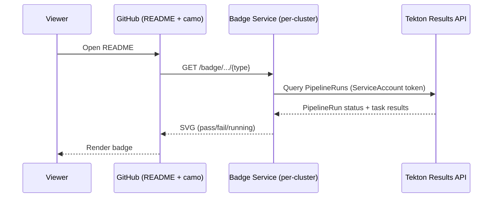

# 73. README Status Badges via Konflux Badge Service

Date: 2026-08-13

## Status

Proposed

## Context

### Problem

Teams want **embeddable build status** on the default branch README (Jenkins-style pass / fail / running). Konflux reports pipeline status as **GitHub Checks** (Checks tab), not GitHub Actions. There is no official GitHub URL that renders a Checks badge image.

Today, users must open the Konflux UI (SSO) or the GitHub Checks popup to see status. We want a **dynamic badge URL** per repository that README can embed for **build**, **Enterprise Contract (EC)**, and **release** data.

### Constraints

- README is rendered by GitHub — badge URL must be **reachable over public HTTPS**.
- Konflux primary API is **Kubernetes CRDs** ([architecture overview](https://konflux-ci.dev/architecture/)); user-facing HTTP endpoints are exceptional. The [architecture overview](../architecture/index.md) distinguishes two precedents: endpoints that expose **user/tenant cluster data** (e.g. Tekton Results ingress per [Pipeline Service](../architecture/core/pipeline-service.md) and [ADR-0009](0009-pipeline-service-via-operator.md)) require **SubjectAccessReviews** for consistent RBAC; **unauthenticated supporting endpoints** that do not expose tenant data (PaC webhook receiver per [ADR-0039](0039-workspace-deprecation.md), registration-service) follow a separate precedent. The badge service exposes **minimal derived status** (pass/fail/running) — no logs, secrets, or pipeline details.
- Konflux runs on **multiple production clusters**, and tenants from the same GitHub organization may be spread across different clusters.
- [Pipelines as Code](https://pipelinesascode.com/docs/concepts/) already reports PipelineRun status to GitHub Checks by watching PipelineRun changes on the cluster. The **cluster is the source of truth** — GitHub Checks is a downstream consumer.
- Pipelines as Code stamps every PipelineRun with metadata labels (`pipelinesascode.tekton.dev/url-org`, `url-repository`, `sha`, `event-type`, `state`) that make them queryable via Tekton Results.

## Decision

Introduce a **Konflux Badge Service** — a new **read-only HTTP service** (hosted in its own repository, e.g. `konflux-ci/badge-service`) that:

1. Exposes **dynamic badge URLs** for onboarded repositories.
2. Returns **SVG badge images** for README embedding.
3. Reads **Tekton Results** for build and EC status using a cluster-internal ServiceAccount.
4. Reads **Release CRs** for release/ring badges.
5. Deploys **per-cluster** — each badge service instance reads its own cluster's data.

### Data flow

GitHub README images are fetched by GitHub's [camo proxy](https://docs.github.com/en/authentication/keeping-your-account-and-data-secure/about-anonymized-urls) — a plain HTTPS GET with **no viewer login** passed to the badge service. The badge service queries **Tekton Results** on the same cluster using a Kubernetes ServiceAccount with the `tekton-results-readonly` ClusterRole.



**Data path**: the badge service queries the Tekton Results REST API with a CEL filter on PaC labels (e.g. `data.metadata.labels['pipelinesascode.tekton.dev/url-org']`, `url-repository`, `event-type=='push'`), ordered by `create_time desc`, limited to the most recent run. It extracts the PipelineRun conclusion from `status.conditions` and optionally reads `TEST_OUTPUT` / `SCAN_OUTPUT` task results for richer badge content.

### ServiceAccount and RBAC

The badge service runs with a Kubernetes ServiceAccount in its own namespace, bound to the [`tekton-results-readonly` ClusterRole](https://github.com/tektoncd/results/blob/main/docs/api/README.md#authorization) — a role that **already exists** as part of the Tekton Results installation. The pod's token is automatically mounted and passed as `Authorization: Bearer <token>` to the Tekton Results REST API. The Results API authenticates via `TokenReview` and authorizes via `SubjectAccessReview` — the [standard Tekton Results auth model](https://github.com/tektoncd/results/blob/main/docs/api/README.md#authentication--authorization).

**RBAC vs application security boundary**: the `tekton-results-readonly` ClusterRole grants read access to **all** Results records across all namespaces. The badge service intentionally returns only a derived status value (pass/fail/running) — the data reduction from full PipelineRun records to a single status string is enforced at the **application layer**, not by RBAC. If the badge service is compromised, the attacker gains read access to all Tekton Results data. Operators should weigh this when deploying and apply standard hardening (minimal container image, network policies restricting egress, pod security standards).

### API shape — two URL scheme options

Two URL schemes are viable. Both expose the same data; the choice affects privacy and operational complexity. **Deployers should choose the scheme that matches their privacy requirements.**

#### Option A: Explicit namespace and component

```
GET /badge/{namespace}/{component}/build       → image/svg+xml
GET /badge/{namespace}/{component}/ec           → image/svg+xml
```

README usage:

```markdown

```

| Pros | Cons |
|---|---|
| No state or index required — the service queries Tekton Results directly by namespace | Namespace and component names are visible in the public README URL |
| Simple to implement and debug | No access control — anyone who guesses or discovers the namespace/component can query the badge |
| User can construct the URL without any UI or CLI 

#### Option B: Opaque token

```
GET /badge/{token}/build       → image/svg+xml
GET /badge/{token}/ec           → image/svg+xml
```

The `{token}` is a short random string (e.g. `k7x2mQ9p`) that maps to a specific namespace + component on that cluster. It is stored as an annotation on the Component CR:

```yaml
apiVersion: appstudio.redhat.com/v1alpha1
kind: Component
metadata:
  name: my-service
  namespace: my-team-ns
  annotations:
    badges.konflux.dev/token: "k7x2mQ9p"
```

README usage:

```markdown

```

| Pros | Cons |
|---|---|
| Namespace and component names are never exposed in public URLs | Requires the badge service to watch Component CRs and maintain an in-memory token → (namespace, component) index |
| Revoking access = remove the annotation; badge returns "unknown" | User must copy the badge URL from the Konflux UI or CLI — cannot construct it manually |
| Token is meaningless without cluster access | Token generation mechanism needed (controller, UI action, or badge service itself on first request) |

#### Common to both options

- **Opt-in required**: both options require a `badges.konflux.dev/enabled: "true"` annotation on the Component CR. The badge service returns `unknown` for components that have not opted in. This prevents unauthenticated enumeration of namespace/component names or build status.
- **Rendering**: `badge-maker` library ([MIT OR Apache-2.0](https://github.com/badges/shields/tree/master/badge-maker)) or equivalent minimal SVG — **not** shields.io SaaS.
- **Status values**: `passing` | `failing` | `running` | `unknown` (no matching PipelineRun found, or badges not enabled).
- **JSON endpoint**: once the SVG service exists, adding a `.json` variant for programmatic consumers (dashboards, Slack bots) is straightforward.

### Security and privacy model

**No GitHub API dependency**: the badge service does not call the GitHub API. It reads Tekton Results using a cluster-internal ServiceAccount. No GitHub App token, no shared rate limit.

**Exposure**: the SVG endpoint is unauthenticated (required for GitHub camo). The badge returns only a **derived status** (pass/fail/running). No logs, secrets, pipeline YAML, or task details are exposed.

**Opt-in only**: the badge service returns `unknown` for any component that does not have the `badges.konflux.dev/enabled` annotation. No status is exposed unless the component owner explicitly enables it. With Option B (opaque token), namespace and component names are never visible externally. With Option A, the user who enables and embeds the URL deliberately chose to expose those names.

**Protection**: per-IP rate limiting at ingress; responses are minimal and cacheable.

### Caching

- Cache badge results per key (TTL 30–60s). Since the data source is cluster-internal, there is no external rate limit to worry about.
- Use HTTP `ETag` headers for client-side cache validation (same approach as [Jenkins embeddable-build-status-plugin](https://github.com/jenkinsci/embeddable-build-status-plugin/blob/master/src/main/java/org/jenkinsci/plugins/badge/StatusImage.java)).
- Tekton Results queries are cheap (indexed, local network). The cache primarily reduces load on the Results API server, not works around external quotas.

### Deployment model

**Per-cluster deployment.** Each Konflux cluster runs its own badge service instance that reads its own Tekton Results API. This is the natural model because:

- Tekton Results is per-cluster (each cluster archives its own PipelineRuns).
- Each cluster has its own public ingress for the badge service.
- No cross-cluster routing or tenant resolution is needed — the badge URL's hostname identifies the cluster.

**Requirements**: a Kubernetes ServiceAccount with `tekton-results-readonly`, and a publicly reachable ingress (Route/Ingress).

**Multi-cluster**: repos onboarded on different clusters use different badge service hostnames. The README author knows which cluster their component is on and uses the corresponding URL. If a unified hostname is needed later, a DNS-level or ingress-level routing layer can be added without changing the badge service itself.

### Rollout

1. Deploy the badge service on one Konflux cluster with both URL scheme options implemented (operators choose which to enable).
2. Support `build` and `ec` badge types (SVG).
3. If using Option B, implement token generation (annotation on Component CR) via UI, CLI, or controller.
4. Validate caching, SVG rendering, and Tekton Results query performance in production.
5. Extend to read Release CRs for release/ring badges within the same codebase.

## Alternatives Considered

| Alternative | Evaluated | Verdict | Rationale |
|---|---|---|---|
| **GitHub Checks API as primary data source** (original revision of this ADR) | Design review, prototype | **Rejected** | Circular data flow — reads data PaC already pushed from the cluster. Shares the GitHub App's [5,000 req/hour](https://docs.github.com/en/apps/creating-github-apps/registering-a-github-app/rate-limits-for-github-apps) quota with PaC and [MintMaker](../architecture/add-ons/mintmaker.md); requires complex backoff. Private repo handling required a phased HMAC scheme. Only covers build and EC badges — no release/ring status. GitHub-specific — does not work for GitLab-hosted repositories. |
| Shields.io SaaS `github/check-runs` | Live URLs on `konflux-ci/konflux-ci`, `konflux-ci/segment-bridge`; [source review](https://github.com/badges/shields/blob/master/services/github/github-check-runs.service.js) | **Rejected** | Reads only first ~30 check-run rows. Busy repos have 50–70+; Konflux `*-on-push` often at row 31+ → `no check runs`. Third-party SaaS; weak for private repos. |
| GitHub Action → commit `badge/*.svg` to repo | Prototype workflow | **Rejected** | Mixes CI status into source; per-repo maintenance. |
| Tekton task → git push SVG | Design review | **Rejected** | Same concerns as git-commit approach. |
| Extend Tekton Results with a badge endpoint | Design review | **Rejected** | Tekton Results is an upstream project (`tektoncd/results`) — adding Konflux-specific badge/SVG logic is out of scope. The Results API requires Bearer token auth which is incompatible with GitHub camo's anonymous GET. A separate thin service that translates authenticated Results queries into unauthenticated SVG responses is the right separation. |
| JSON-only service + self-hosted Shields for SVG | Design review | **Rejected** | Requires deploying two services. `badge-maker` renders SVG trivially; a single service serving both JSON and SVG is simpler to operate. |
| Contribute badge endpoint to Pipelines as Code | Design review | **Rejected** | PaC is an upstream project focused on Git event processing and pipeline triggering. A badge endpoint is a different concern (read-only status rendering). PaC's [Repository CR stores only the last 5 PipelineRun statuses](https://pipelinesascode.com/docs/concepts/) — insufficient for historical queries. Separate service with separate lifecycle is cleaner. |

## Consequences

### Positive

- **No external API dependency** — reads cluster-internal Tekton Results. No GitHub API rate limit concerns, no shared quota with PaC/MintMaker.
- **Richer data from day one** — structured `TEST_OUTPUT` and `SCAN_OUTPUT` results, pipeline duration, Release CR status. Not limited to pass/fail.
- One **org-standard** badge URL pattern for all onboarded repositories.
- **No git noise** — status stays outside source control.
- **Git-provider agnostic** — works for GitHub and GitLab repositories alike; no dependency on provider-specific APIs.
- **Follows established precedent**: public HTTP endpoints exist in Konflux (Tekton Results, PaC webhook receiver, registration-service).
- **Follows Jenkins model**: serving badges from internal CI data is a proven pattern ([embeddable-build-status-plugin](https://github.com/jenkinsci/embeddable-build-status-plugin)).
- **No private/public repo distinction needed** — the badge is tied to a Konflux namespace, not a GitHub repository. The user who embeds the URL controls visibility.

### Negative / compromises

- **New operational component**: deploy, monitor, and secure a public HTTP endpoint per cluster.
- **Cache staleness**: badge status may lag real-time by up to 60 seconds.
- **Per-cluster URLs**: repos on different clusters use different badge service hostnames. A unified hostname requires additional routing infrastructure.
- **New public HTTP endpoint**: architecturally this is a **read-only facade** over the existing Tekton Results HTTP API (which already has an ingress per [Pipeline Service](../architecture/core/pipeline-service.md)), translating authenticated Results queries into unauthenticated SVG responses. It does not introduce a new data path — it narrows an existing one.
- **Option B (opaque token) adds operational complexity**: token generation, Component CR annotation management, and an in-memory index in the badge service.
- **Cross-namespace read access**: the badge service ServiceAccount requires cluster-wide `tekton-results-readonly` — operators must be comfortable granting this. The service exposes only derived status (pass/fail), never raw PipelineRun content.

## References

- [Architecture overview — constraints on HTTP endpoints](../architecture/index.md)
- [Pipeline Service — Tekton Results ingress](../architecture/core/pipeline-service.md)
- [ADR-0009 Pipeline Service via Operator](0009-pipeline-service-via-operator.md) — Tekton/PaC deployment model
- [ADR-0030 Tekton Results Naming Convention](0030-tekton-results-naming-convention.md) — `TEST_OUTPUT` and `SCAN_OUTPUT` result formats
- [ADR-0039 Workspace Deprecation — per-cluster GitHub App model](0039-workspace-deprecation.md)
- [Tekton Results API documentation](https://tekton.dev/docs/results/api/) — REST/gRPC API with CEL filtering
- [Tekton Results Watcher — PaC label propagation](https://tekton.dev/docs/results/watcher/) — how PipelineRun metadata is indexed
- [Pipelines as Code — Concepts and status reporting](https://pipelinesascode.com/docs/concepts/) — how PaC reports status from cluster to GitHub Checks
- [Pipelines as Code — PipelineRun labels](https://docs.pipelinesascode.com/v0.44.0/docs/concepts/) — `pipelinesascode.tekton.dev/url-org`, `url-repository`, `sha`, `event-type` labels on PipelineRuns
- [Jenkins embeddable-build-status-plugin](https://github.com/jenkinsci/embeddable-build-status-plugin) — prior art for serving CI badges from internal data
- [Jenkins StatusImage.java — SVG generation with ETag caching](https://github.com/jenkinsci/embeddable-build-status-plugin/blob/master/src/main/java/org/jenkinsci/plugins/badge/StatusImage.java)
- [badge-maker library](https://github.com/badges/shields/tree/master/badge-maker) — MIT/Apache-2.0 SVG generation
- [GitHub camo proxy](https://docs.github.com/en/authentication/keeping-your-account-and-data-secure/about-anonymized-urls) — how GitHub proxies images in README files
- [GitHub Apps rate limits](https://docs.github.com/en/apps/creating-github-apps/registering-a-github-app/rate-limits-for-github-apps) — 5,000 requests/hour per installation (context for why the GitHub API approach was rejected)
