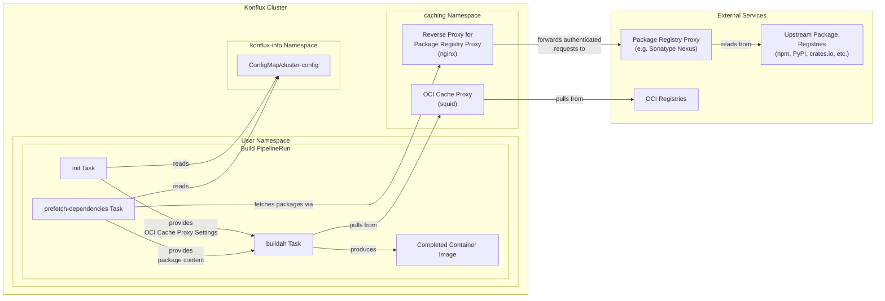

# NN. Package Registry Proxy Configuration for Hermeto

Date: YYYY-MM-DD

## Status

Proposed

## Context

Hermeto is the content prefetching tool used in Konflux build pipelines to fetch application dependencies before the container image build step. It supports multiple package managers including npm, yarn, gomod, pip, cargo, and bundler. Currently, Hermeto fetches dependencies directly from upstream package registries such as registry.npmjs.org, proxy.golang.org, PyPI, crates.io, and rubygems.org.

This direct fetching from upstream sources exposes the build process to supply chain attacks. Malicious packages published to public registries can be consumed by builds without any policy evaluation or control. Recent high-profile incidents have demonstrated that attackers actively target package registries to distribute malware.

To address this security gap, organizations can deploy a package registry proxy with a policy enforcement layer that:

1. **Evaluates all consumed artifacts** against organizational governance policies during ingestion, automatically quarantining components that violate policy before they are available for use in builds.
2. **Stores all consumed artifacts** in a controlled repository, providing an audit trail and enabling reproducible builds.

By routing Hermeto's dependency fetching through such a package registry proxy, malicious or non-compliant components can be blocked before they ever reach the build environment.

### Architecture Overview

The deployment architecture involves two components between Hermeto and upstream package registries:

1. **Package registry proxy** (e.g., Sonatype Nexus Repository Server): An external service that proxies upstream package registries, enforces governance policies on ingested artifacts, and stores them in controlled repositories.
2. **On-cluster reverse proxy**: An nginx reverse proxy deployed on the Konflux cluster that transparently injects package registry proxy credentials into outbound requests. Hermeto fetches packages through this proxy, which forwards the authenticated requests to the package registry proxy.

The design and deployment of the on-cluster reverse proxy is outside the scope of this ADR.

**Users** need the ability to:

* Use the package registry proxy automatically when available, without manual configuration
* Opt out of package registry proxy use for individual pipelines when needed

**Platform administrators** need the ability to:

* Enable/disable package registry proxy usage at the cluster level for all pipelines
* Configure package registry proxy URLs for different package managers (npm, pip, cargo, etc.) since they may be served from different repositories
* Apply GitOps processes for this configuration, similar to other Konflux configuration elements

## Decision

We will extend the `cluster-config` ConfigMap described in [ADR 0057](0057-pipeline-caching-feature-flag.md) with an `allow-package-registry-proxy` flag and per-package-manager package registry proxy URL keys. We will also introduce an `enable-package-registry-proxy` pipeline parameter that gives users control over whether their pipeline uses the package registry proxy.

The package registry proxy is used only when both the administrator and user permit it: `allow-package-registry-proxy` must be `true` in the ConfigMap and `enable-package-registry-proxy` must be `true` in the pipeline. The administrator flag defaults to `false`, so the package registry proxy is disabled until explicitly enabled at the cluster level. The pipeline parameter defaults to `true`, so once an administrator enables it, all pipelines use the package registry proxy automatically. Users who need to bypass it for debugging or compatibility reasons can set their pipeline parameter to `false`.

This is the opposite of the OCI cache proxy model in [ADR 0057](0057-pipeline-caching-feature-flag.md), where each user must enable the OCI cache proxy for their own pipeline. The difference reflects the nature of the feature: OCI caching is a performance optimization individual users choose to adopt, while package registry proxying is a security control that should apply globally unless a user explicitly opts out.

The following diagram shows how the package registry proxy fits into the build pipeline alongside the OCI cache proxy described in [ADR 0057](0057-pipeline-caching-feature-flag.md):

### Implementation Details

Each supported package manager gets its own package registry proxy URL key in the ConfigMap, named `package-registry-proxy-<pkg>-url`. The initially supported package managers are npm, yarn, gomod (with a separate `package-registry-proxy-gomod-sum-url` for the checksum database), pip, cargo, and bundler. Multiple package managers may share the same URL if they use the same upstream registry. The configured URLs point to the on-cluster reverse proxy, which handles authentication to the package registry proxy transparently.

The prefetch-dependencies task resolves `allow-package-registry-proxy` from the ConfigMap and `enable-package-registry-proxy` from its pipeline parameter to determine whether the package registry proxy is enabled. When enabled, it reads the per-package-manager package registry proxy URLs from the ConfigMap and sets the corresponding Hermeto environment variables. This avoids threading proxy configuration through the init task or the pipeline definition, and the number of supported package managers can grow without pipeline changes.

Unlike ADR 0057, we do not define hard-coded fallback URLs. Hermeto does not use a package registry proxy by default, so the presence of a package registry proxy URL in the ConfigMap is what triggers the prefetch-dependencies task to configure Hermeto to route that package manager's requests through the proxy. If a package manager's URL is not present in the ConfigMap, Hermeto fetches directly from upstream for that package manager.

### Alternatives considered

**Package registry proxy configuration via init task**: Following the [ADR 0057](0057-pipeline-caching-feature-flag.md) pattern, where the init task resolves pipeline parameters and ConfigMap settings into results consumed by downstream tasks, two variations were considered. First, the init task could resolve `allow-package-registry-proxy` and `enable-package-registry-proxy` into a single `use-package-registry-proxy` result passed to the prefetch-dependencies task. This was rejected because the prefetch-dependencies task already reads directly from the ConfigMap, making the init task an unnecessary intermediary. Second, the init task could read all package registry proxy URLs and emit them as individual Tekton results for the prefetch-dependencies task to consume as parameters. This was rejected because it requires ~7 result/parameter pairs threaded through the pipeline definition, and the number grows as Hermeto adds support for more package ecosystems. Additionally, Tekton imposes a 4096-byte limit on a task's combined results; a large number of URL results emitted from the init task would consume a significant portion of that budget.

**Single base URL**: One package registry proxy URL (e.g., `https://registry-proxy.example.com`) would be configured and per-package-manager paths constructed at runtime. While simpler to configure, this would hardcode path assumptions in the prefetch-dependencies task and prevent administrators from selectively enabling the package registry proxy for some package managers while leaving others disabled, or from routing different package managers to different proxy servers.

**Per-namespace ConfigMap**: Package registry proxy URLs would be placed in a namespace-scoped ConfigMap directly available to tasks. However, [ADR 0057](0057-pipeline-caching-feature-flag.md) already rejected per-namespace configuration for the OCI cache proxy.

## Consequences

* **SBOM**: Hermeto records the package registry proxy URL used for each dependency in the SBOM, enabling Conforma policies to verify at the per-package level that dependencies were fetched through the package registry proxy.
* **Simple User Experience**: Users control package registry proxy usage through simple boolean flags without needing to understand package registry proxy URLs, authentication, or repository configurations.
* **Cluster-level Control**: The cluster-level `allow-package-registry-proxy` flag enables quick cluster-wide enable/disable, and per-package-manager URLs allow phased rollout across package ecosystems. Since builds depend on the package registry proxy being available, this flag provides a fast way to unblock all builds if it experiences an outage.
* **User Retains Ultimate Control**: As with all Konflux pipeline configuration, advanced users can modify their pipeline YAML to bypass these settings. Users who do not want the package registry proxy can set `enable-package-registry-proxy` to `false`. Note that the package registry proxy URLs themselves are not user-configurable and are set by the administrator at the cluster level.
* **Minimal Pipeline Wiring**: The `enable-package-registry-proxy` pipeline parameter is the only package registry proxy configuration threaded through the pipeline definition. All other configuration is read directly from the ConfigMap by the prefetch-dependencies task, so adding support for new package managers does not require pipeline definition changes.
* **No Silent Fallback**: Hermeto will fail a request if a configured package registry proxy URL is unreachable or invalid, rather than falling back to upstream registries.
* **Clear Error Reporting**: When the package registry proxy blocks a package (e.g., due to a policy violation or quarantine), Hermeto must surface this clearly to the user. Without distinguishable error messages, users may mistake a policy-blocked package for a network or infrastructure issue, leading to confusion and unnecessary support requests.
* **Documentation Requirements**: Clear documentation will be needed to explain the two-level configuration model and per-package-manager URL setup for both administrators and users.
