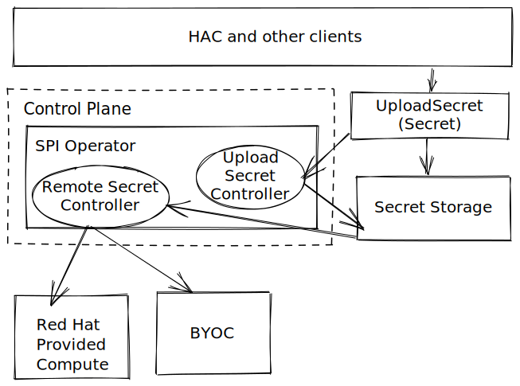

# Secret Management For User Workloads

Date: 2023-03-25

## Status

Accepted

## Context

* When user workloads are deployed to environments, the system should be able to provide a way to inject values that are specific to the environment. Currently, this is done through environment variables that are managed as overlays on the GitOps repository for the application. However, this method does not provide a good way to manage `Secret`. This ADR addresses the secret management of user workloads for different environments.
* As a StoneSoup component, I expect to have the ability to securely upload a secret, associate it with the component, and propagate it to the target environment.

## Decision

### Architecture Overview
#### Terminology

- **Upload Secret**: A short-lived Kubernetes `Secret` used to deliver confidential data to permanent storage and link it to the `RemoteSecret` CR. The Upload Secret is not a CRD.
- `SecretData`: An object stored in permanent SecretStorage. Valid SecretData is always linked to a RemoteSecret CR.
- `RemoteSecret`: A CRD that appears during upload and links `SecretData` + `DeploymentTarget(s)` + K8s `Secret`. `RemoteSecret` is linked to one (or zero) SecretData and manages its deleting/updating.
- K8s `Secret`: What appears at the output and is used by consumers.
- `SecretId`: A unique identifier of SecretData in permanent SecretStorage.
- `SecretStorage`: A database eligible for storing `SecretData` (such as HashiCorp Vault, AWS Secret Manager).

#### Architecture



The idea is to introduce a new CR called `RemoteSecret`, which is a Kubernetes representation of the `K8s Secret` that is stored in permanent storage aka SecretStorage. This CR contains a reference to the destination, either a Kubernetes namespace or an `Environment`. A temporary **Upload Secret** is used to perform an upload to the permanent storage and is represented as a regular Kubernetes secret with special labels and annotations recognized by the _SPI controller_. Different implementations of `SecretStorage` can be used, such as AWS Secret Manager or HashiCorp Vault.

#### Example: If the destination is `Environment`
```yaml
apiVersion: v1
kind: Secret
metadata:
  name: jdbc-connection-parameter
  labels:
    spi.appstudio.redhat.com/upload-secret: secret
    spi.appstudio.redhat.com/target-environment: prod
type: Opaque
data:
 ...
```
```yaml
apiVersion: appstudio.redhat.com/v1beta1
kind: RemoteSecret
metadata:
  name: jdbc-connection-parameter
spec:
  secret:
    environment: prod
    name: jdbc-connection-parameter
 ...
```

#### Example: If the destination is `Namespace` and secret has to be linked to SA
```yaml
apiVersion: v1
kind: Secret
metadata:
  name: jdbc-connection-parameter
  annotations:
      spi.appstudio.redhat.com/secret-linkedto-serviceAccount-name: sa-star
  labels:
    spi.appstudio.redhat.com/upload-secret: secret
    spi.appstudio.redhat.com/target-namespace: ns-9459039345
type: Opaque
data:
 ...
```
```yaml
apiVersion: appstudio.redhat.com/v1beta1
kind: RemoteSecret
metadata:
  name: jdbc-connection-parameter
spec:
  secret:
    namespace: ns-9459039345
    name: jdbc-connection-parameter
    linkedTo:
    - serviceAccount:
        reference:
          name: sa-star
```


### Security and Access Control

* Access to the secret management backend should be restricted to authorized users and components.
* The default backend should use authentication and authorization mechanisms provided by the underlying service, such as Kubernetes or AWS IAM.
* Workspace maintainers should have the ability to create and update secrets for their workspace on the default secret management backend.
* Access to the secret management backend should be audited to detect and prevent unauthorized access or misuse.

### Monitoring and Auditing

* The secret management system should be monitored and audited to detect and prevent unauthorized access or misuse.
* Access and usage of secrets should be monitored and tracked to identify potential security issues or incidents.
* An audit log of all secret access and usage should be maintained to provide a record of who accessed and used secrets, when, and for what purpose.
* The secret management system should also provide alerting and notification mechanisms to alert security administrators and other stakeholders of potential security issues or incidents. This may include alerts for unauthorized access or misuse of secrets, as well as alerts for other security-related events or issues.

## Consequences

* The new secret management system will provide a more secure and scalable way for users to manage secrets for their workloads. It will also require some additional work to integrate with existing systems and processes. A new UI will need to be created to allow users to create and update secret values for their components and provide environment-specific overrides to them.
* Further work to be addressed, mechanisms for determining the exact target namespace in case if Environment name is used as a destination for K8s Secret, and determining the trigger when the K8s Secret has to be delivered. The use of ArgoCD's Resource  ArgoCD's [Resource Hooks](https://argo-cd.readthedocs.io/en/stable/user-guide/resource_hooks/) may be helpful in this regard.
