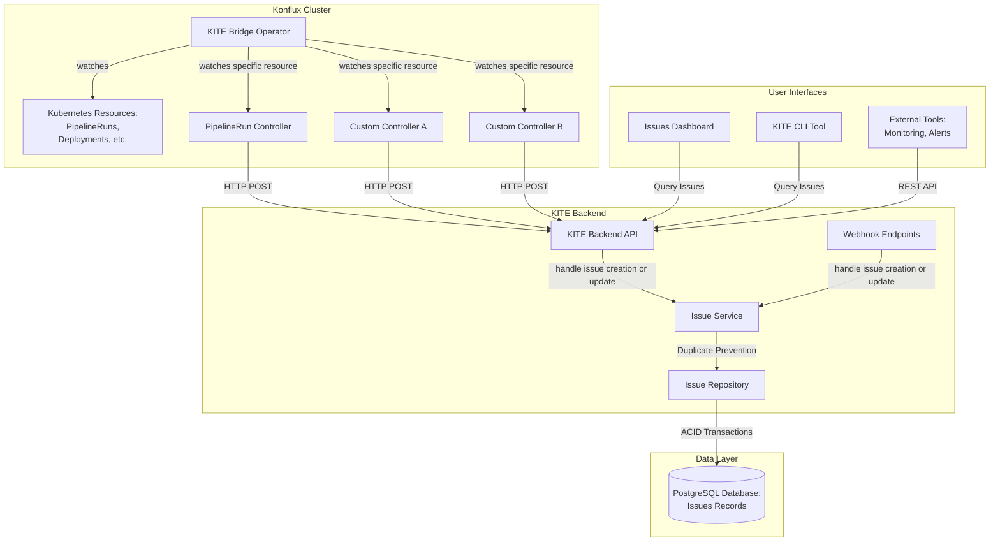
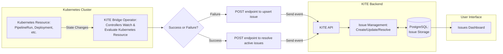

# X. KITE Architecture and Components

Date: 2025-09-08

## Status

Proposed

## Context

The [Konflux Issue Tracking Engine](https://github.com/konflux-ci/kite) (KITE) is a proof-of-concept designed to detect, create, and track issues that block application releases in Konflux.

It prevents duplicate issue records, automates issue creation and resolution, and powers the **Issues Dashboard** where teams can view and manage disruptions.

## Architecture Overview

The following diagram illustrates the key components and data flow of the KITE system:

## Decision

We will implement KITE as a distributed system with the following key architectural decisions:

### Bridge Operator Architecture

The **[KITE Bridge Operator](https://github.com/konflux-ci/kite/tree/main/packages/operator)** implements the "bridge operator" pattern, which connects a Kubernetes environment with external systems not natively managed by Kubernetes.

The operator:

- **Monitors Kubernetes Resources**: Watches for events on various cluster resources (currently focusing on Tekton `PipelineRun` objects)
- **Detects State Changes**: Identifies successes or failures in monitored resources
- **Reports to Backend**: Sends failure information to the KITE backend service for persistence
- **Extensible Design**: Can be extended with additional controllers for monitoring other resource types

The operator runs as a standard Kubernetes controller with cluster-wide permissions to monitor resources across namespaces.

### KITE Backend Service

The **[KITE Backend](https://github.com/konflux-ci/kite/tree/main/packages/backend)** is a Go-based REST API service that:

- **Provides API Endpoints**: Offers [REST API](https://github.com/konflux-ci/kite/blob/main/packages/backend/docs/API.md) for creating, updating, and querying issues
- **Webhook Support**: Includes [specialized webhook endpoints](https://github.com/konflux-ci/kite/blob/main/packages/backend/docs/Webhooks.md) for simplified issue creation/resolution
- **Issue Management**: Handles the complete lifecycle of issues (creation, updates, resolution)
- **Database Integration**: Manages all database operations and data persistence
- **Namespace isolation**: Issue access is namespace-restricted for isolation and security. (WIP)

The backend is built using the [Gin](https://github.com/gin-gonic/gin) HTTP web framework and follows standard HTTP API patterns.

### Team Integration Strategy

KITE provides two primary integration paths for teams to onboard their services and start tracking issues:

#### Recommended Integration Path

**1. Build Custom Controllers**
Teams [develop custom controllers](https://github.com/konflux-ci/kite/blob/main/packages/operator/docs/ControllerDevelopmentGuide.md) for the KITE Bridge Operator that:
- **Watch Specific Resources**: Monitor the Kubernetes resources relevant to their services (e.g., Deployments, Jobs, Custom Resources)
- **Detect State Changes**: Identify success and failure conditions based on their service requirements
- **Report to Backend**: Send issue creation/resolution events to the KITE backend via API calls

**2. Implement Custom Webhook Endpoints**
Teams can [develop custom webhook endpoints](https://github.com/konflux-ci/kite/blob/main/packages/backend/docs/Webhooks.md) tailored to their specific events, giving them:
- **Simplified Integration**: Webhooks handle the complexity of issue creation and duplicate checking automatically
- **Custom Payloads**: Design request payloads that match the team's existing monitoring and alerting systems
- **Automatic Resolution**: Webhook endpoints can automatically resolve issues when success events are received

##### Recommended Integration Path Benefits

- **Standardized Integration**: Teams follow the controller + webhook pattern, providing a consistent integration approach
- **Customized Logic**: Teams have full control over their controllers and webhook logic, enabling flexibility for specific use cases
- **Reduced Development Overhead**: Leverage existing KITE infrastructure rather than building custom issue tracking solutions

#### Alternative Integration Approach

For teams that cannot integrate directly with KITE controllers or webhooks, [external service integration](https://github.com/konflux-ci/kite/blob/main/packages/backend/docs/ExternalServiceIntegration.md) is available through:
- **Direct API Usage**: Teams can use the standard REST API to create and manage issues programmatically

### External PostgreSQL Database

We have chosen to use an **external PostgreSQL database** instead of storing issues as Kubernetes Custom Resources in etcd for the following critical reasons:

#### Protecting etcd from Overload

- **High Volume Data**: Issue tracking generates large amounts of data from continuous monitoring of pipeline runs, builds, and other cluster events
- **etcd Limitations**: etcd is optimized for cluster state management, not high-volume application data storage
- **Cluster Stability**: Overloading etcd with issue records could impact overall cluster performance and stability
- **Resource Separation**: Keeping application data separate from Kubernetes cluster state prevents interference

#### Volume and Performance Considerations

- **Issue Frequency**: In a busy Konflux environment, hundreds or thousands of issues could be created daily
- **Data Growth**: Issue records include metadata, logs, relationships, and historical data that grow over time
- **Query Patterns**: Issue tracking requires complex searches, filtering, and reporting that would strain etcd
- **Retention Policies**: Long-term storage of historical issues for trend analysis is better suited to a database

### Duplicate Issue Prevention

The KITE backend implements several mechanisms to prevent duplicate issues from being created:

#### Database-Level Protection

- **Atomic Transactions**: Uses PostgreSQL transactions with row-level locking (`FOR UPDATE`)
- **Concurrent Safety**: Multiple requests for the same issue cannot create duplicates

#### Application-Level Logic

- **Upsert Pattern**: The system always checks for existing issues before creating new ones
- **Duplicate Detection**: Matches issues based on:
  - [Resource scope](https://github.com/konflux-ci/kite/blob/main/packages/backend/docs/Webhooks.md#benefits-of-scope-based-grouping) (type, name, namespace)
  - Issue state (Active/Resolved)

### Automatic Issue Lifecycle Management

KITE implements automatic issue creation, updating and resolution using the combination of a custom controller + webhook. This minimizes manual intervention and prevents duplicate issue records.

#### High-Level Issue Automation Overview

This diagram shows a simplified flow of how KITE automatically detects and manages issues:

### Additional Architectural Decisions

#### Modular Design

- **Separate Packages**: Backend, CLI, and Operator are independent packages
- **Clear Interfaces**: Well-defined APIs between components
- **Independent Deployment**: Components can be deployed and scaled independently

#### Configuration Management

- **Environment Variables**: Extensive use of environment-based configuration
- **Feature Flags**: Ability to enable/disable features like namespace checking and webhooks

#### Development & Operations

- **Container-First**: All components designed for containerized deployment
- **Health Checks**: Built-in health endpoints for monitoring
- **Logging**: Structured logging with configurable levels and formats
- **Metrics**: Support for metrics collection (when enabled)

## Requirements Alignment
This section demonstrates how KITE's architecture addresses the [specified project requirements](https://docs.google.com/document/d/1HbNCqbrpfOi1MR7oYoaUTINIu5rAQ_bVy1NJCnDqYzM/edit?tab=t.0#heading=h.nk0gqur98cd3).

### Dashboard with issues

**Requirement**: Dashboard with issues, an issue groups one or multiple events that have the same cause or are otherwise connected.

- **Implementation**: Issues Dashboard provides centralized view (TODO), powered by KITE
- **Grouping Logic**: Issues are grouped by scope objects (namespace, resource type, resource name) preventing duplicates
- **Real-time Updates**: Dashboard reflects current issue states as they're created, updated, and resolved

### Scope Support
**Requirement**:

- Scope:
  - Workspace/Namespace
  - Application
  - Component
  - PipelineRun

**Implementation**:

- Database schema includes flexible scope objects with `resourceType`, `resourceName`, `resourceNamespace`
- Controllers can monitor any Kubernetes resource type
- Extensible scope model supports future scope types

### Filtering and Search Capabilities
**Requirement**:

- User can filter out issues based on their:
  - Issue type (failed releases, failed builds, MintMaker fails)
  - Severity (warning, error/fail, information)
  - Scope (which components or applications we care about)
  - Issue being connected to development pipelines or releasable/production content.

**Implementation**:

- REST API supports comprehensive filtering parameters
- Search functionality across issue titles and descriptions
- Scope-based filtering enables component/application-specific views

### Debugging and Links Support

**Requirement**: Users can get through the links in the issue to the logs or other information needed to debug and resolve the problem

**Implementation**:

- Issue model includes `links` array for pipeline logs, dashboards, etc.
- Controllers and webhooks can add relevant debugging URLs
- Structured link storage with titles and descriptions for context

### Extensibility

**Requirement**: Dashboard must be easily extendable, especially when it comes to adding new issue types.

**Implementation**:

- **Controller Framework**: Bridge Operator pattern allows easy addition of new resource monitors
- **Webhook System**: Custom webhook endpoints can be added without code changes
- **API Design**: RESTful API structure supports extension without breaking changes
- **Database Schema**: Flexible issue and scope models support new issue types

### Issue Types and Automatic Resolution

**Requirements**:

- I want issues to be automatically resolved if the underlying problem is solved.
- I want to see issues for:
  - Failed integration tests
  - Failed builds (PR and Push)
  - Special filtering for MintMaker PRs
  - Show due dates when they exist
  - Show migration information when it exists
  - Failed releases (both tenant and managed)
  - Failed pipeline runs (even catastrophic failures when the pipeline does not run at all)
  - MintMaker / Dependency management issues

**Implementation**:

- **Build Failures**: Custom/PipelineRun controller detects failed builds, resolves on successful runs
- **Integration Test Failures**: Custom controller(s) can be added for integration test monitoring
- **Release Failures**: Custom controllers can be added to monitor release failures
- **MintMaker Issues**: Webhook endpoints and/or custom controllers can be configured for dependency management failures
- **Tekton Task Updates**: Controllers can monitor task definitions and create issue records on pending updates

### Deployment and integration

**Requirements**:

- The project is developed as a Kubernetes native project independent of the Konflux community.
- The dashboard is optional for a Konflux deployment (a Konflux add-on).

**Implementation**:

- **Kubernetes Native**: All components deployed as standard K8s resources
- **Add-on Architecture**: This is designed to be standalone and extend Konflux

### API Access for External Tools

**Requirement**: Provide an API so external CI tools (for example RHEL on GitLab) can query issues related to a particular pipeline run.

**Implementation**:

- RESTful API with comprehensive filtering by resource type, name, namespace
- Query endpoints support pipeline run identification
- JSON responses suitable for programmatic consumption

### Error Handling and Debugging

**Requirement**: UI should reflect backend API errors where they are happening for easier debugging

**Implementation**:

- Structured error responses from backend API
- HTTP status codes and error messages can be propagated to dashboard (dashboard still TODO)
- Logging framework captures detailed error information
- Health check endpoints for monitoring KITE component statuses

## Consequences

### Positive

- **Scalability**: External database can handle large volumes of issue data while not overloading etcd
- **Performance**: Database optimizations enable fast queries and reporting
- **Extensibility**: Bridge operator pattern allows easy addition of new resource monitors
- **Data Integrity**: Strong consistency guarantees prevent duplicate issues

### Negative

- **Complexity**: Additional infrastructure component (PostgreSQL, Stand-alone API, additional controllers) to manage
- **Dependencies**: System requires external database availability
- **Cost**: Additional resources needed for database hosting and management
- **Network**: Additional network hops between operator and backend

### Future Considerations

- **Multi-Cluster Support**: Architecture supports scaling across multiple Konflux clusters
- **Controller Expansion**: The architecture supports adding monitors for additional resource types
- **Controller Config**: A configuration file where users can select which controllers they want to use, rather than all
- **Integration Points**: API design supports integration with external tools and dashboards
- **MCP Server Integration**: The REST API architecture enables KITE to serve as an MCP (Model Context Protocol) server:
  - **Real-time Issue Context**: AI assistants could query current cluster issues and their status
  - **Interactive Troubleshooting**: Enable AI-powered tools (maybe via the [KITE CLI](https://github.com/konflux-ci/kite/tree/main/packages/cli) tool) to help users understand and resolve issues
