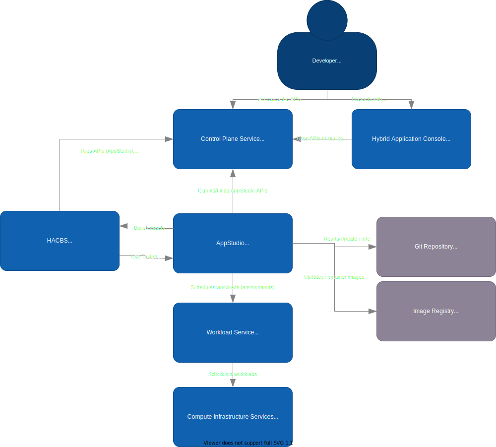
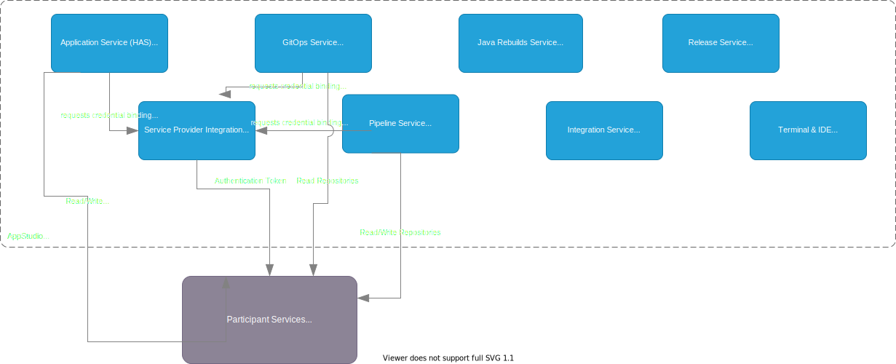

## StoneSoup Architecture Overview

---

#### What is StoneSoup?

A set of services that streamline, consolidate, connect, and secure the enterprise application lifecycle

---

#### StoneSoup System Context

---

#### StoneSoup Services

