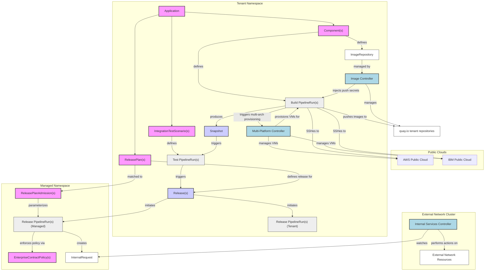
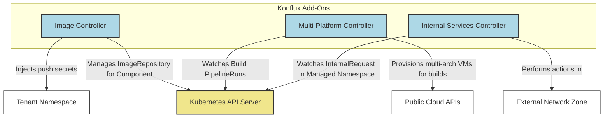

# Konflux Add-Ons

Konflux subsystems are divided into two categories: **core** and **add-ons**. The core subsystems are required for a working system, while add-ons are optional services that provide additional capabilities. This document describes the add-on subsystems and how they integrate with the rest of the Konflux platform.

## Application Context

## Service (Component) Context

### Image Controller

The Image Controller manages the `ImageRepository` resource, which is a subsidiary of the `Component` resource. It induces the Image Controller to create and manage quay.io repositories for the build pipeline run. It injects push secrets into the tenant namespace for use by the build pipeline.

### Multi-Platform Controller

The Multi-Platform Controller has no explicit resources of its own, but it reacts when it sees the build pipeline run and provisions VMs in multiple public cloud APIs (AWS and IBM Cloud) to provide multi-architecture compute for builds, including linux/amd64 and linux/arm64 from AWS and linux/ppc64le and linux/s390x from IBM Cloud.

### Internal Services Controller

The Internal Services Controller has a single resource, the `InternalRequest`, that is created in the managed namespace by the managed release pipeline run. An Internal Services Controller running on a different cluster watches for those and reconciles them to perform actions in another network zone. 
