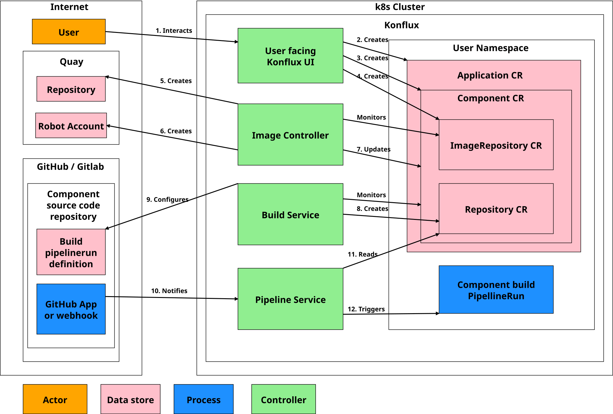

# Build Service


## Overview

The Build Service is composed of controllers that create and configure build pipelines. The main input for the Build Service is a Component CR managed by the Konflux UI or created manually via `kubectl`.



### Dependencies

The Build Service is dependent on the following services:

- **[Pipeline Service](./pipeline-service.md)** (Core Service)
  - Tekton Pipelines for pipeline execution
  - Pipelines as Code for webhook-driven builds
  - Tekton Chains for signing and attestations
  - Tekton Results for pipeline logging and archival

- **[Image Controller](../add-ons/image-controller.md)** (Add-on Service)
  - Generation of container image repositories in the configured registry (e.g., Quay.io)
  - Creation of robot accounts for image push/pull operations
  - Sets the `.spec.containerImage` field on Component CRs, which Build Service waits for before provisioning pipelines

- **[Release Service](./release-service.md)** *(Required for nudging only)*
  - Component Dependency Update Controller queries ReleasePlanAdmission CRs to discover distribution repositories
  - Used when updating dependent components to include both build-time and release-time registry references
  - **Note**: Release Service CRDs must be installed even if nudging is not used (controller cannot be disabled)

## Controllers

The Build Service contains these controllers:
- Component Build Controller
  - Monitors Component CRs and creates PipelineRun definitions which will be used by [Pipelines As Code (PaC)](https://pipelinesascode.com) provided by Pipeline Service.
- PaC PipelineRun Pruner Controller
  - Deletes PipelineRuns for Components that were deleted.
- Component dependency update (nudging) controller
  - Monitors push PipelineRuns and based on set relationships runs renovate which updates
    SHA for image from PipelineRun in user's repository.

### Component Build Controller

Component Build Controller is managed by Component CR changes (creation or update).
It's using Component CR annotations and configuration of the PipelineRuns.

#### Modes

The prerequisite is to have installed GitHub App which is used by the Build Service in the user's repository, or have gitlab/github secret created for usage via webhook
([creating GitLab secrets](https://konflux.pages.redhat.com/docs/users/building/creating-secrets.html#gitlab-source-secret)).

Component Build Controller is working in multiple ways based on a request annotation `build.appstudio.openshift.io/request`:
- PaC provision, annotation value `configure-pac` (default when request annotation isn't set)
    - Sets up webhook if GitHub App isn't used.
    - Integrates with Pipelines As Code, creates PipelineRun definitions in the user code repository.
- PaC provision without MR creation, annotation value `configure-pac-no-mr`
    - Sets up webhook if GitHub App isn't used.
    - Integrates with Pipelines As Code, doesn't create PipelineRun definitions in the user code repository.
- PaC unprovision, annotation value `unconfigure-pac`
    - Removes webhook created during provisioning if GitHub App wasn't used.
    - Creates PR removing PipelineRuns definitions from the user code repository.
- Trigger PaC build, annotation value `trigger-pac-build`
    - Re-runs push pipeline runs (used for re-running failed push pipelines).

All those requests first wait for `.spec.containerImage` to be set, either manually or
by image-controller via
[ImageRepository CR](https://github.com/konflux-ci/architecture/blob/main/architecture/add-ons/image-controller.md#to-create-an-image-repository-for-a-component-apply-this-yaml-code).

Controller will also create component specific service account `build-pipeline-$COMPONENT_NAME`
used for build pipelines. See [Service Account Management](#service-account-management) below.

**PaC provision:**
1. Sets up webhook in the repository if GitHub App isn't used.
1. Creates or reuses Repository CR (Component CR is set as the owner).
1. Creates merge request in the user code repository with PipelineRun definitions.
1. Sets `build.appstudio.openshift.io/status` annotation with either error, or state `enabled` and merge request link.
1. Sets finalizer `pac.component.appstudio.openshift.io/finalizer`.
1. Removes `build.appstudio.openshift.io/request` annotation.

**PaC provision without MR creation:**
1. Sets up webhook in the repository if GitHub App isn't used.
1. Creates or reuses Repository CR (Component CR is set as the owner).
1. Doesn't create merge request in the user code repository with PipelineRun definitions, that is up to user.
1. Sets `build.appstudio.openshift.io/status` annotation with either error, or state `enabled`.
1. Sets finalizer `pac.component.appstudio.openshift.io/finalizer`.
1. Removes `build.appstudio.openshift.io/request` annotation.

**PaC unprovision:**
1. Removes finalizer `pac.component.appstudio.openshift.io/finalizer`.
1. Removes webhook from repository if GitHub App isn't used and the repository isn't used in another component.
1. Creates merge request in the user code repository removing PipelineRun definitions.
1. Sets `build.appstudio.openshift.io/status` annotation with either error, or state `disabled` and merge request link.
1. Removes `build.appstudio.openshift.io/request` annotation.

**Trigger PaC build:**
1. Triggers push pipeline via PaC incoming webhook, requires pipeline run name to be the same as it was named during provisioning `$COMPONENT_NAME-on-push`.
1. Sets `build.appstudio.openshift.io/status` annotation when error occurs.
1. Removes `build.appstudio.openshift.io/request` annotation.

#### Build Pipeline Configuration

Available and default pipelines are defined in a ConfigMap named `build-pipeline-config` in the controller's namespace.

Build pipeline is selected based on `build.appstudio.openshift.io/pipeline` annotation.
When annotation is missing, Build Service adds the annotation with the default pipeline from the ConfigMap.

**Annotation format:**
```json
{"name":"docker-build","bundle":"latest"}
```

- `name`: The pipeline name (must exist in ConfigMap)
- `bundle`: Either `latest` (uses the tag from ConfigMap) or a specific tag for testing

When specified pipeline doesn't exist in ConfigMap, it will result with error.

**Example ConfigMap structure:**
```yaml
apiVersion: v1
kind: ConfigMap
metadata:
  name: build-pipeline-config
  namespace: build-service
data:
  default_build_bundle: "quay.io/konflux-ci/tekton-catalog/pipeline-docker-build:latest"
  pipelines: |
    - name: docker-build
      bundle: quay.io/konflux-ci/tekton-catalog/pipeline-docker-build:latest
    - name: fbc-builder
      bundle: quay.io/konflux-ci/tekton-catalog/pipeline-fbc-builder:latest
```

**Reference implementations:**
- [Konflux CI deployment](https://github.com/konflux-ci/konflux-ci/tree/main/konflux-ci/build-service/core)
- [Build pipeline definitions](https://github.com/konflux-ci/build-definitions)

#### PipelineRun parameters

Build Service sets the following parameters in generated PipelineRuns:

| Parameter | Source | Notes |
|-----------|--------|-------|
| `git-url` | `{{source_url}}` | PaC template variable, evaluated to git repository URL |
| `revision` | `{{revision}}` | PaC template variable, evaluated to git commit SHA |
| `output-image` | Component `.spec.containerImage` | Push pipeline: appends `:{{revision}}`<br>PR pipeline: appends `:on-pr-{{revision}}` |
| `image-expires-after` | ENV `IMAGE_TAG_ON_PR_EXPIRATION` | PR builds only, defaults to value in code |
| `dockerfile` | Component `.spec.source.git.dockerfileUrl` | Defaults to `Dockerfile` |
| `path-context` | Component `.spec.source.git.context` | Optional, subdirectory for build context |

Additional pipeline-specific parameters may be defined in the build pipelines ConfigMap with `additional-params`, which will be added with default values from the pipeline itself.

### Service Account Management

Build Service creates a dedicated service account for each Component: `build-pipeline-$COMPONENT_NAME`.

**Benefits:**
- **Isolation**: Each component's builds run with separate credentials
- **Security**: Follows principle of least privilege
- **Auditability**: Clear ownership of pipeline actions

**Historical Context:** Previously, a shared `appstudio-pipeline` service account was used across all components in a namespace. See [ADR-0025](../../ADR/0025-appstudio-pipeline-serviceaccount.md) for details on the migration to per-component service accounts.

The service account is automatically linked with:
- Image push secret (from Image Controller)
- Image pull secret (from Image Controller)
- Git credentials (if configured for the component's repository)

### PaC PipelineRun Pruner Controller

The purpose of the PaC PipelineRun Pruner Controller is to remove the PipelineRun CRs created for Component CR which is being deleted.

It will remove all PipelineRuns based on `appstudio.openshift.io/component` label in PipelineRun.

### Component dependency update controller (nudging)

Monitors push PipelineRuns and based on defined relationships runs renovate,
which updates SHA for the image produced by PipelineRun in user's repository.

Relationships can be set in a Component CR via `spec.build-nudges-ref` (list of components to be nudged).

**Process:**
1. When PipelineRun is for a component which has set `spec.build-nudges-ref`, it will add finalizer to it
`build.appstudio.openshift.io/build-nudge-finalizer`.
1. It will wait for PipelineRun to successfully finish.
1. When PipelineRun successfully finishes, it will run renovate on user's repositories
   (for components specified in `spec.build-nudges-ref`),
   updating files with SHA of the image which was built by PipelineRun.
1. If ReleasePlanAdmission CRs exist for the component, it will also discover distribution repositories
   and include references to those registries in the updates.
1. Renovate will create merge request in user's repository if it finds matches.
1. Removes `build.appstudio.openshift.io/build-nudge-finalizer` finalizer from PipelineRun.

**Configuration:**

Default files which will be nudged are: `.*Dockerfile.*, .*.yaml, .*Containerfile.*`.

Users can modify the file pattern list via:
- `build.appstudio.openshift.io/build-nudge-files` annotation in push PipelineRun definition.
- [custom nudging config map](https://konflux.pages.redhat.com/docs/users/building/component-nudges.html#customizing-nudging-prs) with `fileMatch` (takes precedence over annotation).

**Related ADRs:**
- [ADR-0029: Component Dependencies](../../ADR/0029-component-dependencies.md) - Explains the design and rationale for component nudging

## Integration with Other Services

### Hybrid Application Service
- Validates Component CRs before Build Service processes them
- Establishes ownership relationships between Applications and Components

### Integration Service
- Consumes Snapshots created from completed builds
- Coordinates testing based on component dependencies (see [ADR-0029](../../ADR/0029-component-dependencies.md))
- Skips testing for "nudging" components (those that nudge others)

### Release Service
- Nudging controller reads ReleasePlanAdmission to discover distribution repositories
- Enables component updates to reference production registries, not just build registries

### Image Controller
- Prerequisite: Must set `.spec.containerImage` before Build Service provisions pipelines
- Creates image repositories and robot account credentials
- Links secrets to component-specific service accounts

## Security Considerations

### Credential Management

- **Git Credentials**: Stored in Secrets, referenced by Component annotations
- **Image Registry Credentials**: Managed by Image Controller, linked to service accounts
- **GitHub App Private Key**: Stored in Secret, used by PaC for webhook signature validation

### Webhook Security

- GitHub App webhooks: Verified by PaC using HMAC signature
- Manual webhooks: Secured with webhook secret token
- Build Service validates webhook payloads before processing

### Service Account Isolation

Each Component uses a dedicated service account with minimal permissions:
- Push access only to its own image repository
- Read access only to its own git credentials
- No cross-component access

See [ADR-0011: Roles and Permissions](../../ADR/0011-roles-and-permissions.md) for RBAC design.

## Known Limitations

### Controllers Cannot Be Individually Disabled

All three controllers (Component Build, PaC PipelineRun Pruner, Component Dependency Update) are unconditionally enabled when Build Service starts. This means:

- Release Service CRDs must be present (nudging controller will fail if `ReleasePlanAdmission` CRD is missing)
- Even minimal deployments that don't use nudging must have Release Service CRDs installed
- Future enhancement: Feature flags to enable/disable individual controllers

### Webhook Management Constraints

- When using GitHub App, Build Service does not manage webhooks (handled by PaC GitHub App integration)
- When using basic auth/token authentication, Build Service manages webhooks per-repository
- Shared repository webhooks: If multiple Components use the same repository, the webhook is only removed when the last Component is deleted
