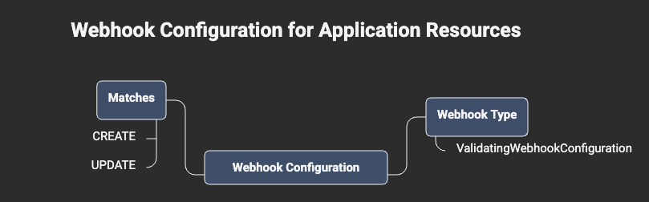
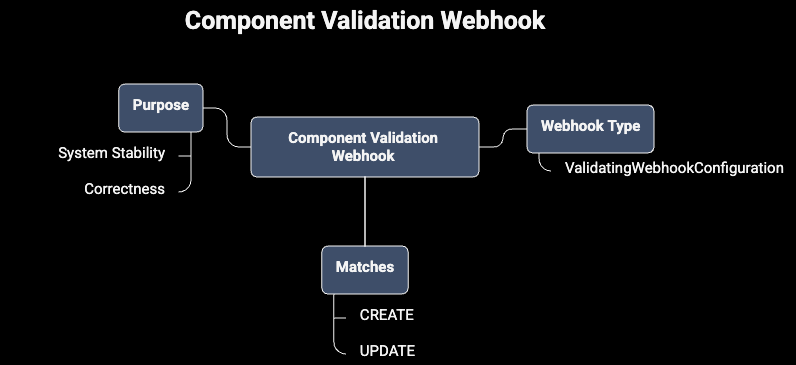
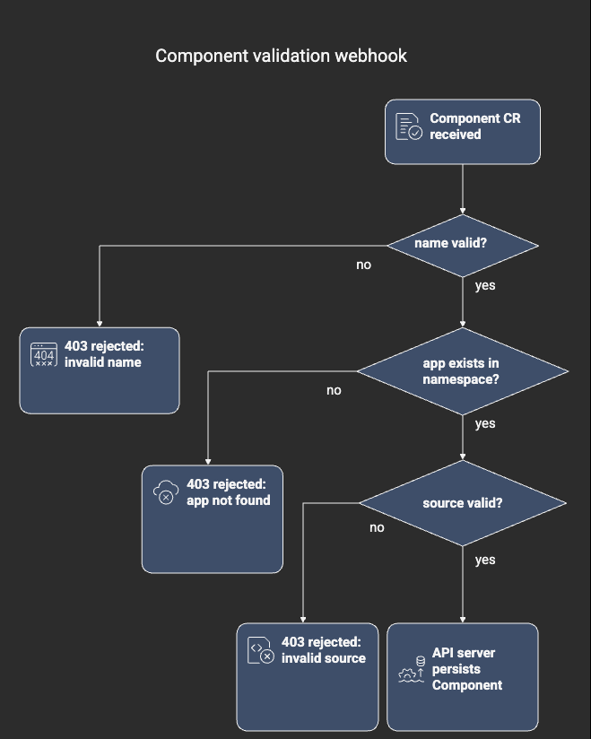
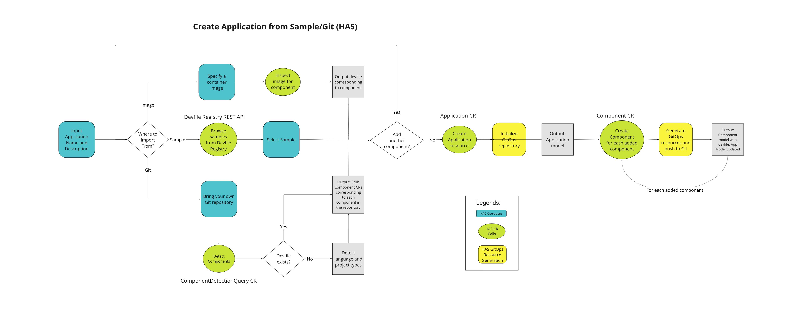
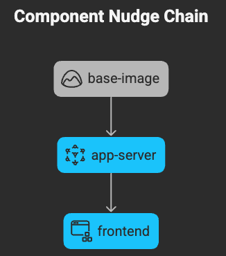
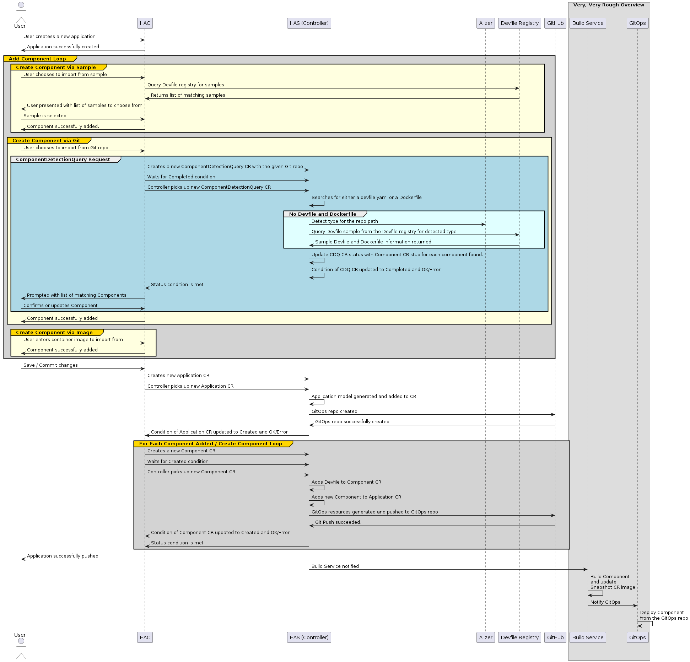
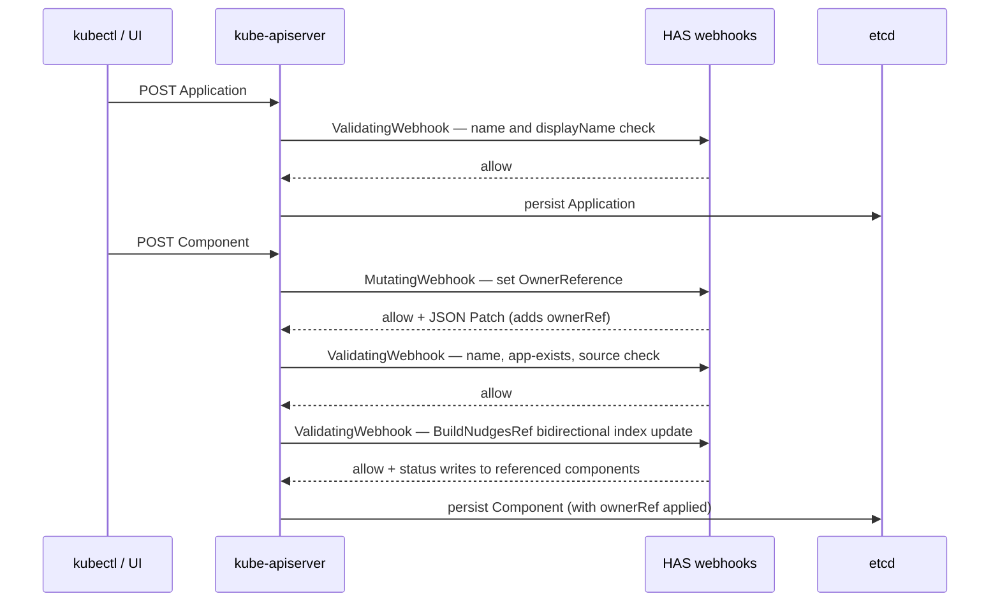
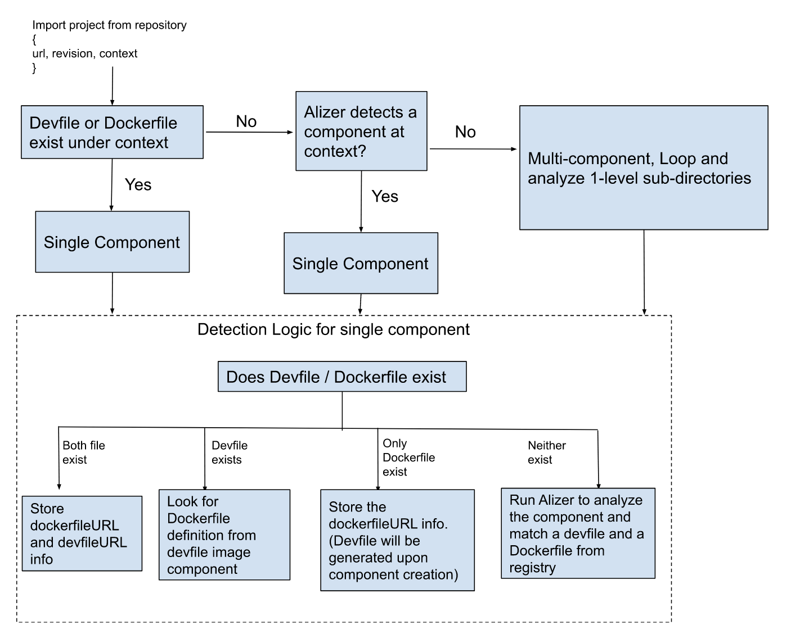

# Hybrid Application Service (HAS)

> ⚠️ **Deprecated — retained for historical reference only.**
> HAS has been superseded. Its repository (`redhat-appstudio/application-service`) is archived on GitHub.
> If you landed here because you are onboarding to Konflux, go to [Build Service](./build-service.md) instead —
> that is where Component provisioning and webhook logic live today.
>
> For the authoritative record of why and how HAS was replaced, see
> [ADR-0056](../../ADR/0056-revised-component-model.md) (Implementable) and
> [ADR-0060](../../ADR/0060-component-groups.md) (Proposed).

---

## Background

The name "Hybrid Application Service" appears in older ADRs, git blame outputs, and
archived GitHub issues without explanation. This page documents what HAS did and what
replaced it — useful context when reading the Konflux commit history or tracing why
certain design decisions were made.

HAS is not operational. Nothing here should be used as a reference for new work.

---

## What HAS was

HAS was a Kubernetes operator that sat in the admission path for two custom resources:
`Application` and `Component`. Its sole job was enforcement — making sure those objects
met shape and relationship constraints before the API server persisted them.

It did not run pipelines. It did not schedule builds. It did not talk to any external
system. It only intercepted API server requests and either allowed them (possibly with
mutations) or rejected them with a reason.

Kubernetes exposes two admission webhook types:

- **Validating** webhooks — read the incoming object, return allow or deny.
- **Mutating (defaulting)** webhooks — read the incoming object, return allow plus a
  JSON Patch that the API server applies before persisting.

HAS used both kinds.

---

## The four webhooks

### 1. Application validation webhook

```
Webhook type: ValidatingWebhookConfiguration
Matches:      CREATE and UPDATE on Application resources
```

This webhook checked that:

- `metadata.name` matched the Kubernetes DNS-subdomain name format
  (`/^[a-z0-9]([-a-z0-9]*[a-z0-9])?$/`).
- `spec.displayName`, if set, did not contain characters that downstream services could
  not safely render (control characters, certain Unicode ranges).

If either check failed, the API server returned a 403 with HAS's error message directly
to the `kubectl` caller. The `Application` was never written to etcd.

**Why this mattered.** Several Konflux services embedded the application name into
annotation values, label selectors, and PipelineRun names. A name like `my app` with a
space would silently corrupt label selectors further down the pipeline, producing
failures that were very hard to trace back. Catching it at admission time gave a clear,
immediate error before any downstream state was written.



### 2. Component validation webhook

```
Webhook type: ValidatingWebhookConfiguration
Matches:      CREATE and UPDATE on Component resources
```


This webhook enforced three things:

1. `spec.application` must reference an `Application` that exists in the same namespace.
2. `metadata.name` must follow the same DNS-subdomain rules as Application names.
3. `spec.source` must contain exactly one of `git` or `image`, and the chosen field must
   be structurally valid (a git source needs at minimum a `url`).




The source validation was particularly important because Build Service read
`spec.source.git.url` without defensive checks — it assumed HAS had already validated
the shape before the object landed in etcd.

### 3. Component defaulting webhook

```
Webhook type: MutatingWebhookConfiguration
Matches:      CREATE on Component resources
```

This webhook ran *before* the validating webhook in the admission chain. It added an
`OwnerReference` block to the `Component` manifest pointing at its parent `Application`:

```yaml
ownerReferences:
  - apiVersion: appstudio.redhat.com/v1alpha1
    kind: Application
    name: my-app
    uid: <uid-of-the-application>
    blockOwnerDeletion: true
    controller: true
```

The `controller: true` flag tells Kubernetes garbage collection to treat the
`Application` as the owning controller. When you deleted an `Application`, Kubernetes
automatically deleted all `Component` objects that carried this reference — no custom
finalizer logic was needed in any other controller.

The diagram below (preserved from the original HAS repository) shows the full sequence
for application and component creation including the webhook call order:



### 4. BuildNudgesRef webhook

```
Webhook type: ValidatingWebhookConfiguration (with side effects — status writes)
Matches:      CREATE and UPDATE on Component resources where spec.build-nudges-ref changed
```

This was the most complex webhook. The `spec.build-nudges-ref` field on a `Component`
is a list of other component names in the same namespace that should get their image
reference bumped (nudged) when this component's image is updated — a list of downstream
consumers.

The webhook maintained a bidirectional index. When component A listed component B in
`spec.build-nudges-ref`, the webhook wrote B's name into A's status *and* wrote A's
name into B's status field `status.buildNudgedBy`. This kept the graph queryable from
either direction without a full namespace scan.

For example, given a three-component nudge chain:



The resulting status fields would be:

```
base-image.status.buildNudgedBy:  []
base-image.spec.build-nudges-ref: [app-server]

app-server.status.buildNudgedBy:  [base-image]
app-server.spec.build-nudges-ref: [frontend]

frontend.status.buildNudgedBy:    [app-server]
frontend.spec.build-nudges-ref:   []
```

Build Service could then walk either direction of the graph without performing a full
namespace-wide list operation.

The full application creation sequence (including all webhook interactions) is preserved
below:



---

## How all four webhooks fit together

The admission chain for a Component creation request, showing webhook call order:



> **Admission order:** Kubernetes runs all mutating webhooks before any validating
> webhooks. That is why the OwnerReference was always present by the time the component
> validator checked `spec.application` — the mutating webhook had already patched the
> object in memory before the validator ran.

---

## CDQ (Component Detection Query)

HAS also included CDQ, the Component Detection Query controller, which ran independently
of the four admission webhooks. When a user provided a repository URL without specifying which parts
were buildable components, CDQ would scan the repository using devfile detection,
Dockerfile detection, and similar heuristics, then return a list of detected component
candidates.

The detection flow is shown below:



CDQ was not migrated to another service — the functionality was intentionally dropped
as part of the Component model revision. The new model assumes users know what they
want to build. Auto-detection added significant complexity and produced false positives
in practice (for example, detecting the wrong Dockerfile in a monorepo).

---

## Why HAS was deprecated

The core problem was ownership and coupling. HAS owned the `Application` and `Component`
CRDs, but Build Service, Integration Service, Release Service, and the UI all had
load-bearing assumptions about those CRDs. Any schema change sent ripples across four
or five codebases simultaneously.

[ADR-0056](../../ADR/0056-revised-component-model.md) identified three concrete
problems:

**1. One component = one branch.** Building the same repository from two branches
(`main` and `release-1.x`) required two separate `Component` objects with duplicated
config. There was no concept of component versions. The new `Component` spec addresses
this with a `spec.source.versions` list.

**2. One component = one application.** The hard `spec.application` field meant a
component image could only belong to one release group. Putting it in two groups
required duplicating the component, which meant two separate build pipelines, two image
repositories, and images that drifted apart over time.

**3. Unclear API ownership.** With HAS deprecated, no service formally owned the
`Application` / `Component` CRD. ADR-0056 resolved this: Build Service owns `Component`,
and Integration Service owns the new `ComponentGroup` (replacing `Application`).

The migration replaced the four HAS webhooks as follows:

| Former HAS webhook | Replacement |
|---|---|
| Application name / displayName validation | CRD schema validation rules on the `Application` resource |
| Component shape validation (name, source, app reference) | CRD schema validation rules on the `Component` resource, owned by Build Service |
| OwnerReference defaulting | Managed by the Build Service controller |
| BuildNudgesRef bidirectional index | Build Service nudging controller (see [build-service.md](./build-service.md#component-dependency-update-controller-nudging)) |

---

## Component API type history

The Go types for `Application`, `Component`, and `ComponentDetectionQuery` did not stay
in one place. They moved twice, and if you are chasing an import path in older code you
need to know all three locations.

**Stage 1 — HAS repo (original home)**

The types were defined inside `redhat-appstudio/application-service` alongside the
webhook controllers. `api/v1alpha1/` held the CRD structs, markers, and generated
`zz_generated.deepcopy.go`. Any service that used `Application` or `Component` objects
imported directly from this path.

**Stage 2 — Consolidated API repo (intermediate)**

As additional services needed the same types, vendoring the full HAS controller repo
created a large, awkward dependency. The types were extracted into a standalone
API-only repo: [`konflux-ci/application-api`](https://github.com/konflux-ci/application-api).

This repo contains no controllers or webhooks — only the CRD Go structs, generated
clients, and webhook registration markers. Services that were updated during this period
import from `github.com/konflux-ci/application-api/apis/appstudio/v1alpha1`.

The `konflux-ci/application-api` repo is still active today. It still exports the
`Application` CRD types, which remain in use while the transition described below
completes.

**Stage 3 — Build Service (current, in progress)**

With [ADR-0056](../../ADR/0056-revised-component-model.md), the `Component` type is
being redesigned. As part of that redesign, ownership of the `Component` CRD moves from
the centralised `application-api` repo into
[`konflux-ci/build-service`](https://github.com/konflux-ci/build-service). The new
`Component` spec lives in `build-service`'s own `api/` directory.

This means:

- New code importing `Component` should use the `build-service` module path.
- The `Application` CRD, once replaced by `ComponentGroup` (ADR-0060), will stop being
  defined in `application-api` as well. Integration Service will own the
  `ComponentGroup` type.
- `application-api` is transitioning toward a no-longer-needed state, though it is not
  yet archived.

> **Summary of import paths across time:**
>
> | Era | Import path | Status |
> |-----|-------------|--------|
> | HAS era | `github.com/redhat-appstudio/application-service/api/v1alpha1` | Archived — read only |
> | Consolidated API era | `github.com/konflux-ci/application-api/apis/appstudio/v1alpha1` | Active, transitioning out |
> | Current / new model | `github.com/konflux-ci/build-service/api/...` | Active, canonical for new work |

---

## Migration path

If you maintain tooling, tests, or documentation that references HAS:

**Replace the import path.** Any code importing from
`github.com/redhat-appstudio/application-service` should already have been migrated to
`github.com/konflux-ci/application-api` (the intermediate consolidated API repo). The
next step is to migrate from there to the types in
[konflux-ci/build-service](https://github.com/konflux-ci/build-service) for `Component`
and to `ComponentGroup` (Integration Service API) for what was previously `Application`.
See the [Component API type history](#component-api-type-history) section for the full
import path timeline.

**Remove stale webhook registrations.** If any `ValidatingWebhookConfiguration` or
`MutatingWebhookConfiguration` objects in a cluster still point at the old HAS service
endpoint, remove them. The service no longer runs; depending on `failurePolicy` those
webhooks will either fail open (allowing all requests silently) or fail closed (blocking
everything silently) — neither is correct.

**CDQ callers.** If your code calls the CDQ API directly, remove those calls. There is
no equivalent API in the current system.

**OwnerReference cascade.** Deleting an `Application` still cascades to `Component`
deletion automatically — but the cascade is now managed by the Build Service controller
rather than an admission webhook. The observable behaviour is unchanged.

---

## Related ADRs

| ADR | Status | What it covers |
|---|---|---|
| [ADR-0056](../../ADR/0056-revised-component-model.md) | Implementable | Motivation and design for the revised Component model that replaced HAS |
| [ADR-0060](../../ADR/0060-component-groups.md) | Proposed | Specification of the new `ComponentGroup` CRD (replaces `Application`) |

Current active repositories:

- [konflux-ci/build-service](https://github.com/konflux-ci/build-service) — owns `Component` CR and build pipeline provisioning
- [konflux-ci/integration-service](https://github.com/konflux-ci/integration-service) — owns `ComponentGroup` CR (implementation in progress per ADR-0060)
- [konflux-ci/application-api](https://github.com/konflux-ci/application-api) — consolidated API types repo; active but transitioning out as CRD ownership moves into the service repos above
- ~~`redhat-appstudio/application-service`~~ — archived, read-only

