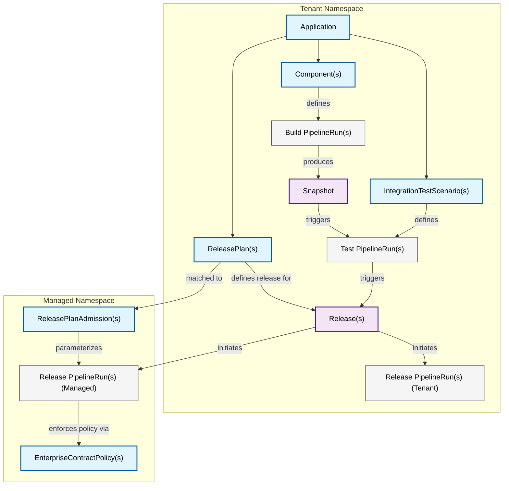

# Konflux Core Services

Konflux subsystems are divided into two categories: **core** and **add-ons**. The core subsystems are required for a working system, while [add-ons](../add-ons/index.md) are optional services that provide additional capabilities.

This document describes the core subsystems and how they work together to provide the fundamental capabilities of the Konflux platform.

## Application Context

## Service (Component) Context

```mermaid
graph TD
    subgraph aws[AWS]
        PG[Postgres Database]
    end

    subgraph registry[OCI Registry]
        OCI[Container Images & Attestations]
    end

    subgraph scm[SCM System]
        SCM[Git Repositories]
    end

    subgraph Konflux Core Services
        HAS[Hybrid Application Service]
        BS[Build Service]
        IS[Integration Service]
        RS[Release Service]
        EC[Enterprise Contract]
        subgraph PS[Pipeline Service]
            TP[Tekton Pipelines]
            PAC["Pipelines as Code (PaC)"]
            TC[Tekton Chains]
            TR[Tekton Results]
        end
    end

    subgraph kubeapi[Kubernetes API Server]
        TW[Tenant Workspace]
        MW[Managed Workspace]
    end

    HAS -- Validates App/Component --> TW
    BS -- Manages Build PipelineRuns --> TW
    IS -- Manages Snapshots & Test PipelineRuns --> TW
    RS -- Manages Releases & Release PipelineRuns --> TW
    RS -- Manages ReleasePlanAdmission --> MW
    EC -- Enforces Policy --> MW
    SCM -- Sends Webhooks --> PAC
    TC -- Signs & Attests --> OCI
    TC -- Watches --> TP
    TR -- Stores Results --> PG
    TR -- Watches --> TP

    style HAS fill:#e3f2fd,stroke:#1976d2,stroke-width:2px,color:#000000;
    style BS fill:#e3f2fd,stroke:#1976d2,stroke-width:2px,color:#000000;
    style IS fill:#e3f2fd,stroke:#1976d2,stroke-width:2px,color:#000000;
    style RS fill:#e3f2fd,stroke:#1976d2,stroke-width:2px,color:#000000;
    style PS fill:#e3f2fd,stroke:#1976d2,stroke-width:2px,color:#000000;
    style TP fill:#e3f2fd,stroke:#1976d2,stroke-width:2px,color:#000000;
    style PAC fill:#e3f2fd,stroke:#1976d2,stroke-width:2px,color:#000000;
    style TC fill:#e3f2fd,stroke:#1976d2,stroke-width:2px,color:#000000;
    style TR fill:#e3f2fd,stroke:#1976d2,stroke-width:2px,color:#000000;
    style EC fill:#e3f2fd,stroke:#1976d2,stroke-width:2px,color:#000000;
    style kubeapi fill:#e8eaf6,stroke:#3f51b5,stroke-width:2px,color:#000000;
    style TW fill:#ffffff,stroke:#1565c0,stroke-width:3px,color:#000000;
    style MW fill:#ffffff,stroke:#1565c0,stroke-width:3px,color:#000000;
    style PG fill:#e8f5e8,stroke:#2e7d32,stroke-width:1px,color:#000000;
    style OCI fill:#f5f5f5,stroke:#424242,stroke-width:1px,color:#000000;
    style SCM fill:#f5f5f5,stroke:#424242,stroke-width:1px,color:#000000;
```

### Hybrid Application Service

The [Hybrid Application Service] provides Kubernetes webhooks for Application and Component resources. It validates Application and Component custom resources to prevent resources from being created with invalid names or configurations, and sets up proper ownership relationships between Components and their parent Applications.

### Build Service

The [Build Service] contains controllers that create and configure build pipelines. It monitors Component CRs and creates PipelineRun definitions which are used by Pipelines As Code (PaC). The Build Service also manages component dependency updates through the nudging controller.

### Integration Service

The [Integration Service] facilitates automated testing of content produced by the build pipelines. It creates Snapshots representing collections of components to be tested together, coordinates testing of those Snapshots through user-defined Integration Test Scenarios, and creates Releases when tests pass and automatic ReleasePlans are configured.

### Release Service

The [Release Service] orchestrates release pipelines to deliver content. It manages the Release custom resource and coordinates the relationship between Development Workspaces and Managed Workspaces through ReleasePlan and ReleasePlanAdmission resources. The Release Service ensures no Enterprise Contract violations exist prior to releasing content.

### Pipeline Service

The [Pipeline Service] provides Tekton APIs and services to Konflux. It offers Tekton APIs through custom resource definitions, container image signing and provenance attestations through Tekton Chains, and archiving of PipelineRuns, TaskRuns, and logs through Tekton Results. Pipeline Service is a foundational service on which Build Service, Integration Service, and Release Service depend.

### Enterprise Contract

The [Enterprise Contract] ensures container images produced by Konflux meet clearly defined requirements before they are considered releasable. It validates that images are signed with trusted keys, have attestations, and meet rule-based requirements defined using Rego policies, such as ensuring tasks were defined in known and trusted task bundles and that required tests passed during the pipeline build.

### Konflux UI

The [Konflux UI] provides a web-based user interface for interacting with Konflux. It offers a unified interface for managing Applications, Components, and monitoring builds, tests, and releases across the entire development lifecycle.

[Hybrid Application Service]: ./hybrid-application-service.md
[Build Service]: ./build-service.md
[Integration Service]: ./integration-service.md
[Release Service]: ./release-service.md
[Pipeline Service]: ./pipeline-service.md
[Enterprise Contract]: ./enterprise-contract.md
[Konflux UI]: ./konflux-ui.md
