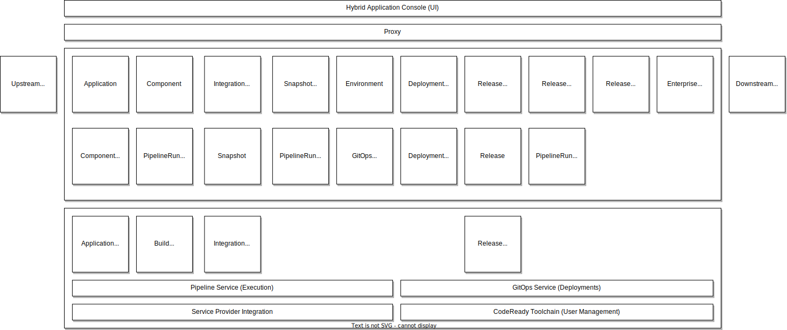

# AppStudio

## Overview
AppStudio is a platform for building integrated experiences that streamline, consolidate, and secure the application lifecycle.

### Goals
- Compose cloud native applications that consist of multiple components and services
- Provide managed application lifecycle
- Rapid bootstrapping of applications
- Fast onboarding of applications to the cloud
- Supports both existing and new applications
- Provide APIs to manage your application lifecycle
- Provide a surface for partners to integrate into the application lifecycle

## Architecture Goals and Constraints
- Robust delivery automation: Establish continuous delivery practices but also deliver operational tooling.
- Just in time scaling: In contrast to “just in case” scaling. The system should be able to scale without capacity reserved ahead of time.
- Static stability: the overall system continues to work when a dependency is impaired
- Each subservice can fulfill its primary use cases independently, without relying on  other systems’ availability.
- Each sub-service owns its data and logic.
- Communication among services and participants is always asynchronous.
- Each sub-service is owned by one team. Ownership does not mean that only one team can change the code, but the owning team has the final decision.
- Minimize shared infrastructure among sub-services
- Participants: onboarding new participants, the flexibility to satisfy the technology preferences of a heterogeneous set of participants. Think of this as the ability to easily create an ecosystem and the ability to support that ecosystem’s heterogeneous needs.
- Security, Privacy, and Governance: Sensitive data is protected by fine-grained access control

## Application Context

The diagram below shows the services that make up AppStudio and their API resources.

API resources in the first row (Application, Component) should primarilly be thought of as
control-plane resources. Users supply these resources to indicate to the system what they want it to
do.

API resources in the second row (PipelineRun, Snapshot) should primarilly be thought of as
data-plane resources. The system responds to user requests by creating and managing the lifecycle of
these resources.

- An [Application] represents a functionally coherent set of [Components] that should be built,
  tested, and released together. The user provides and names their [Applications]. They are
  generally long-lived and don't change much after they are created.
- A [Component] represents a git branch on a git repository (and a particular context directory)
  that should be used to build OCI artifacts from commits that appear there. A [Component] is owned
  by an [Application]. The user provides and names their [Components] and specifies which git
  repositories and branches define how the artifact is built.  The user may add, remove, or change
  [Components] over the lifespan of an [Application].
- A [Snapshot] represents a collection of particular OCI artifacts, mapped to the [Components] of an
  [Application]. A [Snapshot] is owned by an [Application]. Generally, the [integration-service]
  produces new [Snapshots] automatically in response to completed builds. It is also possible for
  the user to construct and provide [Snapshots] to test or release deliberate combinations of
  OCI artifacts. Old [Snapshots] are garbage collected if not bound to other resources like
  a [SnapshotEnvironmentBinding] or a [Release].
- An [IntegrationTestScenario] represents a test that should be run against new [Snapshots] that
  belong to a particular [Application]. It is owned by an [Application]. The user provides
  tekton pipelines that test their application and registers them with the system by creating
  [IntegrationTestScenarios].
- An [Environment] represents a destination that [application-service] and the [gitops-service] can
  deploy to. Multiple [Applications] in the same workspace can deploy to the same
  [Environment]. An [Environment] may be long lived (like the `development` [Environment] provided
  by the system as part of the initialization of a user's workspace) or may be short-lived and
  ephemeral (like the temporary [Environments] created by the [integration-service] as a part of its
  test execution processes).
- A [DeploymentTargetClaim] represents a request to provision a new deployment target. An
  [Environment] is backed by a [DeploymentTargetClaim]. The [DeploymentTargetClaim] causes new
  deployment targets to be provisioned which are represented by [DeploymentTargets] that get bound
  to it. These are typically created and destroyed by the [integration-service] as a part of its
  test execution processes.
- A [SnapshotEnvironmentBinding] represents a request to deploy a particular set of OCI artifacts
  (represented by a [Snapshot]) to a particular location (represented by an [Environment]).
  A [SnapshotEnvironmentBinding] is owned by an [Application]. The [integration-service promotes
  OCI artifacts] by updating the [SnapshotEnvironmentBinding] associated with an [Environment]. The
  [SnapshotEnvironmentBinding] is generally long-lived.
- A [ReleasePlan] represents a release pipeline that can be used to release a [Snapshot] to some
  destination, depending on the implementation of the release pipeline. A [ReleasePlan] is owned by
  an [Application]. It can operate in two modes, one which executes a "tenant" release pipeline in
  the user's workspace, and another when used in conjunction with a [ReleasePlanAdmission] where it
  executes a "managed" release pipeline in a separate privileged workspace owned by another team.
  The [ReleasePlan] is generally long-lived.
- A [ReleasePlanAdmission] represents an *acceptance* of release pipeline content from another
  team's workspace into *this* workspace. It is used exclusively in conjunction with a [ReleasePlan]
  to represent agreement on details about how to release [Snapshots] across workspace boundaries.
  The [ReleasePlanAdmission] is generally long-lived.
- A [Release] represents a request to release a particular set of OCI artifacts (represented by
  a [Snapshot]) by particular means (represented by the release pipeline details in
  a [ReleasePlan]). The creation of a [Release] causes [release-service] to create a release
  PipelineRun in one or more workspaces depending on details in the associated [ReleasePlan] and
  [ReleasePlanAdmission].

## Service (Component) Context

Each service that makes up AppStudio is further explained in its own document.

- [Hybrid Application Service](./hybrid-application-service.md) - A workflow system that manages
  the definition of the users' Application and Components.
- [Build Service](./build-service.md) - A workflow system that manages the build pipeline definition
  for users' Components.
- [Image Controller](./image-controller.md) - A subsystem of the build-service that manages the
  creation and access rights to OCI repositories.
- [Java Rebuilds Service](./jvm-build-service.md) - A subsystem of the build-service that manages
  the rebuild of binary java jars pulled from maven central for an improved degree of provenance.
- [Integration Service](./integration-service.md) - A workflow service that manages execution of
  users' tests and promotion in response to completing builds.
- [Release Service](./release-service.md) - A workflow service that manages execution of privileged
  pipelines to release user content to protected destinations.
- [GitOps Service](./gitops-service.md) - A foundational service providing deployment of user
  applications.
- [Pipeline Service](./pipeline-service.md) - A foundational service providing Pipeline APIs and secure supply
  chain capabilities to other services
- [Service Provider Integration](./service-provider-integration.md) - A foundational service
  providing user secret management to other services.
- [Enterprise Contract](./enterprise-contract.md) - A specialized subsystem responsible for the
  definition and enforcement of policies related to how OCI artifacts are built and tested.

## API References

### Developer Services

- [Application and Environment API](../ref/application-environment-api.md)
- [Service Provider](../ref/service-provider.md)
- [GitOps Service](../ref/gitops.md):

### Naming Conventions

- [Namespace Metadata](../ADR/adr-0010-namespace-metadata)

[integration-service promotes OCI artifacts]: ../ADR/0016-integration-service-promotion-logic.md
[application-service]: ./hybrid-application-service.md
[gitops-service]: ./gitops-service.md
[integration-service]: ./integration-service.md
[release-service]: ./release-service.md
[Application]: ../ref/application-environment-api.md#application
[Applications]: ../ref/application-environment-api.md#application
[Component]: ../ref/application-environment-api.md#component
[Components]: ../ref/application-environment-api.md#component
[Environment]: ../ref/application-environment-api.md#environment
[Environments]: ../ref/application-environment-api.md#environment
[Snapshot]: ../ref/application-environment-api.md#snapshot
[Snapshots]: ../ref/application-environment-api.md#snapshot
[SnapshotEnvironmentBinding]: ../ref/application-environment-api.md#snapshotenvironmentbinding
[SnapshotEnvironmentBindings]: ../ref/application-environment-api.md#snapshotenvironmentbinding
[DeploymentTarget]: ../ref/application-environment-api.md#deploymenttarget
[DeploymentTargets]: ../ref/application-environment-api.md#deploymenttarget
[DeploymentTargetClaim]: ../ref/application-environment-api.md#deploymenttargetclaim
[DeploymentTargetClaims]: ../ref/application-environment-api.md#deploymenttargetclaim
[Release]: ../ref/release-service.html#release
[Releases]: ../ref/release-service.html#release
[ReleasePlan]: ../ref/release-service.html#releaseplan
[ReleasePlans]: ../ref/release-service.html#releaseplan
[ReleasePlanAdmission]: ../ref/release-service.html#releaseplanadmission
[ReleasePlanAdmissions]: ../ref/release-service.html#releaseplanadmission
[IntegrationTestScenario]: ../ref/integration-service.html#integrationtestscenario
[IntegrationTestScenarios]: ../ref/integration-service.html#integrationtestscenario
