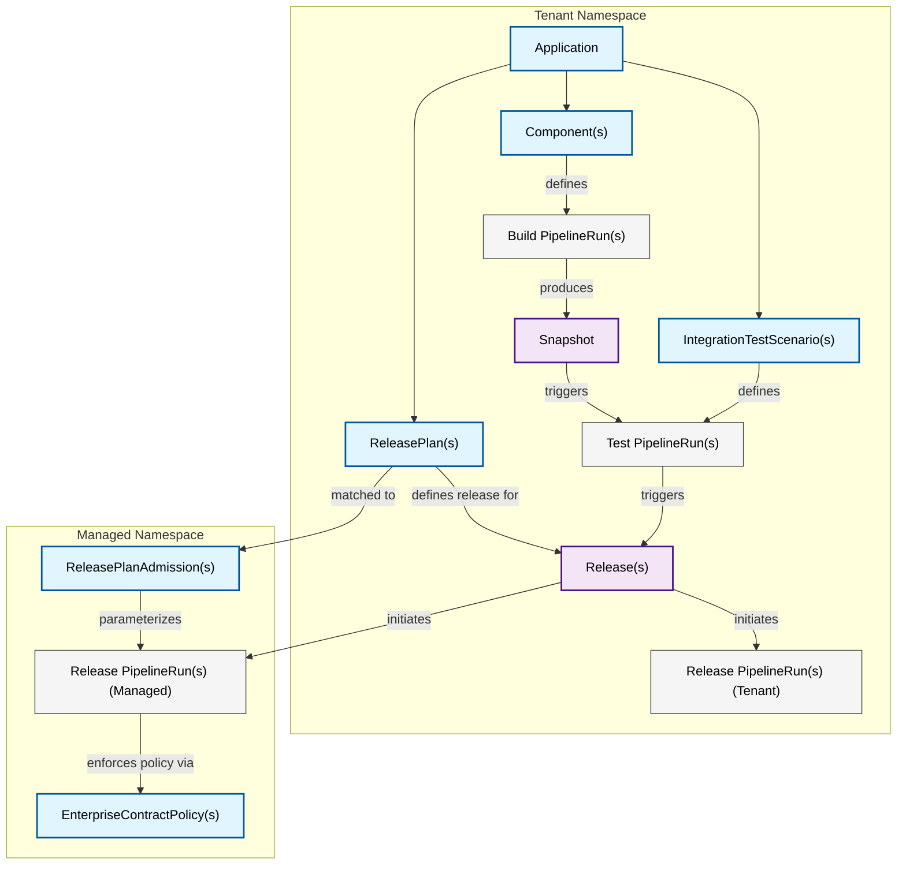
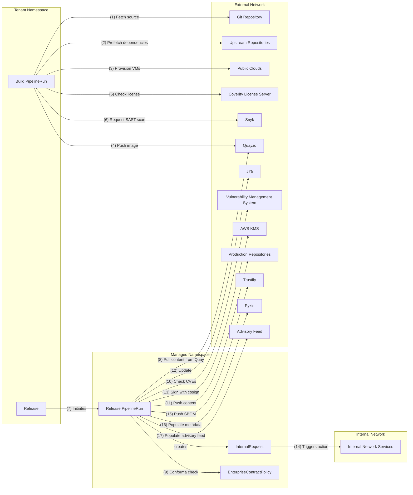

# Konflux

## Overview

Konflux is a platform for building integrated software that streamlines, consolidates, and secures the development lifecycle.

### Goals

- Build component artifacts from source.
- Compose software that consists of multiple components, from multiple repositories.
- Provide transparency on the software supply chain of artifacts: what makes up the software and how was it built.
- Provide a way for software teams to release to destinations under the control of their SRE or release engineering team(s).
- Provide a unified user interface across the entire process

## Architecture Goals

- Build artifacts once with enough data to determine suitability for releasing.
- Build artifacts once that can be released to multiple locations, multiple use cases.
- Specify builds and their dependencies entirely from git and not from transient state of the build system. Employ tools like [renovate](https://docs.renovatebot.com/) to manage dependency updates.
- Build semantically reproducible artifacts. Any configuration which has the potential to affect the semantic functionality of a build should be recorded in the provenance and source controlled whenever possible.
- Be extensible. Provide opinionated [build pipelines](https://github.com/redhat-appstudio/build-definitions/) and [release pipelines](https://github.com/redhat-appstudio/release-service-catalog), but let users extend those and create their own.
- "Shift left" the decisions for releasing into PRs; you should be able to release artifacts from a PR as soon as it is merged.
- Scale without capacity reserved ahead of time.
- Static stability: the overall system continues to work when a dependency is impaired.
- Enhancements to the pipelines (the extensible elements of the system) should be rolled out in such a way that individual users can control **when** they accept the update to their namespaces, their processes. Use policy to drive eventual compliance.
- Each subservice can fulfill its primary use cases independently, without relying on other systems’ availability. An exception to this is the tekton [pipeline service] which provides foundational APIs on which [build-service], [integration-service], and [release-service] depend.
- Each sub-service owns its data and logic.
- Communication among services and participants is always asynchronous.
- Each sub-service is owned by one team. Ownership does not mean that only one team can change the code, but the owning team has the final decision.
- Minimize shared resources among sub-services.
- Security, Privacy, and Governance: Sensitive data is protected by fine-grained access control

## Architecture Constraints

- Our API server is **the kube API server**. Services are [controllers](https://kubernetes.io/docs/concepts/architecture/controller/) that expose their API as Custom Resource Definitions. This means that requests are necessarily asyncronous. This means that [RBAC](https://kubernetes.io/docs/reference/access-authn-authz/rbac/) is implemented the same way across services. In any exceptional case that a service needs to expose its own user-facing HTTP endpoint (like [tekton results](https://github.com/tektoncd/results)), use `SubjectAccessReviews` to ensure RBAC is consistent. Note, a few other supporting endpoints are exposed outside of kube (the [sprayproxy](https://github.com/redhat-appstudio/sprayproxy) from [pipeline-service] for receiving webhooks, [registration-service](https://github.com/codeready-toolchain/registration-service) from [codeready-toolchain](https://github.com/codeready-toolchain/) for signing up new users).
- **Use tekton** for anything that should be extended by the user (building, testing, releasing). Expose as much detail via kube resources as possible. Prefer to implement native tasks to perform work on cluster, rather than calling out to third-party services.
- The **user has admin** in their namespace. This means that the user can access secrets in their namespace. This means that the system can never provide secrets to the user that are scoped beyond that user's domain. A user can exfiltrate the push secret from their namespace, build invalid content on their laptop, and push it to their buildtime registry. Such a build will be rejected at release time.
- The cluster is our **unit of sharding**. Each cluster is independent and runs an instance of every subsystem. User namespaces are allocated to one cluster. If we lose a cluster, all namespaces on that cluster are inaccessible, but namespaces on other clusters are not impacted, limiting the blast radius. No subsystem should coordinate across clusters.
- Artifacts built, tested, and shipped by the system are **OCI artifacts**. SBOMs, attestations, signatures, and other supporting metadata are stored in the registry alongside the artifact, tagged by the `cosign triangulate` convention.
- While not true today, it should be possible to **install** one subsystem without the others and to replace one subsystem with a new one without affecting the others. See [!148](https://github.com/redhat-appstudio/architecture/pull/148) for an example of attempting to achieve this.
- Any attestation used for making a release-time decision should be provably trusted (either because it is GPG signed or its immutable reference is added to the provenance by a trusted task).

> :bulb: Adding new functionality usually looks like either adding a new **controller** or adding a new **tekton task**.

## Application Context

- An [Application] represents a functionally coherent set of [Components] that should be built,
  tested, and released together. The user provides and names their [Applications]. They are
  generally long-lived and don't change much after they are created.
- A [Component] represents a git branch on a git repository (and a particular context directory)
  that should be used to build OCI artifacts from commits that appear there. A [Component] is owned
  by an [Application]. The user provides and names their [Components] and specifies which git
  repositories and branches define how the artifact is built.  The user may add, remove, or change
  [Components] over the lifespan of an [Application].
- A [Snapshot] represents a collection of particular OCI artifacts, mapped to [Components].
  A [Snapshot] is owned by an [Application]. Generally, the [integration-service] produces new
  [Snapshots] automatically in response to completed builds. It is also possible for
  the user to construct and provide [Snapshots] to test or release deliberate combinations of
  OCI artifacts. [Snapshots] are immutable. For a user to "modify" a [Snapshot], they need to create
  a new [Snapshot] based on an old [Snapshot]. Old [Snapshots] are garbage collected if not bound to
  other resources like a [Release].
- An [IntegrationTestScenario] represents a test that should be run against new [Snapshots] that
  belong to a particular [Application]. It is owned by an [Application]. The user provides
  tekton pipelines that test their application and registers them with the system by creating
  [IntegrationTestScenarios].
- A [ReleasePlan] represents a release pipeline that can be used to release a [Snapshot] to some
  destination, depending on the implementation of the release pipeline. A [ReleasePlan] is owned by
  an [Application]. It can operate in two modes, one which executes a "tenant" release pipeline in
  the user's namespace, and another when used in conjunction with a [ReleasePlanAdmission] where it
  executes a "managed" release pipeline in a separate privileged namespace owned by another team.
  The [ReleasePlan] is generally long-lived.
- A [ReleasePlanAdmission] represents an *acceptance* of release pipeline content from another
  team's namespace into *this* namespace. It is used exclusively in conjunction with a [ReleasePlan]
  to represent agreement on details about how to release [Snapshots] across namespace boundaries.
  The [ReleasePlanAdmission] is generally long-lived.
- A [Release] represents a request to release a particular set of OCI artifacts (represented by
  a [Snapshot]) by particular means (represented by the release pipeline details in
  a [ReleasePlan]). The creation of a [Release] causes [release-service] to create a release
  PipelineRun in one or more namespaces depending on details in the associated [ReleasePlan] and
  [ReleasePlanAdmission]. A [Release] can be created in one of two ways: if the [ReleasePlan] has an
  *automated release* flag set to true, then [integration-service] will automatically create new
  [Releases] for every [Snapshot] that successfully passes its post-merge testing. If that flag is
  set to false, then the user is expected to create new a [Release] manually, associated with
  [Snapshot] selected by the user manually.

The system's API resources can be categorized in two primary ways: as either
control-plane or data-plane resources and as either tenant resources or managed
resources.

Regarding control-plane and data-plane:

- Control plane resources are resources that users supply to indicate to the
  system what they want it to do. Examples are [Application], [Component],
  [IntegrationTestScenario], [ReleasePlan], and [ReleasePlanAdmission].
- Data plane resources are resources primarilly created and managed by the
  system in response to user requests. Examples are [PipelineRun], [Snapshot],
  and [Release].

Regarding tenant resources and managed resources.

- Tenant resources are resources that appear in [tenant namespaces]. Examples
  are [Application], [Component], [IntegrationTestScenario], [ReleasePlan],
  [Snapshot], and [Release].
- Managed resources are resources that appear in [managed namespaces]. Examples
  are [ReleasePlanAdmission] and [EnterpriseContractPolicy].
- Tekton [PipelineRuns], as a foundational piece, appear in both tenant and managed namespaces.

## Service (Component) Context

```mermaid
graph TD
    subgraph aws[AWS]
        PG[Postgres Database]
    end

    subgraph registry[OCI Registry]
        OCI[Container Images & Attestations]
    end

    subgraph scm[SCM System]
        SCM[Git Repositories]
    end

    subgraph Konflux Services
        HAS[Hybrid Application Service]
        BS[Build Service]
        IS[Integration Service]
        RS[Release Service]
        subgraph PS[Pipeline Service]
            TP[Tekton Pipelines]
            PAC["Pipelines as Code (PaC)"]
            TC[Tekton Chains]
            TR[Tekton Results]
        end
    end

    subgraph kubeapi[Kubernetes API Server]
        App[Application]
        Comp[Component]
        Snap[Snapshot]
        ITS[IntegrationTestScenario]
        RPA[ReleasePlanAdmission]
        RP[ReleasePlan]
        Release[Release]
        PR[PipelineRun]
    end

    HAS -- Manages --> App
    HAS -- Manages --> Comp
    BS -.-> Comp
    BS -.-> PR
    IS -.-> App
    IS -- Manages --> ITS
    IS -- Manages --> Snap
    IS -.-> PR
    RS -.-> PR
    RS -- Manages --> RPA
    RS -- Manages --> RP
    RS -- Manages --> Release
    TP -- Provides --> PR
    SCM -- Sends Webhooks --> PAC
    TC -- Signs & Attests --> OCI
    TC -- Watches --> TP
    TR -- Stores Results --> PG
    TR -- Watches --> TP

    style HAS fill:#e3f2fd,stroke:#1976d2,stroke-width:2px,color:#000000;
    style BS fill:#e3f2fd,stroke:#1976d2,stroke-width:2px,color:#000000;
    style IS fill:#e3f2fd,stroke:#1976d2,stroke-width:2px,color:#000000;
    style RS fill:#e3f2fd,stroke:#1976d2,stroke-width:2px,color:#000000;
    style PS fill:#e3f2fd,stroke:#1976d2,stroke-width:2px,color:#000000;
    style TP fill:#e3f2fd,stroke:#1976d2,stroke-width:2px,color:#000000;
    style PAC fill:#e3f2fd,stroke:#1976d2,stroke-width:2px,color:#000000;
    style TC fill:#e3f2fd,stroke:#1976d2,stroke-width:2px,color:#000000;
    style TR fill:#e3f2fd,stroke:#1976d2,stroke-width:2px,color:#000000;
    style EC fill:#e3f2fd,stroke:#1976d2,stroke-width:2px,color:#000000;
    style kubeapi fill:#e8eaf6,stroke:#3f51b5,stroke-width:2px,color:#000000;
    style App fill:#ffffff,stroke:#1565c0,stroke-width:3px,color:#000000;
    style Comp fill:#ffffff,stroke:#1565c0,stroke-width:3px,color:#000000;
    style Snap fill:#ffffff,stroke:#1565c0,stroke-width:3px,color:#000000;
    style ITS fill:#ffffff,stroke:#1565c0,stroke-width:3px,color:#000000;
    style RPA fill:#ffffff,stroke:#1565c0,stroke-width:3px,color:#000000;
    style RP fill:#ffffff,stroke:#1565c0,stroke-width:3px,color:#000000;
    style Release fill:#ffffff,stroke:#1565c0,stroke-width:3px,color:#000000;
    style PR fill:#ffffff,stroke:#1565c0,stroke-width:3px,color:#000000;
    style PG fill:#e8f5e8,stroke:#2e7d32,stroke-width:1px,color:#000000;
    style OCI fill:#f5f5f5,stroke:#424242,stroke-width:1px,color:#000000;
    style SCM fill:#f5f5f5,stroke:#424242,stroke-width:1px,color:#000000;

    click HAS "Hybrid Application Service" "https://github.com/redhat-appstudio/application-service"
    click BS "Build Service" "https://github.com/redhat-appstudio/core/build-service.md"
    click IS "Integration Service" "https://github.com/redhat-appstudio/core/integration-service.md"
    click RS "Release Service" "https://github.com/redhat-appstudio/core/release-service.md"
    click PS "Pipeline Service" "https://github.com/redhat-appstudio/core/pipeline-service.md"
    click KubeAPI "Kubernetes API Server (Controllers)" "https://kubernetes.io/docs/concepts/architecture/controller/"

    click App "Application API Reference" "https://konflux-ci.dev/docs/reference/kube-apis/application-api/#k8s-api-github-com-konflux-ci-application-api-api-v1alpha1-application"
    click Comp "Component API Reference" "https://konflux-ci.dev/docs/reference/kube-apis/application-api/#k8s-api-github-com-konflux-ci-application-api-api-v1alpha1-component"
    click Snap "Snapshot API Reference" "https://konflux-ci.dev/docs/reference/kube-apis/application-api/#k8s-api-github-com-konflux-ci-application-api-api-v1alpha1-snapshot"
    click ITS "IntegrationTestScenario API Reference" "https://konflux-ci.dev/docs/reference/kube-apis/integration-service/#k8s-api-github-com-konflux-ci-integration-service-api-v1alpha1-integrationtestscenario"
    click Release "Release API Reference" "https://konflux-ci.dev/docs/reference/kube-apis/release-service/#k8s-api-github-com-konflux-ci-release-service-api-v1alpha1-release"
    click RP "ReleasePlan API Reference" "https://konflux-ci.dev/docs/reference/kube-apis/release-service/#k8s-api-github-com-konflux-ci-release-service-api-v1alpha1-releaseplan"
    click RPA "ReleasePlanAdmission API Reference" "https://konflux-ci.dev/docs/reference/kube-apis/release-service/#k8s-api-github-com-konflux-ci-release-service-api-v1alpha1-releaseplanadmission"
```

Each service that makes up Konflux is further explained in its own document.

### Konflux Core Services

These services make up the core of Konflux and are all required for a working system.

- [Hybrid Application Service](./core/hybrid-application-service.md) - A workflow system that runs the validation webhooks for Applications and Components
- [Build Service](./core/build-service.md) - A workflow system that manages the build pipeline definition
  for users' Components.
- [Integration Service](./core/integration-service.md) - A workflow service that manages execution of
  users' tests and promotion in response to completing builds.
- [Release Service](./core/release-service.md) - A workflow service that manages execution of privileged
  pipelines to release user content to protected destinations.
- [Pipeline Service](./core/pipeline-service.md) - A foundational service providing Pipeline APIs and secure supply
  chain capabilities to other services
- [Enterprise Contract](./core/enterprise-contract.md) - A specialized subsystem responsible for the
  definition and enforcement of policies related to how OCI artifacts are built and tested.

### Konflux Add-Ons

The [konflux add-ons](./add-ons/index.md) are optional services that, when installed, provide some additional capability.

- [Image Controller](./add-ons/image-controller.md) - A subsystem of the build-service that manages the
  creation and access rights to OCI repositories.
- [Multi Platform Controller](./add-ons/multi-platform-controller.md) - A
  subsystem that manages public cloud resources to make multi-platform VMs
  available to build pipelines.
- [Internal Services Controller](./add-ons/internal-services.md) - A
  subsystem that facilitates access to resources across network boundaries.

## Data Flow

When a commit lands on a tracked branch in a user's git repository, a series of network requests are made to external services. The following diagram illustrates the sequence of these requests.

1.  The build pipeline in the tenant namespace fetches source code from a **Git Repository**.
2.  The build pipeline prefetches dependencies from **Upstream Repositories** like pypi, rubygems, and npmjs.org.
3.  If multi-platform builds are configured, the build pipeline may make requests to **Public Clouds** (like AWS or IBM Cloud) to provision virtual machines.
4.  The build pipeline pushes the built container image and its associated artifacts (like SBOMs) to **Quay.io** or another OCI registry.
5.  The build pipeline may check with a **Coverity License Server** to validate dependencies.
6.  The build pipeline requests a SAST scan from **Snyk**.
7.  A `Release` resource in the tenant namespace initiates a `Release PipelineRun` in the managed namespace.
8.  The release pipeline pulls the content, attestations, and SBOMs from **Quay.io**.
9.  A conforma check compares the attestations against an **EnterpriseContractPolicy**.
10. The release pipeline checks the CVE status in a **Vulnerability Management System**.
11. The release pipeline pushes content to **Production Repositories**.
12. The release pipeline in the managed namespace may update a **Jira** ticket to reflect the status of the release.
13. The release pipeline makes a request to **AWS KMS** to sign the release with `cosign`.
14. The release pipeline in the managed namespace may create an `InternalRequest` which is observed by a controller that interacts with other **Internal Network Services** (like a signing server, message bus, or other internal systems) to complete the release process.
15. The release pipeline pushes the SBOM to **Trustify** for vulnerability management.
16. The release pipeline populates metadata in **Pyxis**.
17. The release pipeline populates the **Advisory Feed**.

## API References

### Developer Services

- [Application and Environment API](../ref/application-environment-api.md)

### Naming Conventions

- [Namespace Metadata](../ADR/adr-0010-namespace-metadata)

[integration-service promotes OCI artifacts]: ../ADR/0016-integration-service-promotion-logic.md
[application-service]: ./core/hybrid-application-service.md
[pipeline-service]: ./core/pipeline-service.md
[gitops-service]: ./gitops-service.md
[build-service]: ./core/build-service.md
[integration-service]: ./core/integration-service.md
[release-service]: ./core/release-service.md
[Application]: ../ref/application-environment-api.md#application
[Applications]: ../ref/application-environment-api.md#application
[Component]: ../ref/application-environment-api.md#component
[Components]: ../ref/application-environment-api.md#component
[Snapshot]: ../ref/application-environment-api.md#snapshot
[Snapshots]: ../ref/application-environment-api.md#snapshot
[Release]: ../ref/release-service.html#release
[Releases]: ../ref/release-service.html#release
[ReleasePlan]: ../ref/release-service.html#releaseplan
[ReleasePlans]: ../ref/release-service.html#releaseplan
[ReleasePlanAdmission]: ../ref/release-service.html#releaseplanadmission
[ReleasePlanAdmissions]: ../ref/release-service.html#releaseplanadmission
[IntegrationTestScenario]: ../ref/integration-service.html#integrationtestscenario
[IntegrationTestScenarios]: ../ref/integration-service.html#integrationtestscenario
