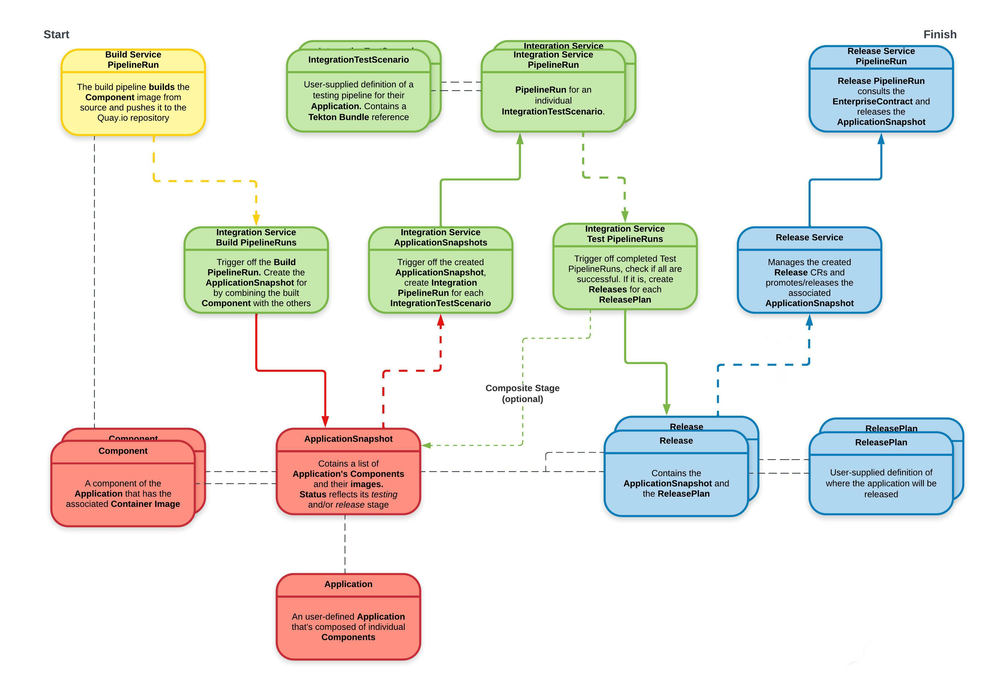

# Release Service

## Overview

The **Release service** is composed of a Release Operator that can create and orchestrate release pipelines defined
in Release Strategies to deliver content.

The main API that is exposed is called the **Release** custom resource. This custom resource is used by the Release
Service as input to request a release of content for an **Application**.

Additional custom resources are used to compose the system. **ReleasePlan** and **ReleasePlanAdmission** define the
relationship between **Development** Workspaces and **Managed** Workspaces.

**Release Strategies** are referenced in **ReleasePlanAdmissions** and are used to define which pipeline should be
executed to deliver content.

In addition, the Release service ensures that no violations in the [Enterprise Contract] exist prior to releasing content.

## System Context

The diagram below shows the interaction of the release service and other services.



## Application Context

The diagram below shows the flow of custom resources and the orchestration of pipelines by the release service.


## Terminology

**Snapshot** - The custom resource that contains the list of all Components of an Application with their Component Image digests. Once created, the list of Components with their images is immutable. The Integration service updates the status of the resource to reflect the testing outcome.
**Release Pipeline** - An instance of a Pipeline that is orchestrated by the Release Service.
**Bundle** - A tekton bundle (image) that contains Tekton resources.
**Development Workspace** - A workspace shared by 1 or more team members when code is built and tested.
**Managed Workspace** - A controlled workspace that is managed by an SRE or Release Engineering team. This is where Release Pipelines execute.

## Resources
Below is the list of CRs that the Release service is responsible for interacting with:

### CREATE

| Custom Resource             | When?                                                       | Why?                                                                                          |
|-----------------------------|-------------------------------------------------------------|-----------------------------------------------------------------------------------------------|
| SnapshotEnvironmentBinding  | When deploying the Snapshot to an Environment               | To create a SnapshotEnvironmentBinding for the referenced Environment when one does not exist |
| PipelineRun                 | Once a Release has been composed and is ready for execution | To perform the steps in the Release Pipeline                                                  |

### READ

| Custom Resources        | When?                                                  | Why?                                                             |
|-------------------------|--------------------------------------------------------|------------------------------------------------------------------|
| Application & Component | When validating ReleasePlans and ReleasePlanAdmissions | To ensure data consistency                                       |
| ReleasePlan             | When starting to process a Release                     | To determine the target workspace to run the Release Pipeline in |
| ReleasePlanAdmission    | When starting to process a Release                     | To determine how to compose the Release Pipeline                 |
| Snapshot                | Creating and triggering a Release Pipeline             | To determine which components to release                         |

### UPDATE

| Custom Resource            | When?                                                    | Why?                                                             |
|----------------------------|----------------------------------------------------------|------------------------------------------------------------------|
| SnapshotEnvironmentBinding | When deploying the Snapshot to an Environment            | To update existing SnapshotEnvironmentBinding for a new Snapshot |
| Release                    | During the lifecycle of an attempt to release a Snapshot | To provide status for the execution of the Release Pipeline      |

### WATCH

| Custom Resource            | When?                                                      | Why?                                                               |
|----------------------------|------------------------------------------------------------|--------------------------------------------------------------------|
| Release                    | Always                                                     | To provide an API to trigger a release                             |
| PipelineRun                | Once the PipelineRun is created                            | To relay the Release PipelineRun status to the Release for viewing |
| SnapshotEnvironmentBinding | After the SnapshotEnvironmentBinding is created or updated | To relay the GitOps deployment status to the Release for viewing   |

#### Annotations/Labels

Following the [annotation guidelines](https://docs.google.com/document/d/1gyXM3pkKFFfxHZnopBi_53vREFWhwA0pFUuIhopDuEo/edit#), the Release Service sets the below annotations on PipelineRuns.
```
“pipelines.appstudio.openshift.io/type":     "release",
“appstudio.openshift.io/application":        “<application name>”,
"release.appstudio.openshift.io/name":       "<release name>",
"release.appstudio.openshift.io/namespace":  "<development workspace name>"
```
The Release service will copy the annotations and labels from the Release CR and append those to the Release PipelineRuns for traceability across the system per [Labels and Annotations for StoneSoup pipelines](https://docs.google.com/document/d/1fJq4LDakLfcAPvOOoxxZNWJ_cuQ1ew9jfBjWa-fEGLE/edit#) and [StoneSoup builds and tests PRs](https://docs.google.com/document/d/113XTplEWRM63aIzk7WwgLruUBu2O7xVy-Zd_U6yjYr0/edit#).

## Detailed Workflow

1. A Release CR is created automatically by the Integration Service or manually by a user.
   * The `spec.snaphot` should reference the Snapshot to release.
   * The `spec.releasePlan` should reference the ReleasePlan to use.
2. Find the matching ReleasePlanAdmission in the `spec.target` namespace specified in the ReleasePlan.
3. Extract the `spec.pipelineRef`, `spec.serviceAccount`, `spec.policy` from the ReleasePlanAdmission
5. Create a Release PipelineRun using the above info.
6. Watch Release PipelineRun and update Release `status` with progress and outcome.
7. If ReleasePlanAdmission specified a `spec.environment`, then do the following:
   * Copy the Snapshot to the managed workspace.
   * Verify that the Application and Components have been copied to managed workspace.
   * Create or update SnapshotEnvironmentBinding in the managed workspace.
   * Watch SnapshotEnvironmentBinding to relay deployment status to Release CR `status`.

### Dependencies

The [Release Service](./release-service.md) is dependent on the following services:
- [Pipeline Service](./pipeline-service.md)
    - Pipeline execution, Pipeline logging
- [Integration Service](./integration-service.md)
    - Facilitates automated testing of content produced by the build pipelines
- [GitOps Service](./gitops-service.md)
    - Provides the facility to create
        - Snapshots defining sets of Builds to release
        - Environment to deploy the Application to
        - SnapshotEnvironmentBindings to have the Snapshot of the Application deployed to a specific Environment
- [Enterprise Contract Service](./enterprise-contract.md)
    - Provides facilities to validate whether content has passed the Enterprise Contract.

## References

[Enterprise Contract]: ./enterprise-contract.md
[Integration Service]: ./integration-service.md
[GitOps Service]: ./gitops-service.md
[Pipeline Service]: ./pipeline-service.md
