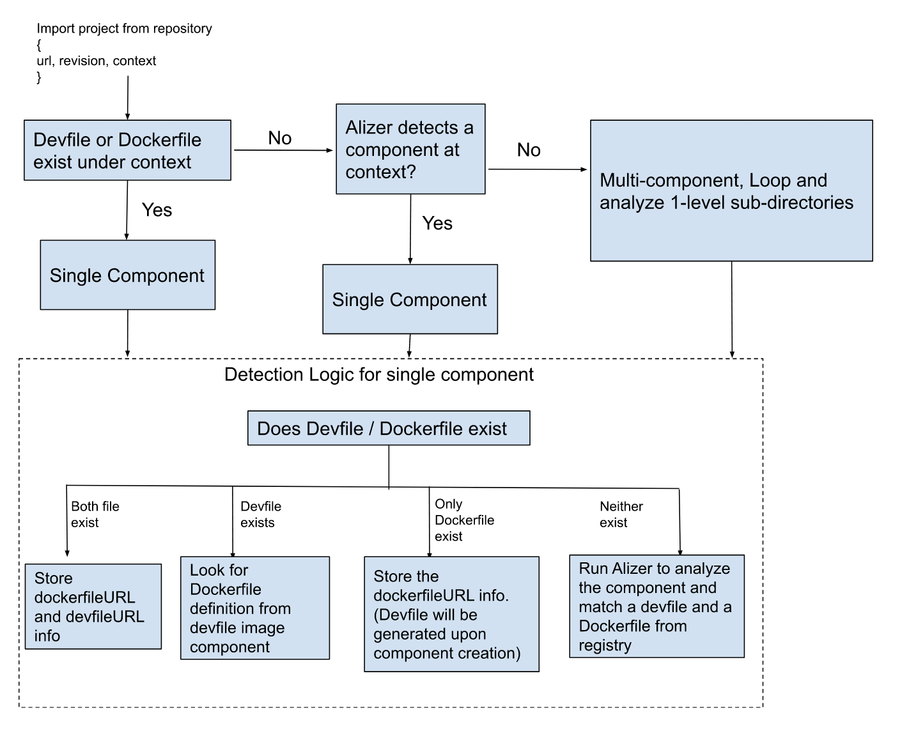

# Component Detection Query (CDQ) Controller Logic

## CDQ Detection Logic

When the repository is imported, CDQ looks for Devfile and Dockerfile under context directory. If neither Devfile nor a Dockerfile exist, HAS will run [Alizer](https://github.com/devfile/alizer) against the repository to detect the Components. If there is a Component being detected under context, or Devfile or Dockerfile exists, CDQ will consider the repository is a single Component project. Otherwise, it is a multi-component project.

**CDQ Detection Logic for a Component:**

* If Devfile and Dockerfile exist under context, use the Devfile and Dockerfile.

    Devfile locations in order of priority: `<context>/devfile.yaml` -> `<context>/.devfile.yaml` -> `<context>/devfile.yml` -> `<context>/.devfile.yml` -> `<context>/.devfile/devfile.yaml` -> `<context>/.devfile/.devfile.yaml` -> `<context>/.devfile/devfile.yml` -> `<context>/.devfile/.devfile.yml`.

    Dockerfile location we look for: `<context>/Dockerfile` -> `<context>/docker/Dockerfile` -> `<context>/.docker/Dockerfile` -> `<context>/build/Dockerfile`
    _Containerfile is an alternative for Dockerfile._

* If only Devfile exist under context, look for Dockerfile definition under Devfile image Component.
* If only Dockerfile exist, use the Dockerfile. a proper Devfile content will be generated with a matched runtime upon Component creation
* If neither files exist, run Alizer to analyze the Component and match a Devfile sample with a Dockerfile from the community Devfile registry

## CDQ Validation Logic

CDQ validates the Devfile to ensure the provided Devfile is valid, and with proper outerloop definition. The validation logic is:

* The Devfile needs to be valid, which follows the [validation rules](https://devfile.io/docs/2.2.0/devfile-validation-rules)
* The Kubernetes Component URI and Kubernetes definition content need to be valid
* If the Devfile contains no Devfile Kubernetes/Image components, this means the Devfile contains no outerloop definition and CDQ ignores the Devfile from provided repository. The CDQ detection logic will fall back to the behavior that with no Devfile exists in the repository
* When the Devfile contains no Deploy/Apply command, or if a Devfile contains more than one Kubernetes component but with no Deploy command being defined, or if the Devfile contains more than one Image components but with no Apply command being defined; the CDQ will error out
