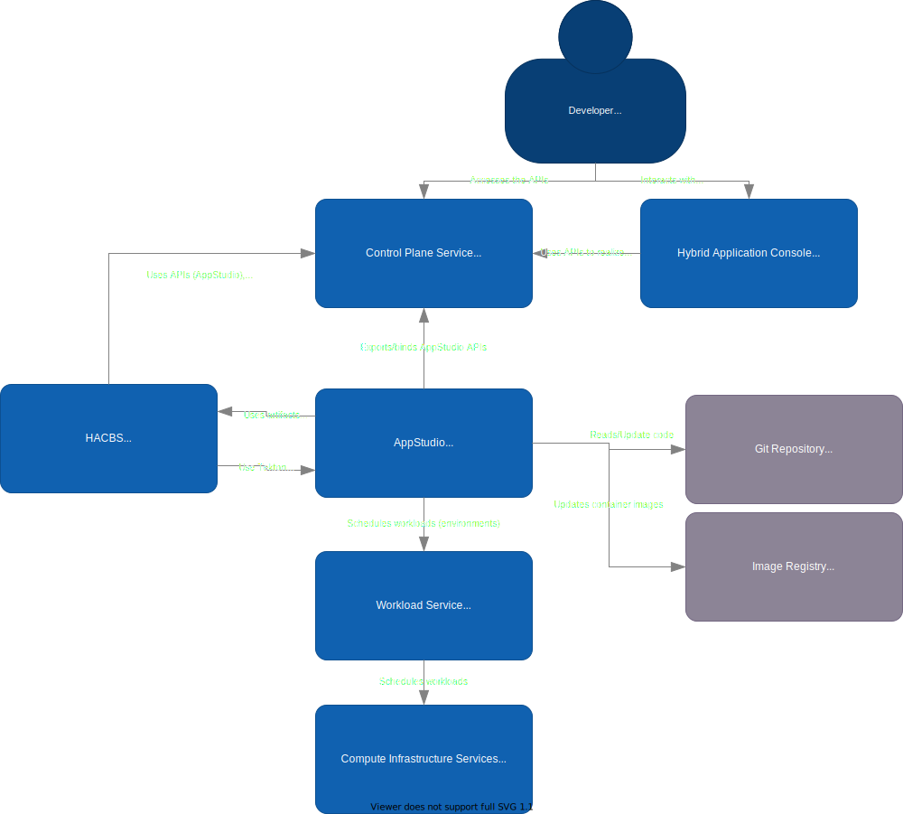
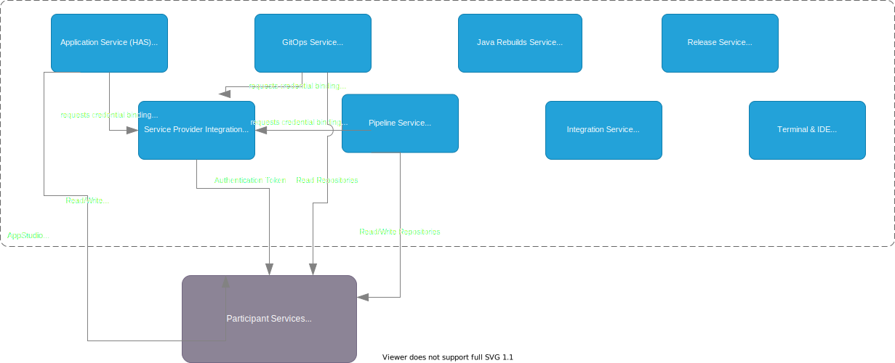

# Managed Developer Services

## Overview
Red Hat developer services provide the platform for building integrated experiences that streamline, consolidate, and secure the application lifecycle.

### Goals
- Compose cloud native applications that consist of multiple components and services
- Provide managed application lifecycle
- Rapid bootstrapping of applications
- Fast onboarding of applications to the cloud
- Supports both existing and new applications
- Provide APIs to manage your application lifecycle
- Provide a surface for partners to integrate into the application lifecycle

## Architecture Goals and Constraints
- Robust delivery automation: Establish continuous delivery practices but also deliver operational tooling.
- Just in time scaling: In contrast to “just in case” scaling. The system should be able to scale without capacity reserved ahead of time.
- Static stability: the overall system continues to work when a dependency is impaired
- Each subservice can fulfill its primary use cases independently, without relying on  other systems’ availability.
- Each sub-service owns its data and logic.
- Communication among services and participants is always asynchronous.
- Each sub-service is owned by one team. Ownership does not mean that only one team can change the code, but the owning team has the final decision.
- Minimize shared infrastructure among sub-services
- Participants: onboarding new participants, the flexibility to satisfy the technology preferences of a heterogeneous set of participants. Think of this as the ability to easily create an ecosystem and the ability to support that ecosystem’s heterogeneous needs.
- Security, Privacy, and Governance: Sensitive data is protected by fine-grained access control

## System Context

The diagram below shows the interaction of the AppStudio and HACBS with other systems and environments.

## Application Context

## Service (Component) Context

Each service is that makes up AppStudio and HACBS are further decomposed on their own documents.

- [GitOps Service](./gitops-service.md)
- [Pipeline Service](./pipeline-service.md)
- [Build Service](./build-service.md)
- [Workspace and Terminal Service](./workspace-and-terminal-service.md)
- [Service Provider Integration](./service-provider-integration.md)
- [Hybrid Application Service](./hybrid-application-service.md)
- [Enterprise Contract](./enterprise-contract-service.md)
- [Java Rebuilds Service](./java-rebuilds-service.md)
- [Release Service](./release-service.md)
- Integration Service

## API References

### Developer Services

- [Application and Environment API](../ref/application-environment-api.md)
- [Service Provider](../ref/service-provider.md)
- [GitOps Service](../ref/gitops.md):

### Control Plane

- [KCP](../ref/kcp.md)
