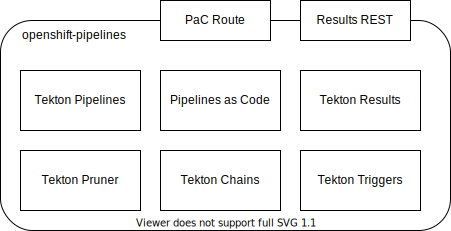

# Pipeline Service

Pipeline Service provides Tekton APIs and services to StoneSoup.
In the initial phase of StoneSoup, Pipeline Service will be provided by a stock
installation of the OpenShift Pipelines operator.
This deployed version will be the a candidate build of the OpenShift Pipelines
operator from a Red Hat build system.

## APIs and Services

Pipeline Service provides the following:

- Tekton APIs directly through its custom resource definitions.
- Container image signing and provenance attestations through Tekton Chains.
- Archiving of `PipelineRuns`, `TaskRuns`, and associated logs through Tekton
  Results.

Pipeline Service also exposes the following ingress points:

- Pipelines as Code Webhook: this is a `Route` that receives webhook events
  from source code repositories.
- Tekton Results REST: this is an `Ingress` that serves Tekton Results data
  over a RESTful API. Clients authenticate with the same `Bearer` token used to
  authenticate Kubernetes requests.

## Deployment Configuration

The deployment of the OpenShift Pipelines operator will have the following
notable configurations:

- Tekton Triggers will be disabled entirely.
- The pruner (provided by the Pipelines operator) will be disabled in favor of
  pruning via Tekton Results.
- Pipelines as Code will link the results of pipeline tasks to an appropriate
  [Hybrid Application Console (HAC)](./hybrid-application-console.md) URL.
