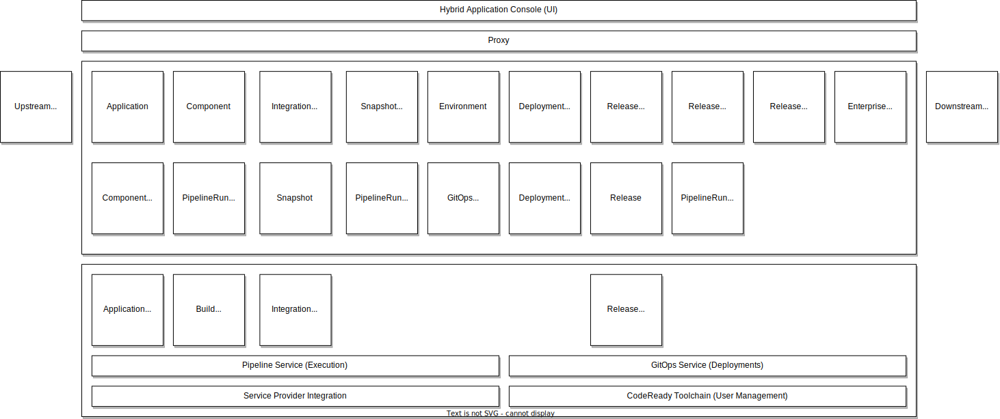

# Konflux

## Overview
Konflux is a platform for building integrated software that streamlines, consolidates, and secures the development lifecycle.

### Goals
- Compose software that consists of multiple components, from multiple repositories.
- Provide transparency on the software supply chain, including both what makes up the software and how it was built.
- Provide a way for software teams to release to destinations under the control of their SRE or release engineering team(s).
- Rapid bootstrapping of new software projects
- Support both existing and new projects
- Provide APIs to manage your software lifecycle
- Provide a surface for partners to integrate, add value
- Provide a unified user interface across the entire process

## Architecture Goals

- Build artifacts once with enough data to determine suitability for releasing.
- Build artifacts once that can be released to multiple locations, multiple use cases.
- Specify builds and their dependencies entirely from git and not from transient state of the build system. Employ tools like [renovate](https://docs.renovatebot.com/) to manage dependency updates.
- Build semantic reproducible artifacts. Any configuration which has the potential to affect the semantic functionality of a build should be source controlled and associated with the produced artifact (via the provenance, for example).
- Be extensible. Provide opinionated [build pipelines](https://github.com/redhat-appstudio/build-definitions/) and [release pipelines](https://github.com/redhat-appstudio/release-service-catalog), but let users extend those and create their own.
- "Shift left" the decisions for releasing into PRs; you should be able to release artifacts from a PR as soon as it is merged.
- Just in time scaling: In contrast to “just in case” scaling. The system should be able to scale without capacity reserved ahead of time.
- Static stability: the overall system continues to work when a dependency is impaired.
- Enhancements to the pipelines (the extensible elements of the system) should be rolled out in such a way that individual users can control **when** they accept the update to their workspaces, their processes. Use policy to drive eventual compliance.
- Each subservice can fulfill its primary use cases independently, without relying on other systems’ availability. An exception to this is the tekton [pipeline service] which provides foundational APIs on which [build-service], [integration-service], and [release-service] depend.
- Each sub-service owns its data and logic.
- Communication among services and participants is always asynchronous.
- Each sub-service is owned by one team. Ownership does not mean that only one team can change the code, but the owning team has the final decision.
- Minimize shared resources among sub-services.
- Participants: onboarding new participants, the flexibility to satisfy the technology preferences of a heterogeneous set of participants. Think of this as the ability to easily create an ecosystem and the ability to support that ecosystem’s heterogeneous needs.
- Security, Privacy, and Governance: Sensitive data is protected by fine-grained access control

## Architecture Constraints

- Our API server is **the kube API server**. Services are [controllers](https://kubernetes.io/docs/concepts/architecture/controller/) that expose their API as Custom Resource Definitions. This means that requests are necessarily asyncronous. This means that [RBAC](https://kubernetes.io/docs/reference/access-authn-authz/rbac/) is implemented the same way across services. In any exceptional case that a service needs to expose its own user-facing HTTP endpoint (like [tekton results](https://github.com/tektoncd/results)), use `SubjectAccessReviews` to ensure RBAC is consistent. Note, a few other supporting endpoints are exposed outside of kube (the [sprayproxy](https://github.com/redhat-appstudio/sprayproxy) from [pipeline-service] for receiving webhooks, [registration-service](https://github.com/codeready-toolchain/registration-service) from [codeready-toolchain](https://github.com/codeready-toolchain/) for signing up new users).
- **Use tekton** for anything that should be extended by the user (building, testing, releasing). Expose as much detail via kube resources as possible. Prefer to implement native tasks to perform work on cluster, rather than calling out to third-party services.
- The **user has admin** in their workspace. This means that the user can access secrets in their workspace. This means that the system can never provide secrets to the user that are scoped beyond that user's domain. A user can exfiltrate the push secret from their workspace, build invalid content on their laptop, and push it to their buildtime registry. Such a build will be rejected at release time.
- The cluster is our **unit of sharding**. Each cluster is independent and runs an instance of every subsystem. User workspaces are allocated to one cluster. If we lose a cluster, all workspaces on that cluster are inaccessible, but workspaces on other clusters are not impacted, limiting the blast radius. No subsystem should coordinate across clusters.
- Artifacts built, tested, and shipped by the system are **OCI artifacts**. SBOMs, attestations, signatures, and other supporting metadata are stored in the registry alongside the artifact, tagged by the `cosign triangulate` convention.
- While not true today, it should be possible to **install** one subsystem without the others and to replace one subsystem with a new one without affecting the others. See [!148](https://github.com/redhat-appstudio/architecture/pull/148) for an example of attempting to achieve this.
- Any attestation used for making a release-time decision should be provably trusted (either because it is GPG signed or its immutable reference is added to the provenance by a trusted task).

> :bulb: Adding new functionality usually looks like either adding a new **controller** or adding a new **tekton task**.

## Application Context

The diagram below shows the services that make up Konflux and their API resources.

API resources in the first row (Application, Component) should primarilly be thought of as
control-plane resources. Users supply these resources to indicate to the system what they want it to
do.

API resources in the second row (PipelineRun, Snapshot) should primarilly be thought of as
data-plane resources. The system responds to user requests by creating and managing the lifecycle of
these resources.

- An [Application] represents a functionally coherent set of [Components] that should be built,
  tested, and released together. The user provides and names their [Applications]. They are
  generally long-lived and don't change much after they are created.
- A [Component] represents a git branch on a git repository (and a particular context directory)
  that should be used to build OCI artifacts from commits that appear there. A [Component] is owned
  by an [Application]. The user provides and names their [Components] and specifies which git
  repositories and branches define how the artifact is built.  The user may add, remove, or change
  [Components] over the lifespan of an [Application].
- A [Snapshot] represents a collection of particular OCI artifacts, mapped to [Components].
  A [Snapshot] is owned by an [Application]. Generally, the [integration-service] produces new
  [Snapshots] automatically in response to completed builds. It is also possible for
  the user to construct and provide [Snapshots] to test or release deliberate combinations of
  OCI artifacts. [Snapshots] are immutable. For a user to "modify" a [Snapshot], they need to create
  a new [Snapshot] based on an old [Snapshot]. Old [Snapshots] are garbage collected if not bound to
  other resources like a [SnapshotEnvironmentBinding] or a [Release].
- An [IntegrationTestScenario] represents a test that should be run against new [Snapshots] that
  belong to a particular [Application]. It is owned by an [Application]. The user provides
  tekton pipelines that test their application and registers them with the system by creating
  [IntegrationTestScenarios].
- An [Environment] represents a destination that [application-service] and the [gitops-service] can
  deploy to. Multiple [Applications] in the same workspace can deploy to the same
  [Environment]. An [Environment] may be long lived (like the `development` [Environment] provided
  by the system as part of the initialization of a user's workspace) or may be short-lived and
  ephemeral (like the temporary [Environments] created by the [integration-service] as a part of its
  test execution processes).
- A [DeploymentTargetClaim] represents a request to provision a new deployment target. An
  [Environment] is backed by a [DeploymentTargetClaim]. The [DeploymentTargetClaim] causes new
  deployment targets to be provisioned which are represented by [DeploymentTargets] that get bound
  to it. These are typically created and destroyed by the [integration-service] as a part of its
  test execution processes.
- A [SnapshotEnvironmentBinding] represents a request to deploy a particular set of OCI artifacts
  (represented by a [Snapshot]) to a particular location (represented by an [Environment]).
  A [SnapshotEnvironmentBinding] is owned by an [Application]. The [integration-service promotes
  OCI artifacts] by updating the [SnapshotEnvironmentBinding] associated with an [Environment]. The
  [SnapshotEnvironmentBinding] is generally long-lived.
- A [ReleasePlan] represents a release pipeline that can be used to release a [Snapshot] to some
  destination, depending on the implementation of the release pipeline. A [ReleasePlan] is owned by
  an [Application]. It can operate in two modes, one which executes a "tenant" release pipeline in
  the user's workspace, and another when used in conjunction with a [ReleasePlanAdmission] where it
  executes a "managed" release pipeline in a separate privileged workspace owned by another team.
  The [ReleasePlan] is generally long-lived.
- A [ReleasePlanAdmission] represents an *acceptance* of release pipeline content from another
  team's workspace into *this* workspace. It is used exclusively in conjunction with a [ReleasePlan]
  to represent agreement on details about how to release [Snapshots] across workspace boundaries.
  The [ReleasePlanAdmission] is generally long-lived.
- A [Release] represents a request to release a particular set of OCI artifacts (represented by
  a [Snapshot]) by particular means (represented by the release pipeline details in
  a [ReleasePlan]). The creation of a [Release] causes [release-service] to create a release
  PipelineRun in one or more workspaces depending on details in the associated [ReleasePlan] and
  [ReleasePlanAdmission]. A [Release] can be created in one of two ways: if the [ReleasePlan] has an
  *automated release* flag set to true, then [integration-service] will automatically create new
  [Releases] for every [Snapshot] that successfully passes its post-merge testing. If that flag is
  set to false, then the user is expected to create new a [Release] manually, associated with
  [Snapshot] selected by the user manually.

## Service (Component) Context

Each service that makes up Konflux is further explained in its own document.

- [Hybrid Application Service]() - A workflow system that manages
  the definition of the users' Application and Components.
- [Build Service]() - A workflow system that manages the build pipeline definition
  for users' Components.
- [Image Controller]() - A subsystem of the build-service that manages the
  creation and access rights to OCI repositories.
- [Java Rebuilds Service]() - A subsystem of the build-service that manages
  the rebuild of binary java jars pulled from maven central for an improved degree of provenance.
- [Integration Service]() - A workflow service that manages execution of
  users' tests and promotion in response to completing builds.
- [Release Service]() - A workflow service that manages execution of privileged
  pipelines to release user content to protected destinations.
- [GitOps Service]() - A foundational service providing deployment of user
  applications.
- [Pipeline Service]() - A foundational service providing Pipeline APIs and secure supply
  chain capabilities to other services
- [Service Provider Integration]() - A foundational service
  providing user secret management to other services.
- [Enterprise Contract]() - A specialized subsystem responsible for the
  definition and enforcement of policies related to how OCI artifacts are built and tested.
- [Internal Services Controller]() - A specialized subsystem that enables
  invoking services that are not network addressable.

## API References

### Developer Services

- [Application and Environment API]()
- [Service Provider]()
- [GitOps Service]():

### Naming Conventions

- [Namespace Metadata]()

[integration-service promotes OCI artifacts]: 
[application-service]: 
[pipeline-service]: 
[gitops-service]: 
[build-service]: 
[integration-service]: 
[release-service]: 
[Application]: 
[Applications]: 
[Component]: 
[Components]: 
[Environment]: 
[Environments]: 
[Snapshot]: 
[Snapshots]: 
[SnapshotEnvironmentBinding]: 
[SnapshotEnvironmentBindings]: 
[DeploymentTarget]: 
[DeploymentTargets]: 
[DeploymentTargetClaim]: 
[DeploymentTargetClaims]: 
[Release]: 
[Releases]: 
[ReleasePlan]: 
[ReleasePlans]: 
[ReleasePlanAdmission]: 
[ReleasePlanAdmissions]: 
[IntegrationTestScenario]: 
[IntegrationTestScenarios]: 
