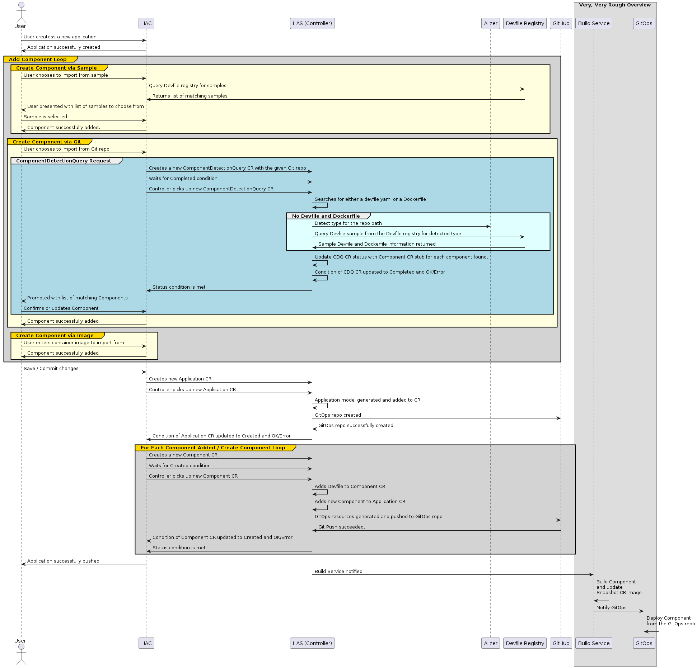

# Hybrid Application Service (HAS)

Hybrid Application Service (HAS) provides an abstract way to define Applications and Components within the cloud. It also allows users to create new Applications and Components or import existing ones into Konflux. HAS itself is a fully managed service with a set of predefined service types to provide out-of-the-box support.

## Goals
- Define an Application model that defines the Application and its containing Components
- Create new multi-component Applications that can be represented by the Application model
- Governs the life-cycle of Application model includes create, update and delete
- Create predefined Component types to help to develop, build and deploy Components of a particular language or framework
- Provide sample/starter Component for the predefined Component types
- Import existing Applications and represent them by the Application model
- Discovery mechanism matching the Component type for each Component to a predefined type support
- Set up the development environment (tools) easily for Components that match the predefined Component type

## Architecture Overview
To see how HAS fits into the Konflux architecture, refer to the Konflux [Application Context](

The diagram below shows the interaction between HAC and HAS services for the creation of Application and Component.

### Flow Chart

### Sequence Diagram

## Documentation

Navigate the various Hybrid Application Service topics to read more about them.

- [Hybrid Application Service (HAS) Design]()
- [Hybrid Application Service (HAS) Glossary]()
- [Hybrid Application Service (HAS) Kubernetes API]()
- [Hybrid Application Service (HAS) Kubernetes CRDs]()
- [Component Detection Query (CDQ) Controller Logic]()
- [Hybrid Application Service (HAS) Component Types]()
