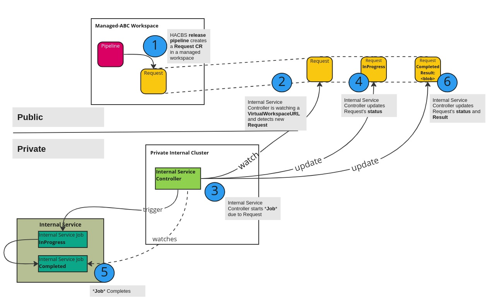

# Interacting with Internal Services

## Status

---

Accepted

## Context

---

Many organizations, including Red Hat, possess numerous internal services that help productize their software.
In many cases, these internal services will continue to play a role in the release workflows used in Konflux.

We originally thought that we should expose access to an organization's internal services by encouraging the use of "[bastion](https://en.wikipedia.org/wiki/Bastion_host)" interfaces that are publicly addressable but which also have some degree of internal network access. On review, we see now that internal network ingress like this opens up unwanted
attack vectors towards an organization's internal networks.

**Problem**: Konflux Release pipelines need to **initiate** processes with an organization's internal services which
are **not publicly addressable** in a secure fashion and be able to obtain process status and completion results.

## Decision

---

Use a "controller" running in a private cluster that can watch and reconcile **Request** custom resources in
one or more workspaces. This will be referred to as the **Internal Service Controller**.

**Request** is used here as a general type meaning that real use cases might involve custom resources
such as **ServiceABCRequest**.

This strategy will make use of KCP's VirtualWorkspace model allowing an internal service controller to watch a group of
workspace via a single _KUBECONFIG_. This internal service controller is expected to trigger a specific job that encapsulates the Internal Service's unit of work
that HACBS wants to initiate. It is expected that the internal service controller should update the **status** of the **Request** CR to denote the progress of the
triggered unit of work.

The internal service controller should also be able to update the **Request** CR to provide a **result** back to the process that
originally created the custom resource.

**Example:**

During the course of an attempt to release content, artifacts may need to be signed. The service that
performs the signing process is an internal service within an organization with no publicly addressable API.
The [release-service] may execute a release pipeline that has a step that wants to access that signing service's
API and obtain a signature to be used in downstream steps in the release pipeline.

Using the pattern here, the user organization (called MyOrg) would create a signing controller hosted in a cluster inside their network, but which uses a KUBECONFIG pointed at the kcp VirtualWorkspace for a `MyOrgSigningRequest`. They would construct a release pipeline which creates those `MyOrgSigningRequest` CRs in their managed workspace, and which watches for `status` updates on those request CRs to determine when the internally hosted signing process has completed.

## Architecture Overview

---

## Open Questions

---

* How can internal services controllers control who they accept requests from?

## Consequences

---

* Managed workspaces will require the **Request** custom resource definitions installed.
 * Then custom release pipelines can create CRs for that CRD to make a request to the Internal Service.
* Skill gap. Not all engineers are experienced with writing controllers. Nonetheless, this pattern will enable
developers to gain the experience.

## Proof of Concept

---

A proof of concept for the **Internal Services Controller** can be found [here](https://github.com/scoheb/internal-services-controller-poc)

## References

---

[release-service]: 
