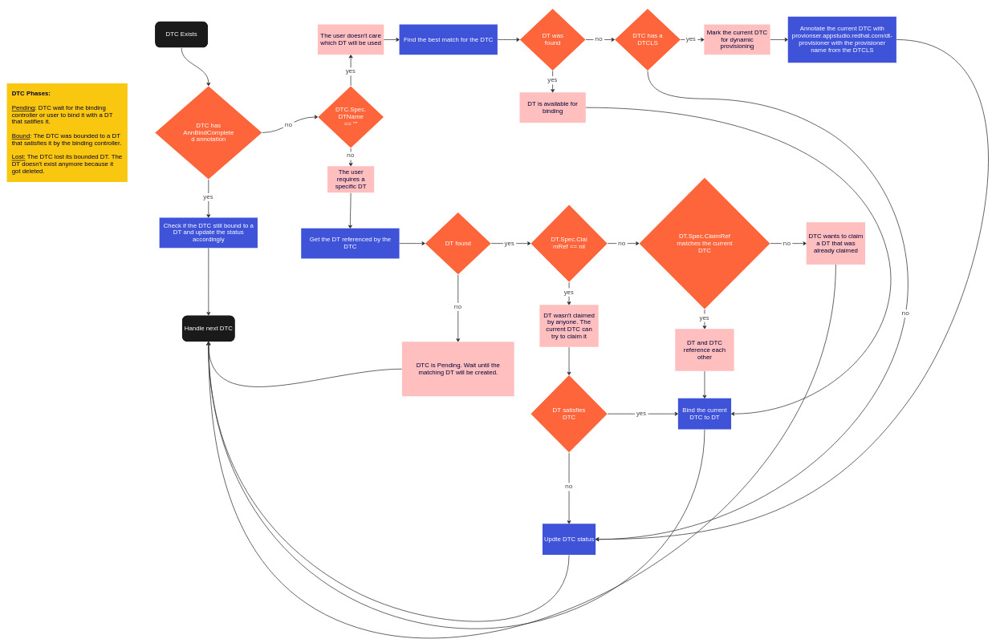
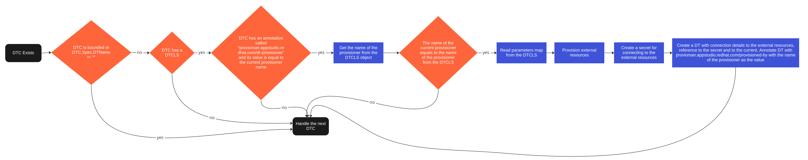
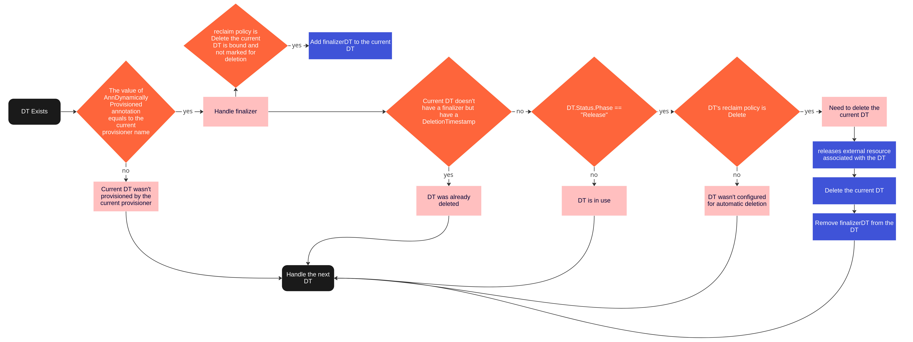
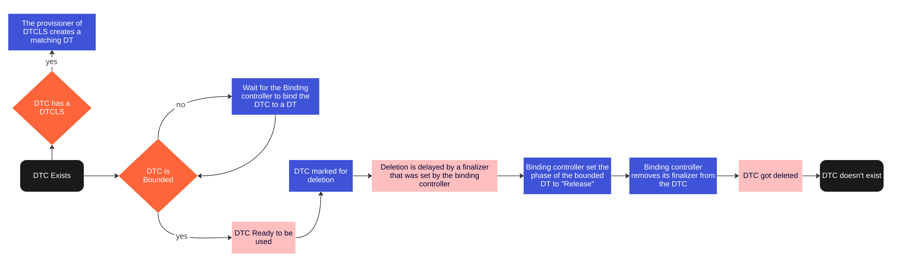
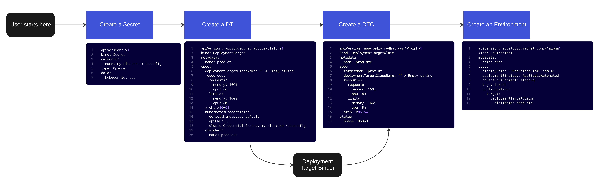
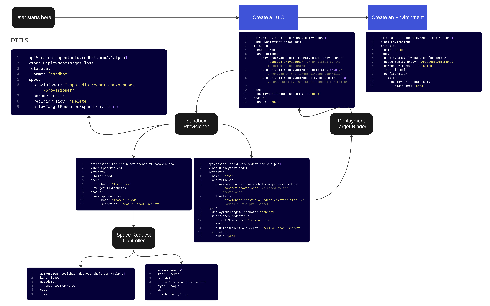
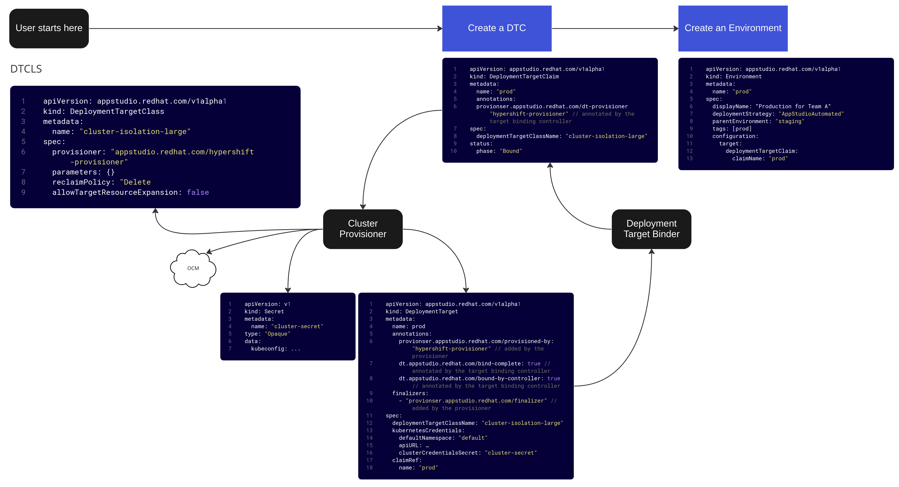

# Environment Provisioning

## Status

Superceded by [ADR 32. Decoupling Deployment](0032-decoupling-deployment.html)

## Approvers

* Elson Yuen
* Gorkem Ercan
* Jonathan West
* Shoubhik Bose

## Reviewers

* Alexey Kazakhov
* Ann Marie Fred
* John Duimovich
* Krunoslav Pavic
* Scott Hebert

## Authors

* Gal Ben Haim
* Ralph Bean

## Context

In our old KCP architecture, we had [a
design](https://docs.google.com/document/d/1WKd1FVHAxaNQKCIzIW-vUQRgsoOP9T-8rYozAMDpYc0/edit#) for
provisioning a new deployment target in support of new [Environments].  This design was to be
implemented in [GITOPSRVCE-228](https://issues.redhat.com/browse/GITOPSRVCE-228) by an environment
controller that would create and manage sub-workspaces of the user’s main Konflux workspace, and
that would provide a serviceaccount to Argo in order to deploy the user’s application to those
sub-workspaces. Now, without KCP, we need a new design.

The [Environment] CR serves two purposes:

- First, it represents a request from the user for HAS and the GitOps service to **recognize a new destination** for deployments. A new [Environment], when bound to an Application and a Snapshot, causes HAS to write a new directory matching the [Environment] in the gitops repo, which in turn causes Argo to deploy content from that directory somewhere.
- Second, it represents a request from the user to **provision a new deployment target**. Back in the KCP design, a new [Environment] caused the environment controller(s) to create a new sub-workspace, initialize it, and report back a serviceaccount kubeconfig to be used by Argo to administer it.

Some use cases to consider for [Environments]:

1.  As a part of the Konflux workspace initialization process, the user should find that both a **dev and stage environment** with corresponding deployment targets are ready for them ([STONE-180](https://issues.redhat.com/browse/STONE-180)). In our post-KCP architecture, these will be backed by **namespaces** on a devsandbox member cluster.
2.  The user will want to manually create **additional** [Environments] (for example, a prod environment). The user may want to use our compute resources provided in the form of a new **namespace on a devsandbox member cluster** for this ([STONE-183](https://issues.redhat.com/browse/STONE-183)) or they may want to **bring their own cluster** as a target ([STONE-162](https://issues.redhat.com/browse/STONE-162)).
3.  The integration-service expects to be able to create **ephemeral** [Environments] for automated testing purposes ([STONE-114](https://issues.redhat.com/browse/STONE-114)). For our short-term goals, the automated testing use case requires the same kind of compute as for the dev and stage [Environments] (devsandbox member cluster namespaces), but will expand to include other kinds of deployment targets in the future - like hypershift clusters ([STONE-185](https://issues.redhat.com/browse/STONE-185)).

## Decision

We are going split the two original purposes of the [Environment] CR into different APIs.

- The [Environment] will still represent the first purpose of requesting that HAS and the GitOps service **recognize a new deployment destination**.
- For the second purpose of **provisioning a new deployment target** we are going to introduce a new [DeploymentTarget] and [DeploymentTargetClaim] API, which will be referenced from an [Environment].

The new [DeploymentTarget] API is designed to emulate storage management APIs (see [persistent-volumes](https://kubernetes.io/docs/concepts/storage/persistent-volumes/) and [storage provisioner design](https://github.com/kubernetes-csi/external-provisioner/blob/master/doc/design.md) for reference).

### CRDs

#### DeploymentTarget (DT)

A deployment target, usually a K8s api endpoint. The credentials for connecting to the target will
be stored in a secret which will be referenced in the clusterCredentialsSecret field. A [DT] Can be
created manually by a user, or dynamically using a provisioner. The `phase` section shows the lifecycle phase of the [DT].

**Immutable object**: no

**Scope**: namespace

```yaml
apiVersion: appstudio.redhat.com/v1alpha1
kind: DeploymentTarget
metadata:
    name: prod-dt
spec:
    deploymentTargetClassName: isolation-level-namespace
    kubernetesCredentials:
        defaultNamespace: team-a--prod-dtc
        apiURL: …
        clusterCredentialsSecret: team-a--prod-dtc--secret
    claimRef:
        name: prod-dtc
status:
    phase: Bound

```

Phases:

**Pending:** DT is not yet available for binding.

**Available:** DT waits for a Claim to be bound to.

**Bound:** The DT was bounded to a DTC.

**Released:** The DT was previously bound to a DTC which got deleted. external resources were not freed.

**Failed:** DT was released from its claim, but there was a failure during the release of external resources.


#### DeploymentTargetClaim (DTC)

Represents a request for a [DeploymentTarget]. The `phase` section shows the lifecycle phase of the [DTC].

**Immutable object**: no

**Scope**: namespace

```yaml
apiVersion: appstudio.redhat.com/v1alpha1
kind: DeploymentTargetClaim
metadata:
    name: prod-dtc
spec:
    deploymentTargetClassName: isolation-level-namespace
status:
    phase: Bound
```

Phases:

**Pending:** DTC wait for the binding controller or user to bind it with a DT that satisfies it.

**Bound:** The DTC was bounded to a DT that satisfies it by the binding controller.

**Lost:** The DTC lost its bounded DT. The DT doesn't exist anymore because it got deleted.

#### DeploymentTargetClass (DTCLS)

Referred from a [DeploymentTarget] and [DeploymentTargetClaim]. Defines [DeploymentTarget] properties that
should be abstracted from the controller/user that creates a [DTC] and wants a [DT] to be provisioned
automatically for it.

In the example below you can see a class that represents a [DT] that grants the requestor access to
a namespace. The requestor isn’t aware of the actual location the [DT] is going to be provisioned. The
parameters section can be used to forward additional information to the provisioner. The
reclaimPolicy field will tell the provisioner what to do with the [DT] once its corresponding [DTC] is
deleted, the values can be Retain or Delete.

**Immutable object**: yes

**Scope**: cluster

```yaml
apiVersion: appstudio.redhat.com/v1alpha1
kind: DeploymentTargetClass
metadata:
    name: isolation-level-namespace
spec:
    provisioner: appstudio.redhat.com/devsandbox
    parameters: {}
    reclaimPolicy: Delete
```

#### Environment

[Environment] objects refer to a [DTC] using the `deploymentTargetClaim`
field. The environment controller will wait for the [DTC] to get to the
`bound` phase, once it is bound, it will reach the [DT] and read the
target's connection details from the kubernetesCredentials field and
configure Argo/Gitops services to use them.

**Immutable object**: no

**Scope**: namespace

```yaml
apiVersion: appstudio.redhat.com/v1alpha1
kind: Environment
metadata:
    name: prod
spec:
    displayName: “Production for Team A”
    deploymentStrategy: AppStudioAutomated
    parentEnvironment: staging
    tags: [prod]
    configuration:
        target:
            deploymentTargetClaim:
                claimName: prod-dtc
```

### Controllers

#### DeploymentTargetBinder

Binds [DeploymentTargetClaim] to a [DeploymentTarget] that satisfies its requirements.

It watches for [DTC] resources and tries to find a matching [DT] for each one of them. In addition, it's responsible for updating the `Status` sections of the [DT] and [DTC] (it also watches [DTC] objects). It marks [DTC] objects that requires dynamic provisioning.

A [DT] that was created dynamically for a specific [DTC] will always be attached to it.

[DT] and [DTC] have one to one bindings.

##### Binding Loop (DTC Reconciliation)



#### DeploymentTargetProvisioner

Watch for [DTC] objects. If the [DTC] was marked for a dynamic provisioning by the provisioner, it reads the parameters from the [DTCLS] mentioned in the [DTC], provisions the target and creates a [DT]
object which references the [DTC] that started the process.

When a [DTC] is deleted, if it was bound to a [DT] created by the provisioner, it reclaims the [DT] and
the actual cluster that was created for it based on the reclaimPolicy configuration.

##### Provision Loop (DTC Reconciliation)



##### Deprovision Loop (DT Reconciliation)



#### EnvironmentController

Watch for [Environment] objects. If the [Environment] references a [DTC] that is `Bound` and that
[DTC] references a [DT] that contains a `spec.kubernetesCredentials.clusterCredentialsSecret` field,
then ensure that there exists a [GitOpsDeploymentManagedEnvironment] resource that also references
that secret.

### DeploymentTarget(DT) and DeploymentTargetClaim(DTC) Lifecycle



### Access Matrix

| *User,Controller/CRD* | **DT**                | **DTC**               | **DTCLS** | **Environment**      |
|-----------------------|-----------------------|-----------------------|-----------|----------------------|
| **Binder**            | watch/list/get/update | watch/list/get/update |           |                      |
| **Provisioner**       | create/delete         | watch                 | get       |                      |
| **Environment**       | get                   | get                   |           | watch                |
| **Integration**       |                       | create/delete         |           | create/delete        |
| **User**              | create/delete         | create/delete         |           | create/delete/update |

### Annotation details

| *Const Name in code*      | *Key*                                          | *Values*                | *Applied by*       | *Applied on* | *Purpose*                                                                                                                                                |
|---------------------------|------------------------------------------------|-------------------------|--------------------|--------------|----------------------------------------------------------------------------------------------------------------------------------------------------------|
| AnnTargetProvisioner      | provionser.appstudio.redhat.com/dt-provisioner | A name of a provisioner | Binding controller | DTC          | Indicates that a DT should be dynamically provisioned for the DTC by the provisioner whose name appear in the value                                      |
| AnnBindCompleted          | dt.appstudio.redhat.com/bind-complete          | "yes"                   | Binding controller | DTC          | Indicates that the binding controller completed the binding process                                                                                      |
| AnnBoundByController      | dt.appstudio.redhat.com/bound-by-controller    | "yes"                   | Binding controller | DTC          | Indicates that the binding controller bind the DTC to a DT. In practice it means that the controller set the DTC.spec.VolumeName to the value of DT.Name |
| AnnDynamicallyProvisioned | provionser.appstudio.redhat.com/provisioned-by | A name of a provisioner | Provisioner        | DT           | Indicates that the provisioner whose name appears in the value provisioned the DT.                                                                       |

### Finalizer details

| Const Name in code | Key                                       | Applied by  | Applied on | Purpose                                                                       |
|--------------------|-------------------------------------------|-------------|------------|-------------------------------------------------------------------------------|
| finalizerDT        | provionser.appstudio.redhat.com/finalizer | Provisioner | DT         | Delays the deletion of a DT so the provisioner can free up external resources |

### Use Case Descriptions

- **During onboarding** - when a user requests a new appstudio tier namespace, the tier template includes two [Environments], and two [DTCs]. The [Environments] reference the [DTCs]. The [DTCs] bear a request for the `devsandbox` [DTCLS]. The devsandbox provisioner responds to that request and generates a `SpaceRequest`, ultimately resulting in a new namespace for each environment. The spacerequest controller provisions a serviceaccount in the new namespace and places a kubeconfig including the token for this serviceaccount in the origin namespace. The `SpaceRequest` in the origin namespace is updated to reference that `Secret` and is marked ready by the `SpaceRequest` controller. The devsandbox deployment target provisioner controller sees that and creates the devsandbox [DT] referencing the `Secret` and marks the devsandbox [DT] as ready. The deployment target binder sees that, and attaches the new [DTs] to the [DTCs]. The environment controller sees this and creates a [GitOpsDeploymentManagedEnvironment] that references the `Secret` found from traversing from the [Environment] to the [DTC] to the [DT].
- **For manual creation of new Environments** - a user submits a form in HAC which creates a new Environment CR and a new [DTC] CR. The Environment CR references the [DTC] CR, which is reconciled as in the previous bullet.
- **For automated testing in ephemeral environments** - a user specifies an IntegrationTestScenario CR with an existing Environment to clone. After a build completes, but before it executes tests, the integration-service creates a new Environment CR and a new [DTC] CR with the devsandbox [DTCLS] as above, and references the [DTC] from the Environment. The integration-service should delete the [DTC] once the environment isn’t needed anymore for the test.
- **BYO cluster** - A user creates a [DT] and a [DTC] and `Secret`. The [DT] has the details and a reference to the secret used to connect to his/hers cluster. In addition, it contains the name of the [DTC] it should be bounded to. The user then refer to the [DTC] from the Environment that should use it.

#### Manual Environment Creation Examples

##### Manual Environment Creation - BYOC



##### Manual Environment Creation - Sandbox



##### Manual Environment Creation - Cluster



### Mutating DeploymentTargets and Claims

Users may mutate existing [DeploymentTargets] and [DeploymentTargetClaims] in order to, for instance,
request that their provisioned cluster is scaled up to include more resources. However,
implementation of resource request changes is provided on a per-provisioner basis. Some may support
it, and some may not. Most all of our provisioners in the MVP will make no changes to
a [DeploymentTarget]’s external resources in the event of a resource request change to either the
[DeploymentTargetClaim] or the [DeploymentTarget].

In the rare case that a provisioner does support resizing external resources - the user should
request resource changes on the [DeploymentTargetClaim], which should then cause the provisioner to
resize the external resources modeled by the [DeploymentTarget]. Lastly, the provisioner should update
the resources in the spec of the [DeploymentTarget] to reflect the external change.

## Consequences

- Better load distribution between the development teams. An addition of a new provisioner type doesn’t require changing any of the existing controllers.
- Encapsulate the logic of provisioning/deleting a [DeploymentTarget] within the provisioner that is responsible for it.
- Opens the possibility to create [DeploymentTargetClaims] in advance and by that reducing the waiting time for an ephemeral environment for testing.
- The design is similar to the design of storage in k8s, so it should look familiar to developers and users.
- We have a larger API surface than we might ultimately need. Users won’t experience this in the UI, but API-based users will face apparent complexity. The fact that this design emulates the concepts in the k8s storage API should reduce the cognitive load this might impose on users and our engineers.

## Phases of implementation

An addendum about what features can be left out until later iterations.

### Phase 0 (Path to MVP)

For our "MVP" target in early CY23, we're going to ignore the details of this proposal. It sketches
an architecture that we only want to roll out between MVP and Service Preview.

### Phase 1

The result of this phase is automation that binds [DT] and [DTC], and automatically provisions
an environment on the Sandbox cluster (using the
[SpaceRequest
API](https://docs.google.com/document/d/1uqgghk1lN9dyoBLsvn5YD443TwKrsKHU6fvfUuo84Hs/edit#)) and
creates a [DT].

- Create the [DT], [DTC], and [DeploymentTargetClass] CRDs and make them available.
- Modify the Environment CRD and teach the gitops service how to navigate from the linked [DTC] to
  the [DT] in order to find the Secret that it needs for Argo.
- Implement the binding controller.
- Implement the Sandbox provisioner, to make use of the [SpaceRequest
  API](https://docs.google.com/document/d/1uqgghk1lN9dyoBLsvn5YD443TwKrsKHU6fvfUuo84Hs/edit#).
- On workspace initialization,
  - The NsTemplateTier will:
    - Create the [Environments] for Dev and Stage in the user's main namespace.
    - Create the [DeploymentTargetClaims] for Dev and Stage in the user's main namespace.
  - The Sandbox provisioner will generate SpaceRequests.
  - The SpaceRequest controller should ultimately create namespaces, serviceaccount, and a Secret.
  - The Sandbox provisioner in response will generate the [DT], linking the Secret.
  - The binding controller will bind the generated [DT] to the [DTC].

Work on the components of Phase 1 (the sandbox provisioner, the binding controller, the gitops
service controller changes and the API changes) can all proceed in parallel while work on the
SpaceRequest API advances.

When done, Phase 1 enables adjusting the integration service controller to create and delete new
[Environments] and [DTCs] for integration tests.

### Phase 2 (need more grooming and clear requirement from the PM)

The result of this phase is the ability to specify parameters that are
needed from the deployment target, such as memory, CPU, CPU
architecture and the number of nodes.

- The [DT], [DTC] an [DTCLS] would need to extended to support the new parameters.
  - **DTCLS - allowTargetResourceExpansion** - represents whether or not the underlying provisioner allows targets to be resized. I.e., for a whole cluster provided by the "hypershift" ocm provider - can it have its number or size of nodes increased without having to delete it and create a new one.
  - [DTC] - **Immutable object**: no, for bound claims, only the resources map can be updated. When updating a resource, its new value can’t be less than the previous value.
- The Sandbox provisioner should be extended to use the properties mentioned above (when those applicable) when creating external resources and a [DT].
- The matching algorithm in the binding controller will need to take into account the added parameters.

#### DeploymentTarget (DT)

```yaml
apiVersion: appstudio.redhat.com/v1alpha1
kind: DeploymentTarget
metadata:
    name: prod-dt
spec:
    deploymentTargetClassName: isolation-level-namespace
    resources:
        requests:
            memory: 16Gi
            cpu: 8m
        limits:
            memory: 16Gi
            cpu: 8m
    arch: x86–64
    kubernetesCredentials:
        defaultNamespace: team-a--prod-dtc
        apiURL: …
        clusterCredentialsSecret: team-a--prod-dtc--secret
    claimRef:
        name: prod-dtc
```

#### DeploymentTargetClaim (DTC)

```yaml
apiVersion: appstudio.redhat.com/v1alpha1
kind: DeploymentTargetClaim
metadata:
    name: prod-dtc
spec:
    deploymentTargetClassName: isolation-level-namespace
    resources:
        requests:
            memory: 16Gi
            cpu: 8m
        limits:
            memory: 16Gi
            cpu: 8m
    arch: x86–64
status:
    phase: Bound
```

#### DeploymentTargetClass (DTCLS)

Hypershift cluster with 3 nodes example:

```yaml
apiVersion: appstudio.redhat.com/v1alpha1
kind: DeploymentTargetClass
metadata:
    name: isolation-level-cluster-small
spec:
    provisioner: appstudio.redhat.com/hypershift
    parameters:
        numOfNodes: 3
    reclaimPolicy: Delete
    allowTargetResourceExpansion: false
```

### Phase 3

The result of this phase is to automatically provisioning of Hypershift cluster using Konflux's
credentials. We call it `provided compute` (compute that we provide, not the user) and it’s included
as part of the offering. This compute can be used for both long lived clusters and for ephemeral
clusters used by the integration service.

For long lived clusters, the maintenance model for them is yet to be determined.

#### DeploymentTargetClass (DTCLS)

Hypershift cluster with 3 nodes example:

```yaml
apiVersion: appstudio.redhat.com/v1alpha1
kind: DeploymentTargetClass
metadata:
    name: isolation-level-cluster-small
spec:
    provisioner: appstudio.redhat.com/hypershift
    parameters:
        numOfNodes: 3
    reclaimPolicy: Delete
    allowTargetResourceExpansion: false
```

Hypershift cluster with 6 nodes example:

```yaml
apiVersion: appstudio.redhat.com/v1alpha1
kind: DeploymentTargetClass
metadata:
    name: isolation-level-cluster-large
spec:
    provisioner: appstudio.redhat.com/hypershift
    parameters:
        numOfNodes: 6
    reclaimPolicy: Delete
    allowTargetResourceExpansion: false
```

## References

- [Discussion recording, 2022-12-07](https://drive.google.com/file/d/1UWIefLzFb2rYnz8mvvWkNKJyuWy-_nhm/view)
- [Original drafting in googledoc](https://docs.google.com/document/d/1vFD5lDbxek_Q2RZyKdFuZ8z0xYubOA1i8cu2K7KNxaQ/edit#heading=h.k2fng7c0dm7k)
- [Original miro](https://miro.com/app/board/uXjVP77ztI4=)
- [Issue tracking creation of this ADR (STONE-174)](https://issues.redhat.com/browse/STONE-174)

[Environment]: ../ref/application-environment-api.md#environment
[Environments]: ../ref/application-environment-api.md#environment
[DT]: ../ref/application-environment-api.md#deploymenttarget
[DTs]: ../ref/application-environment-api.md#deploymenttarget
[DeploymentTarget]: ../ref/application-environment-api.md#deploymenttarget
[DeploymentTargets]: ../ref/application-environment-api.md#deploymenttarget
[DTC]: ../ref/application-environment-api.md#deploymenttargetclaim
[DTCs]: ../ref/application-environment-api.md#deploymenttargetclaim
[DeploymentTargetClaim]: ../ref/application-environment-api.md#deploymenttargetclaim
[DeploymentTargetClaims]: ../ref/application-environment-api.md#deploymenttargetclaim
[DeploymentTargetClass]: ../ref/application-environment-api.md#deploymenttargetclass
[DeploymentTargetClasses]: ../ref/application-environment-api.md#deploymenttargetclass
