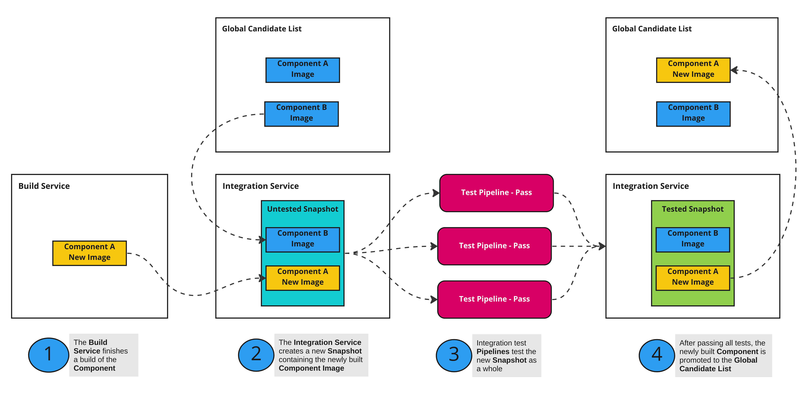
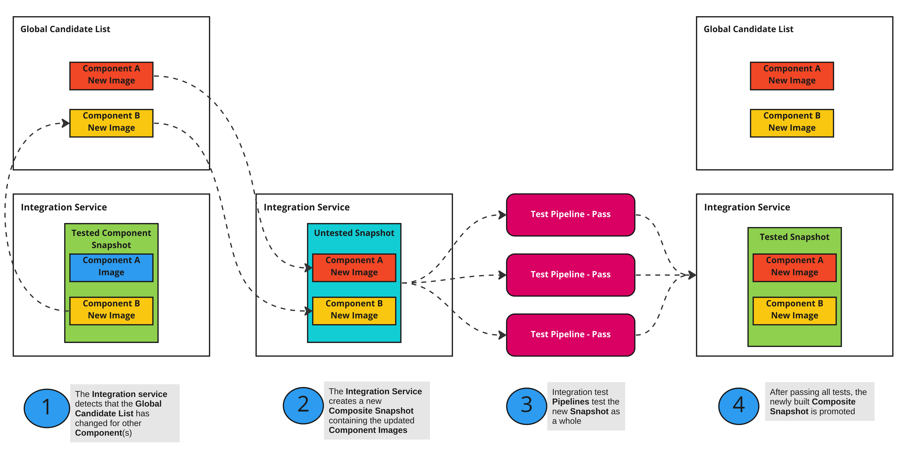

# The Two-phase Architecture of the Integration Service

Date Documented: 2023-02-09
Date Accepted: 2023-02-14

## Status

Accepted

## Context

The Integration Service is in charge of running integration test pipelines by executing
the Tekton pipeline for each user-defined IntegrationTestScenario.
The main payloads that are being tested are Snapshots which contain references to all
Components that belong to the Application, along with their images.

One problem faced by the integration service is caused by the fact that testing an
application with Tekton pipelines takes time. During the course of testing an application,
multiple component builds can happen in quick succession, leading to a potential race
condition between different Snapshots that are created for each of those builds.
This would primarily manifest itself by two Snapshots getting promoted in quick
succession but neither of them having the latest images contained within them.

## Decision

In order to protect against the race conditions, the integration service will leverage a
two phase approach to testing. The phases will consist of a Component phase that will
always be executed and the optional Composite phase which would come into play only when
race conditions between component builds are detected.

### Component phase

When a single component image is built, the Integration Service tests the application
by creating a Snapshot. All Components with their images from the Global Candidate List
are included within the Snapshot and then the Component that was newly built is
updated/overwritten to complete the Snapshot creation.

After all test pipelines for the Snapshot finish successfully, the Integration service
updates the Global Candidate List with the newly built Component image and checks if it
can promote the Component Snapshot. If the Global Candidate List for other Components
doesn't match the rest of the Component Snapshot contents, its status is marked as
invalid and the testing goes into the Composite phase.
Otherwise, the Component Snapshot is promoted according to user preferences.

### Composite phase

The Composite phase is used when the Global Candidate List changes while testing a
Snapshot in the Component phase.

The Composite phase exists to resolve a race condition when teams merge multiple PRs
to multiple components of the same application at nearly the same time.
When multiple components are built at the same time, the Integration Service tests
the application by creating a composite Snapshot using multiple Components updated
to use the newly built images.

If all testing pipelines pass successfully, the Composite Snapshot is promoted
according to user preferences.

## Consequences

To illustrate the consequences of implementing the above approach,
we can outline two scenarios, one with a happy path where only a single component
is built at a time, and one with a race condition where two components are built
in quick succession.

### Happy path with a single component build

In the happy path without race conditions, one PR merges to one component.
1. The Component phase runs, and records results on the **Component** Snapshot.
2. The Global Candidate List is updated.
3. The Integration Service detects that the Snapshot is up-to-date by checking the
Global Candidate List and skips the second phase of testing, marking the Snapshot as
complete.
4. The **Component** Snapshot is promoted according to the user preferences.

### Path with a race condition

In the path with race conditions, two PRs merge to two components at the same time.

1. Two instances of the Component phase start up in parallel, testing two different
Snapshots - each one including one of the two merged PRs.
2. The first Snapshot finishes testing and detects that the Global Candidate List
has not changed in the meantime and finalizes the Snapshot in question,
updating the Global Candidate List with the newly built component image.
3. The second Snapshot finishes testing. It is presented with an updated
Global Candidate List that includes both changes, which have not been tested together yet.
4. A **Composite** Snapshot is created that includes both changes and the
Integration service starts testing it in the Composite phase.
5. Composite phase testing runs in full
6. The **Composite** Snapshot is promoted according to the user preferences.

## Footnotes
For future consideration, if two components rely on each other to the point that
breaking changes from one component create issues in another component during testing,
a new feature to support batching of components together is being investigated.
This would allow for the Integration service to hold off on testing a Component build
until the dependent build is also completed.

We originally made this decision verbally and with diagrams back in May of 2022,
and have been operating with it as the operating design since then.
However, we realized (through conversations like
[this slack conversation](https://redhat-internal.slack.com/archives/C02CTEB3MMF/p1669961732100869))
that it is not obvious without documentation.
We are documenting it here as an ADR for posterity, visibility.
