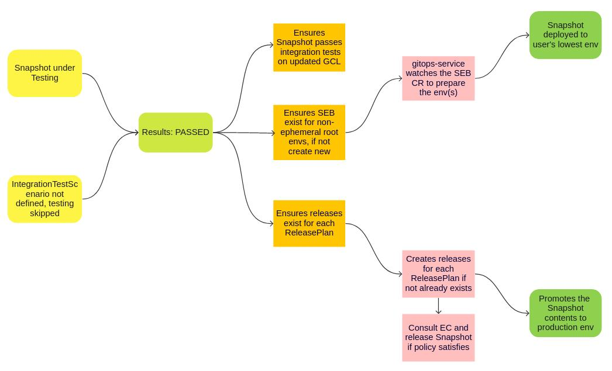

# Promotion logic in the Integration Service

* Date Documented: 2023-02-08
* Date Accepted: 2023-02-27

## Status

Superceded by [ADR 32. Decoupling Deployment](0032-decoupling-deployment.html)

## Context

Before the merge of HACBS & AppStudio, the Konflux build-service created the
ApplicationSnapshot and promoted the content to the user's lowest environment as soon as
the build was completed and once the environment was built.
The integration-service fulfilled the same role for HACBS in addition to running the
IntegrationTestScenario tests first before promoting.

Here, we are documenting the decision to consolidate and move the logic at one place to avoid duplicacy
on the actions.

Note: This functionality has now been completely dropped from the build-service side after the merger.

### What is promotion logic ?

DevOps workflows often automate deployments of applications across different environments to ensure
that the workloads are properly tested before being further promoted to an environment with a higher
service level agreement.
The promotion path can be represented with a directed acyclic graph from the environment with the
lowest SLA to the one with the highest, for example development -> staging -> production.
In Konflux, this promotion logic would be represented by a set of components (container images) defined by
an immutable Snapshot being deployed to the relevant environment.

Once the Snapshot is tested and verified successfully, its contents will then be deployed to the user's defined
lowest environments.

## Decision

Consolidate the promotion logic for both HACBS & AppStudio and move it to the integration-service after
the merger of Konflux.

Upon successful promotion of a Snapshot, the integration service will have:

* Updated the Global Candidate List (GCL) with the Components' ContainerImages upon the successful completion
  of the test pipelines for the Snapshot.
* Ensured that Releases associated with the given Snapshot and the ReleasePlan exists, creating one if necessary.
* Ensured that all SnapshotEnvironmentBindings(SEB) for non-ephemeral lowest environments point to the
  newly constructed Snapshot. If no SEBs existed to update, the integration service will have created a new binding
  for each of the environments.

Note: In case of no IntegrationTestScenario defined, the testing of the Snapshot will be skipped and the
outcome will be considered as passed followed by the same promotion process defined in the diagram.

To get the environment details, Integration service validates all the Environment CRs in the user's namespace
and makes decisions on where to deploy the contents of the Snapshot.
With the current functionality, integration-service can setup to deploy to more than one lowest environments.

The “lowest environments” are the Environments with no explicit parentEnvironment set.

The Application Service (HAS) and the Gitops Service listen to the SnapshotEnvironmentBinding CR created by the
integration-service and they work together to deploy the Snapshot to the lowest defined environments(dev/stage/something else).

In tandem, Integration-service creates the Release for each ReleasePlan with an auto-release label based on the
testing outcomes.
The Release contains the Snapshot and the ReleasePlan which will have the user-supplied definition of where to
release the Snapshot of an Application.

Release-service then communicates with the enterprise-contract to ensure the policy is satisfied to promote
the Snapshot content to the production environment.

Note: Integration service does not promote the Snapshots originating from PRs, only those originating from
push (merge-to-main) events gets promoted to lowest environments and released.

## Consequences

* As per this decision, Integration Service now holds the full charge to automatically promote the Snapshot of the
  Application to the user’s defined lowest environments only.
  The integration service doesn't hold the control to make promotions to the non-lowest/production environments.

* Once all the tests succeed the Snapshot will always be deployed via a single code path, in a single service.
  This should make future design choices easier to reason about and communicate between teams.

## Footnotes

The promotion logic has originally been implemented as part of HACBS-802 / HACBS-801 and is currently in action.
This document is created for posterity and visibility.

[parentEnvironment]: https://github.com/redhat-appstudio/application-api/blob/5f554103549049bf02c1e344a13f0711081df6a1/api/v1alpha1/environment_types.go#L36-L39
[Global Candidate List]: ../architecture/integration-service.html
[HACBS-802]: https://issues.redhat.com/browse/HACBS-802
[HACBS-801]: https://issues.redhat.com/browse/HACBS-801
