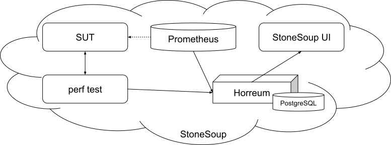

# Continuous Performance Testing (CPT) of Apps in Konflux

## Status

In consideration

## Context

In general, performance testing is just another form of testing that helps application teams to ensure there are no regressions in their code and that their application behaves as expected.

The IntegrationTestScenario pipelines in Konflux are not suitable for full-blown performance and scale testing (that usually takes lots of time and involves human analysis so it is not suitable for quick automated checks we need for release gating runs in Konflux), but are a good place for a quick and small-scale regression test.

What makes performance testing different from functional testing is it is harder to decide if the test passed or failed as every performance test tests different aspects of the application and so it expects different performance, different metrics, different thresholds. Furthermore, even if the measured performance of the app under test did not change, there might be some significant resource usage by the application which we want to cause the test to be marked as failed.

The approach to make this pass/fail detection possible proposed here, is to use historical results as a benchmark – not only actual results of the performance test, but also monitoring data about the resource usage, etc.

> Example: Imagine you develop a web e-shop application that uses PostgreSQL data backend. Your perf test is browsing through a goods catalog and measures latency of pages. When you want to decide on pass or fail result of this test, you need to check that metrics like below are aligned to previous results of a same test with same configuration:
>
> - Average page load latency.
> - Backend service CPU and memory usage...
> - PostgreSQL CPU and memory usage…
> - Internal PostgreSQL metrics like number of commits during the test or average number of database sessions during the test…
>
> If any of these metrics does not align to historical results, we mark this test result as a failure.

And even if some test fails, the application team should be able to review the data and change the test definition, so next time a new test result is being evaluated based on the historical results, this new result will be one of them.

The algorithm that says if the current test passes or fails when compared to historical results can vary. It can be:

- Using a floating average of historical data and setting a safe range around it and making sure the new result is in that range.
- Some other possibilities might evolve later. Above is just an example used now by some Performance teams.

Goal of this ADR is to propose a way for this kind of testing to be implemented in Konflux (feature [STONE-679](https://issues.redhat.com/browse/STONE-679)). Even if it would not deprecate full-blown performance and scale testing, having a release gate with some short and small scale performance test is desirable for many application teams.

### Glossary

- SUT: Subject Under Test
- Horreum: a results storage service: <https://github.com/Hyperfoil/Horreum>
- CPT: Continuous Performance Testing

## Decision

Let's use this architecture with a single Horreum instance per control plane cluster (as it is similar to what we do for Tekton results).
Horreum instances would be managed by Red Hat and used by tenants on specific cluster.

1. Performance test runs in the Tekton pipeline and generates JSON with test parameters and results.
2. Pipeline gathers configured monitoring metrics and add them to the JSON.
3. Pipeline uploads the JSON with all the data to Horreum.
4. Horreum performs result analysis, looking for changes in configured metrics.
5. Pipeline gets PASS/FAIL decision from Horreum back to the pipeline, so pipeline can return proper result.

Although Horreum provides rich web UI for configuring JSON parsing, change detection and data visualization, it will stay hidden to Konflux users. Konflux will expose subset of that functionality in it's own web UI and will talk to Horreum via it's API interface.

We need to make a decision about one instance per cluster or one instance per tenant.

## Consequences

Pros:

- We can provide some best practices to customers wanting to do some basic performance regression testing.
- Horreum is end-to-end solution that already exists, is already used by multiple teams and has documentation for the whole process.
- Konflux UI can display all the trends because historical data will be available in Horreum.
- Red Hat team that develops Horreum is willing to help with this effort.
- Integration scripts needed to run in the pipeline (to gather monitoring data, to upload results to Horreum, to get PASS/FAIL decision from Horreum...) that already exists:
    - Monitor performance workloads.
    - Process the data in Horreum.
    - Gather monitoring data about SUT from Prometheus and bundle it to results that are uploaded to Horreum.

Cons:

- Somebody has to manage the Horreum instance. Required development time on it. Service instance needs ownership.
- Although Horreum uses Keycloak as well, some changes in the Horreum authentication mechanism might be required to cooperate with Konflux member cluster RBAC.
    - To make sure Horreum users from one tenant are not able to access data from different tenant, created <https://github.com/Hyperfoil/Horreum/issues/420>.
- Horreum is used by multiple teams without any capacity issues, but Horreum itself was not perf&scale tested formally, so there might be some scaling issues.
- We would need to develop Konflux UI to get graphs/results from Horreum and to allow users to configure the change detection parameters for their tests.
- If we need one Horreum instance per workspace, that would require further development work (i.e. operator for provisioning per worksapce, data backup/restore etc).
- As the performance testing pipelines can be some heavy on resources, attribution of costs to users/workspaces might be tricky, but can be measured in a same way as we plan to measure functional tests or build pipelines.
- Attribution of costs to run the Horreum, maybe tracking these can be added to scope of <https://issues.redhat.com/browse/STONE-215>.
- Integration scripts that need to be created:
    - Document / provide a step for integrating the change detection into pipeline.
