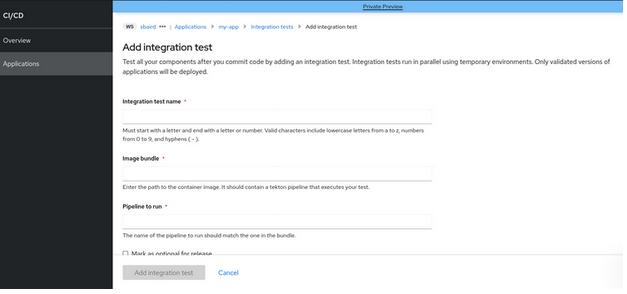
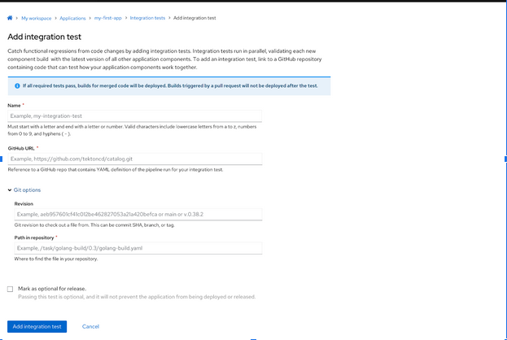
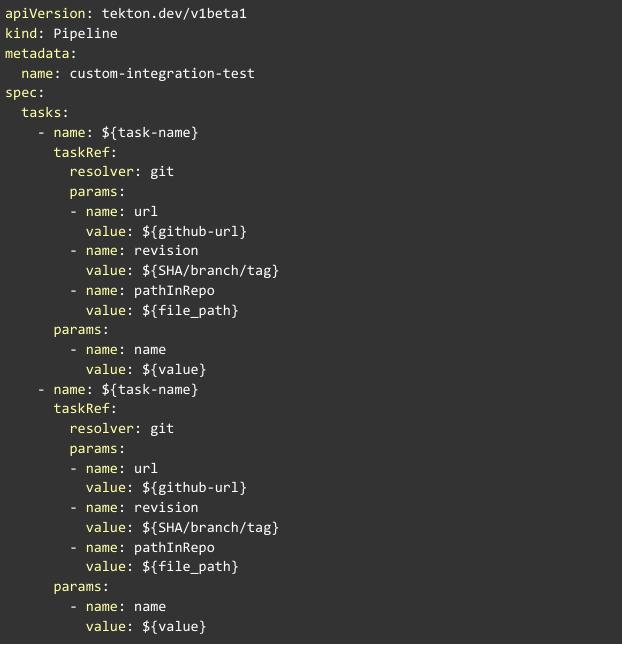

# Git references to furnish Integration Test Scenarios

* Date Documented: 2023-04-10
* Date Accepted: 2023-04-21

## Status

Approved

## Context

Up to now, the Integration service has only supported setting the Tekton bundle (Bundle string `json:"bundle"`) in the
IntegrationTestScenario [CR] as a reference for the integration tests, in order to run the Tekton PipelineRuns.

Below is the existing format to supply the Integration test references:

Building and maintaining Tekton bundles is cumbersome for users when providing custom tests.

Resolving tasks from a git repository is more natural for developers and allows for faster iteration. Hence, users
should be able to reference their Tekton pipeline definitions that are hosted in git repositories ([RHTAP-402]).

To support the functionality of using git references, Tekton resolvers need to be enabled. As part of [PLNSRVCE-1030],
pipeline service adds support for the [Tekton-resolvers] including git resolvers which should in turn give us the ability
to expand the support for resolvers in the IntegrationTestScenarios.

## Decision

Integration service now migrates to the new version of the IntegrationTestScenario CRD having the expanded functionality
to allow using different types of Tekton resolvers ex: bundles-resolver, cluster-resolver, hub-resolver along with
the git-resolver. This gives the extensibility to permit the use of different resolvers in the future.

The new format of adding the Integration Test Scenarios would look like:

Users git repository path to their test code can now provide the information or the location of their IntegrationTestScenarios
through Git references like **Github URL**, **Git Options** (**Revision** & **Path in repository**).

The information provided by the users in the above form will then be consumed by the integration service with the help of IntegrationTestScenario CR and will be used to run the integration tests against the Application Snapshot in question.

Example of the tekton pipeline definition with git resolver:

The existing IntegrationTestScenarios will be migrated to the new API version with tekton resolvers, by using the
standard kubernetes conversion webhooks ([STONEINTG-386]).

## Open Questions

Addressing the impact of malicious git [commits] to help protect (or warn) users against them is not being addressed
as part of this feature and still open for further discussion.

Can the validation be added as security improvement from Tekton side and later adopt by Integration service ?

## Consequences

* Better user experience through Tekton pipeline definitions that are hosted in git repositories which are easier to
maintain as opposed to building their own Tekton bundle images every time they adjust their test.
It also removes the need for our users to have to understand what a Tekton bundle is and learn how to build it,
if they don't already know.

* Resolvers are currently in Technology Preview for the OpenShift Pipelines 1.9. Technology Preview features are not
supported with Red Hat production service level agreements (SLAs) and might not be functionally complete.
Red Hat does not recommend using them in production. These features only provide early access to upcoming product features,
enabling customers to test functionality and provide feedback during the development process.

## Footnotes

* The risk mentioned in the consequences has been [accepted] by the PM(s).
* There will be no direct support for the Tekton bundles. But the IntegrationTestScenrios are expandable to make
use of bundle resolvers, if needed.

[CR]: https://redhat-appstudio.github.io/architecture/ref/integration-service.html#integrationtestscenariospec
[RHTAP-402]: https://issues.redhat.com/browse/RHTAP-402
[PLNSRVCE-1030]: https://issues.redhat.com/browse/PLNSRVCE-1030
[Tekton-resolvers]: https://tekton.dev/vault/pipelines-main/resolution/
[STONEINTG-386]: https://issues.redhat.com/browse/STONEINTG-386
[commits]: https://github.com/tektoncd/pipeline/issues/6315
[accepted]: https://issues.redhat.com/browse/RHTAP-625?focusedId=21972490&page=com.atlassian.jira.plugin.system.issuetabpanels%3Acomment-tabpanel#comment-21972490
