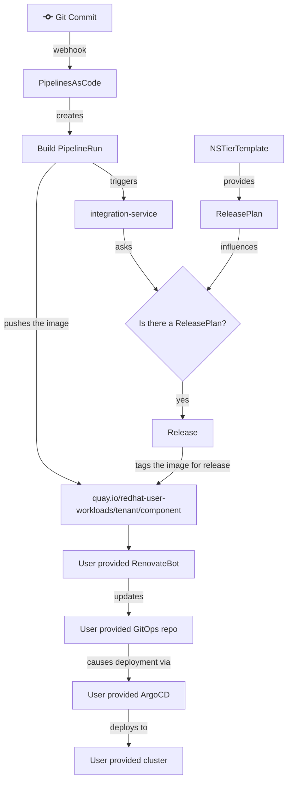
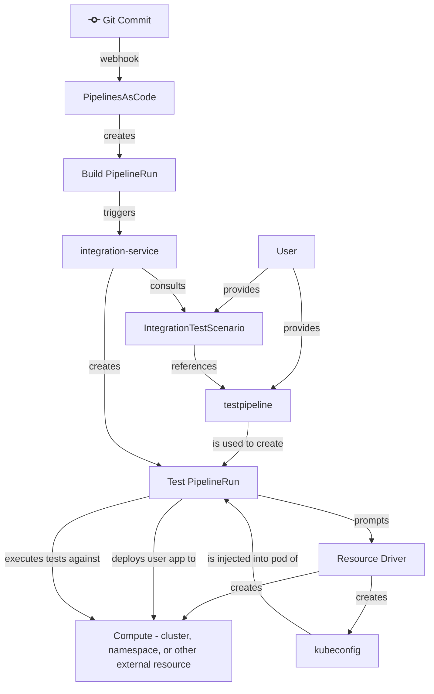

# Decoupling Deployment

Date started: 2023-11-17
Date accepted: 2023-02-01

## Status

Accepted

Relates to:

- [ADR 14. Let Pipelines Proceed]()
- [ADR 22. Secret Management for User Workloads]()

Supercedes:

- [ADR 08. Environment Provisioning]()
- [ADR 16. Integration Service Promotion Logic]()
- [ADR 28. Handling SnapshotEnvironmentBinding Errors]()

## Authors

- Ralph Bean

## Context

Since the beginning of our project, we've had an emphasis on providing an integrated experience for
the user, automating all steps through build, test, deployment, and release to higher environments.

Some challenges:

- Our controllers' APIs are highly coupled. For example, it isn't feasible to try and use
  [integration-service] today without [application-service] and [gitops-service]. This creates
  a high barrier to engage with some of the useful subsystems we've built. A user (and potential
  contributor) has to adopt the whole thing, or nothing.
- Today, we can generate simple but often incorrect deployment manifests for users' applications,
  which we deploy via the application gitops repo. The user cannot interact with or influence these
  resources directly; they have to do so through the Application/Component API. If we permit them to
  directly provide deployment resources through that API, the API will become a leaky abstraction.
  If don't permit them to provide their own resources, and instead try to handle every application
  configuration case in the HAS generation code, we will struggle to keep up with users' demands for
  the many and varied kinds of application deployments.

See also [RHTAP-1873](https://issues.redhat.com/browse/RHTAP-1873).

## Decision

We are going to decouple the deployment from the build, test, and release portions of our system.

**Deployment**:

- The [Environment], [SnapshotEnvironmentBinding], and [GitOpsDeploymentManagedEnvironment]
  resources will be deprecated and eventually decomissioned.
- The [application-service] will stop generating GitOps repo content and stop creating GitOps
  repositories.
- We will stop deploying the [gitops-service] entirely and the RDS instance it uses.
- HAC will stop rendering [Environments] and their status.
- If a user wants to make use of deployment capabilities, we will promote the usage of [renovatebot]
  to propagate _released_ images to their self-managed gitops repo as pull requests. Dependabot is
  equally viable if the user's gitops repo is on GitHub.

**Test and promotion**:

- We will decomission the [DeploymentTargetClaim], [DeploymentTarget], and [DeploymentTargetClass]
  APIs in favor of the new [Dynamic Resource Allocation APIs] that are an alpha feature of Kubernetes
  v1.27 and OpenShift 4.14.
- [integration-service] should no longer create and and manage [Environments] and the related
  [DeploymentTargetClaims]. Users will be expected to provide integration test pipelines that (somehow)
  specify `resourceClaims`, which will cause a provisioner to provision the compute and inject a
  kubeconfig for the target compute into the taskrun pod. The user's test pipeline should then take
  steps to *deploy an instance of their application to be tested* to the compute provided by dynamic
  resource allocation provisioner, using using the provided kubeconfig.
- In the intervening time between now and when the Dynamic Resource Allocation APIs are available
  (OpenShift 4.14 plus the time we need to implement a sandbox SpaceRequest *resource driver*), users
  that need an ephemeral namespace for testing will need to employ a Task as the first step in their
  pipeline that creates a SpaceRequest. They will need to use a finally task to clean up the SpaceRequest
  after testing completes.
- We should promote [release-service] as the primary means to advertise to [renovatebot] that one or more
  images have passed testing and are ready to be promoted to a particular environment (with a lowercase
  "e") by way of image tags in a registry.

### Out of scope

Some other interesting ideas that are floating around these days, but which should be taken up in
other ADRs, if we take them up at all:

- Decoupling [integration-service] and [release-service] from a shared [Snapshot] API. They will
  continue to share a [Snapshot] API as of this ADR.
- Decoupling [integration-service] from the [application-service] APIs, like [Application] and
  [Component]. It will still promote images to the "global candidate list" (on the [Component]
  resources) and continue to use the list of [Components] to guide its construction of [Snapshots].

### Use Case Descriptions

**During onboarding**: whereas today when a user requests a new appstudio tier namespace, the tier
template includes an [Environment] that the integration-service will promote to. Tomorrow, the
appstudio tier template should no longer include an [Environment] which on its own will cause
integration-service to _not_ trigger a deployment when testing completes. Instead, the appstudio
tier template should include a [ReleasePlan] with a reference to the [push-to-registry]
release pipeline. This new default [ReleasePlan] should carry parameters such that whenever
a [Snapshot] is successfully tested, a [Release] is created that re-tags the images in build-time
quay repositories with a tag like `:released` or `:validated` (name tbd). The
[push-to-registry] pipeline can use the `appstudio-pipeline` service account in the user's
dev workspace, which already has push access to the repository in question.

Outside of the Konflux member cluster, the user is responsible for acquiring a gitops repo and
deployment environments of their choice, manually laying out their application resources in the repo
(assisted by tools like `kam`), specifying image references by tag to match the `:released` or
`:validated` tagging schem mentioned above, configuring ArgoCD to deploy from their gitops repo, and
configuring [renovatebot] to propagate image updates by digest to their gitops repo. Really, ArgoCD
here is just an example and other gitops tools could be used; renovate could even update Helm repos
with the new images. Options for the user are not limited.

**For manual creation of new environments** - the user manages this directly using a combination of
their gitops repo and argo, outside of the Konflux member cluster.

**For automated testing in ephemeral environments** - the user specifies an
[IntegrationTestScenario] CR, which references a pipeline which (somehow) creates a `resourceClaim`.
After a build completes, the [integration-service] creates the PipelineRun which causes the **resource
driver** associated with the `resourceClaim` to provision the requested compute. The resource driver
injects the kubeconfig for the ephemeral compute into the pod, to be used by the test TaskRun. The
user's test TaskRun is responsible for deploying the user's app based on the [Snapshot] provided by
[integration-service] as a parameter and the kubeconfig injected into the TaskRun pod by the resource
driver before running tests.  The resource driver should cleanup after itself after the test TaskRun
and its corresponding pod complete.

## Consequences

- Users who expect effortless deployment of their app when onboarding to the system will be
  dissapointed. They have more work to do to set up a deployment of their app outside the system.
- Users will lose visibility of their applications' deployments and status in the Konflux UI
  (HAC). Other systems like the Argo UI are arguably better at this than we are.
- Users who expect to provide and manage their own resources to control their app will be delighted.
  They now no longer have to interact with an intermediary API to try to express details about their
  deployment(s).
- As a team, we'll be in a better position to try to achieve independence for [integration-service],
  make it usable outside the context of Konflux, and ideally make it attractive for collaborators.

## Implementation

Some of these phases can be done at the same time.

- Work with the only known users of ephemeral environments right now (Exhort team) to create the
  intermediary solution: a pair of tekton tasks that create and destroy SpaceRequests. Use this
  in their pipelines to drop usage of the existing Environment-cloning feature set.
- Create a Dynamic Resource Allocation resource driver that supports SpaceBindings
- [integration-service]: Drop the environment reference from the [IntegrationTestScenario] spec,
  and related controller code for managing ephemeral [Environments] for tests.
- [release-service]: Drop the environment reference from the [ReleasePlanAdmission] spec, and
  related controller code for managing a [SnapshotEnvironmentBinding].
- [HAC]: update [IntegrationTestScenario] no longer use [Environments].
- [HAC]: Drop UI features showing the [Environments]: (commit view, Environments pane, etc.)
- [HAC]: Drop UI features differentiating "build" and "deploy" secrets. With this change, "deploy"
  secrets are no longer relevant.
- [integration-service]: stop creating a [SEB] for the lowest [Environments].
- [application-service]: stop generating the gitops repo content in response to [SEBs].
- [application-service]: stop creating gitops repos.
- Drop the [Environment], [SnapshotEnvironmentBinding], [GitOpsDeploymentManagedEnvironment],
  [DeploymentTarget], [DeploymentTargetClaim], and [DeploymentTargetClass] APIs from the
  [application-api] repo.
- Stop deploying the [gitops-service] and decomission the RDS database.

[Dynamic Resource Allocation APIs]: https://kubernetes.io/docs/concepts/scheduling-eviction/dynamic-resource-allocation/
[renovatebot]: https://github.com/renovatebot/renovate
[deployment-target-operator]: #
[gitops-service]: 
[push-to-registry]: https://github.com/redhat-appstudio/release-service-catalog/tree/main/pipelines/push-to-external-registry
[application-api]: https://github.com/redhat-appstudio/application-api
[application-service]: 
[integration-service]: 
[release-service]: 
[Application]: 
[Applications]: 
[Component]: 
[Components]: 
[Environment]: 
[Environments]: 
[GitOpsDeploymentManagedEnvironment]: 
[GitOpsDeploymentManagedEnvironments]: 
[SnapshotEnvironmentBinding]: 
[SnapshotEnvironmentBindings]: 
[Snapshot]: 
[Snapshots]: 
[Release]: 
[Releases]: 
[ReleasePlan]: 
[ReleasePlans]: 
[ReleasePlanAdmission]: 
[ReleasePlanAdmissions]: 
[IntegrationTestScenario]: 
[IntegrationTestScenarios]: 
[DT]: 
[DTs]: 
[DeploymentTarget]: 
[DeploymentTargets]: 
[DTC]: 
[DTCs]: 
[DeploymentTargetClaim]: 
[DeploymentTargetClaims]: 
[DTCls]: 
[DTClses]: 
[DeploymentTargetClass]: 
[DeploymentTargetClasses]: 
